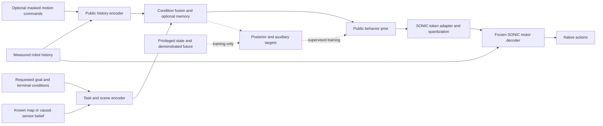

# Distillation research and framework design for navigation-context students

> **Status note (September 23, 2026).** Sections 1–13 are the September 13 design snapshot. For current status, corrections and plan, see [docs/STATUS.md](STATUS.md) and the [revised roadmap](ROADMAP_20260923.md).

**September 13 synchronized readout (historical):** [September 13 research update and log](RESEARCH_UPDATE_20260913.md) records completed supported-recovery and continuation results, the new methods package, and the pending expanded panel. The latest continuation candidate scores 4/8 and 2/8 on two evaluation seeds, versus its parent's 4/8 and 1/8. Earlier pending-result statements below are historical. The [working-tree sync manifest](publication/research-sync-20260913.json) supersedes the older synchronization revision below.

**September 13 follow-up:** the [motor-to-navigation contribution report](sonic/motion2scene/MOTOR_TO_NAVIGATION_CONTRIBUTION_20260913.md), [navigation pilot](sonic/motion2scene/NAVIGATION_MOTOR_PILOT_20260913.md), [terminal-control audit](sonic/motion2scene/NAVIGATION_TERMINAL_CONTROL_20260913.md), and [supported recovery protocol](sonic/motion2scene/NAVIGATION_SUPPORTED_RECOVERY_20260913.md) extend this research with new implementation and executed experiments. The motor specialist now reaches 88/89 train and 10/20 development completions, with a 114D current-command interface and preserved teacher encoder/decoder. Sections 1–13 retain the earlier research snapshot; Sections 14–16 record what the new evidence changes. In particular, the earlier weak context-token checkpoint is no longer the preferred motor preservation anchor.

The recommended direction is a **shared distillation framework that can produce specialized students with different deployment inputs**, beginning with a student conditioned directly on robot history, a navigation goal, and known scene geometry. Preserve SONIC's learned motor decoder as the principal control backend. Use full-command distillation to diagnose and retain motor competence, while developing the navigation student as a sibling configuration. A broadly capable full-command BFM need not be completed before navigation-context research can proceed.

Paired motion/navigation annotations and hindsight scenes are valuable training resources. They can provide task conditioning, geometric supervision, candidate continuations, and systematic augmentation. Their value depends on preserving the distinction between a motion that is geometrically compatible with a scene, an action queried from a tracker, and a successfully executed navigation behavior. The framework should make those distinctions usable in training rather than discard everything below a single qualification threshold.

This report covers the repository and available experiment artifacts through September 13, 2026. The packaged methods, tests, reports and compact evidence are synchronized through source commit `aa0785e`; external experiment packets are referenced separately. Proposed interfaces, experiments, sampling ratios, and milestones below are design recommendations, not completed implementations or measured results. The initial navigation scope is local whole-body traversal and goal arrival in static scenes; camera navigation, dynamic obstacles, semantic goals, and building-scale routing are extensions with separate observation contracts.

## 1. Research conclusions and immediate priorities

There are three separate learning problems:

1. **Motor transfer:** reproduce the tracking teacher's useful actions from an implementable student interface.
2. **Task abstraction:** select a suitable motion from a goal and scene when detailed reference commands are absent.
3. **Observation transfer:** achieve that behavior from imperfect onboard observations instead of an exact simulator map.

The current experiments expose difficulties in the first two. They have not yet established the third. Treating all three as one larger model-training job would obscure the source of failure.

The main recommendations are:

| Decision | Recommended design | Reason |
|---|---|---|
| Principal student | Direct goal/scene-conditioned SONIC-token student | Reuses the strongest existing motor path and matches the desired external interface |
| Generality | One collection/training/evaluation framework; separately configurable student profiles | Extensibility does not require every deployed student to support every command mode |
| Offline/online balance | Offline initialization followed by frequent, bounded student-rollout/query/update cycles | Offline fitting supplies a stable starting point; visited-state data addresses closed-loop distribution shift |
| Existing paired data | Import all pairs with explicit evidence and target eligibility | Geometry-only pairs are useful without being mislabeled as successful navigation demonstrations |
| Hindsight information | Public task fields when legitimately available; otherwise supervision, teacher input, or sampling metadata | Future knowledge must not silently enter the deployed actor |
| Main acquisition priority | Executed approach, avoidance, deceleration, hold, and recovery segments | Current obstacle and stopping supervision is very sparse |
| Architectural complexity | Preserve token decoder; add context, sequence support, and retention controls first | The tested new action heads did not close the motor gap |
| Generative extension | Persistent behavior choices or future state/action prediction after a controlled baseline | Multimodality and geometric guidance need meaningful trajectory targets |
| Evaluation | Separate tracking fidelity from goal/hold/contact success | A valid alternative route need not reproduce a reference trajectory |

The most consequential research question is: **under a fixed teacher-query and interaction budget, can correctly paired context and supported student-state supervision produce a navigation student that both retains motor competence and changes its behavior appropriately when the goal or obstacles change?** A useful result may come from the data and teaching mechanism rather than a novel neural architecture.

## 2. Current repository structure and evidence

### 2.1 Existing implementation paths

The repository already contains most of the pieces needed for an initial framework. The problem is that their contracts and training loops are distributed across several experimental paths.

| Area | Implemented role | Boundary relevant to this design |
|---|---|---|
| [`hindsight_training/prepare.py`](../vendor/sonic/gear_sonic/research/hindsight_training/prepare.py), [`prepare_repaired.py`](../vendor/sonic/gear_sonic/research/hindsight_training/prepare_repaired.py) | Convert and bind native motions, teacher checkpoints, and training configurations | Motion ingestion and plane tracking are separate from obstacle-scene execution |
| [`hindsight_training/student.py`](../vendor/sonic/gear_sonic/research/hindsight_training/student.py), [`distill.py`](../vendor/sonic/gear_sonic/research/hindsight_training/distill.py) | Earlier scene/route-conditioned offline token student and frozen decoder | Its externally supplied route is a distinct deployment interface |
| [`scene_distillation/collect.py`](../vendor/sonic/gear_sonic/research/scene_distillation/collect.py) | Native teacher collection, teacher prefixes, and token-student DAgger | Captures teacher actions/tokens and decoder history at the same decision; query support is not proof of recovery |
| [`commands.py`](../vendor/sonic/gear_sonic/research/scene_distillation/commands.py), [`transformer.py`](../vendor/sonic/gear_sonic/research/scene_distillation/transformer.py), [`train.py`](../vendor/sonic/gear_sonic/research/scene_distillation/train.py) | Masked command foundation, privileged posterior/public prior, offline fitting | Existing command profiles have different information from navigation goals |
| [`action_flow.py`](../vendor/sonic/gear_sonic/research/scene_distillation/action_flow.py), [`train_action_flow.py`](../vendor/sonic/gear_sonic/research/scene_distillation/train_action_flow.py) | Direct normalized-action regression and conditional flow matching | Current flow head predicts 29 action coordinates, not a future geometric trajectory |
| [`direct_context.py`](../vendor/sonic/gear_sonic/research/scene_distillation/direct_context.py), [`context_token.py`](../vendor/sonic/gear_sonic/research/scene_distillation/context_token.py) | Measured-frame task context and direct context-conditioned BFM tokens | Implemented and fitted in the latest pilot; older documents describing these as unimplemented are superseded |
| [`action_native.py`](../vendor/sonic/gear_sonic/research/scene_distillation/action_native.py) | Paired-context collection, student loading, tracking evaluation, exploratory DAgger | The latest context-token checkpoint can use the common loader; successful context-only online learning remains unestablished |
| [`navigation.py`](../vendor/sonic/gear_sonic/research/scene_distillation/navigation.py), [`online.py`](../vendor/sonic/gear_sonic/research/scene_distillation/online.py) | Recurrent navigation director through a frozen command foundation; scene query runtime | Useful hierarchical comparator; its four commands may not express all narrow-passage postures |
| [`scene_teacher.py`](../vendor/sonic/gear_sonic/research/scene_distillation/scene_teacher.py), [`scene_qualification.py`](../vendor/sonic/gear_sonic/research/scene_distillation/scene_qualification.py) | Task/teacher bindings and qualification infrastructure | A fixed continuation registry is not a general route-planning expert |
| [`direct_scene_runtime.py`](../vendor/sonic/gear_sonic/research/scene_distillation/direct_scene_runtime.py) | Independent measured-state scene-task evaluation | Implemented for bounded upright traversal probes; general contact skills and camera observations need extensions |
| [`token_residual.py`](../vendor/sonic/gear_sonic/research/scene_distillation/token_residual.py), [`residual_rl.py`](../vendor/sonic/gear_sonic/research/scene_distillation/residual_rl.py) | Supervised action residual and separate residual-PPO machinery | The completed residual pilot used supervised imitation; it was not a completed actuation-aware residual-RL study |
| [`aggregate.py`](../vendor/sonic/gear_sonic/research/scene_distillation/aggregate.py), [`curriculum.py`](../vendor/sonic/gear_sonic/research/scene_distillation/curriculum.py), [`experiment.py`](../vendor/sonic/gear_sonic/research/scene_distillation/experiment.py) | Manifest aggregation, sampling/curriculum, bounded orchestration | These should become shared infrastructure rather than be reimplemented for each student |

The direct student is consistent with the existing [direct masked scene/navigation design](sonic/motion2scene/DIRECT_MASKED_SCENE_NAVIGATION_20260913.md). A separate navigation director is optional. The more recent [flow/context implementation guide](../vendor/sonic/gear_sonic/research/scene_distillation/FLOW_CONTEXT_EXPERIMENTS.md) and [completed results](sonic/motion2scene/FLOW_DISTILLATION_RESULTS_20260913.md) resolve several stale status statements in earlier READMEs and plans.

### 2.2 Actual model and observation interfaces

The current transformer foundation consumes **930 normalized history values** and **79 command values with availability bits**. The transformer divides the history storage into ten 93-value feature blocks. These blocks are explicitly not chronological frames. A future temporal encoder must reconstruct the original observation terms and their history order before claiming time-based attention.

The observation configuration includes gravity direction, angular velocity, joint positions, joint velocities, and previous actions with histories. It does not provide an explicit world pose suitable for reconstructing a scene map. Existing context collection separately records measured anchor translation and quaternion. The underlying conventions are visible in [`local_dir_hist.yaml`](../vendor/sonic/gear_sonic/config/manager_env/observations/policy/local_dir_hist.yaml), [`sonic_release.yaml`](../vendor/sonic/gear_sonic/config/exp/manager/universal_token/all_modes/sonic_release.yaml), and `ContextPrefixCollectionCallback`.

The 79-command interface contains eight root/task slots, 42 keypoint coordinates for 14 bodies, and 29 target joint angles. Native collection marks the arrival-speed slot unavailable; “full” therefore means all actually available native command components, not necessarily 79 observed values. The historical `navigation` profile exposes indices `(2, 3, 5, 6)`: body-frame reference velocity x/y, reference height, and yaw rate. It has no destination or obstacle request.

The transformer has a 64-dimensional Gaussian behavior latent. A learned adapter maps it to **64 SONIC post-FSQ token coordinates**, quantized on the decoder's expected lattice. These are different representations despite having the same width. The frozen checkpoint-bound decoder maps tokens plus the 930-value history to **29 native action means**. Those values must retain their native scaling, joint order, clipping, PD interpretation, and previous-action semantics; they should not be called torques.

The training posterior additionally receives the **1,645-value critic state** and **640-value future-reference encoder input**. Deployment uses the public prior. The direct context extension currently adds a ten-value navigation vector and up to five obstacle primitives, each with 15 geometric features. Its navigation vector contains body-relative start/goal, arrival tolerance, terminal speed, hold duration, and a complete-map bit. It rejects incomplete maps. There is no implemented camera belief or visibility-memory mechanism in this direct-context profile.

### 2.3 Teacher strength and the remaining student gap

The repaired checkpoint-1400 teacher is a useful motor-teaching candidate. Its recorded matched evaluation completed **88/89 training motions and 14/20 development motions**, with mean duration progress of approximately 99.0% and 81.1%. The corresponding teacher summary (`workspace/m2s-repaired-teacher-4096-step1400-20260912/summary.json` after `m2s unpack`) is consistent with the repository readout. However, the released baseline completed 17/20 development motions in the comparison; checkpoint 1400 was selected for stronger strict training-label coverage, not universal superiority. See the [teacher transition report](sonic/motion2scene/BFM_REPAIRED_TEACHER_TRANSITION_20260912.md).

Its frozen SHA-256 for the later distillation studies is `afd649cfbbfd28833550e11a0f8c3b7a5f6a05ee8b4021dd0dac97a6f94733ce`. A fresh 89-environment FP32 collection admitted **21 whole-qualified episodes and 6,433 rows**. The earlier 28/89 strict-qualified diagnostic used a different evaluation setup; these counts should not be merged.

| Completed experiment | Main measured outcome | Interpretation |
|---|---|---|
| Transformer foundation, 40,000 updates including five DAgger fits | Final full-command and reduced-command completion: 5/89 train; 0/20 development in each mode at the original evaluation seed | Motor transfer remains weak even with detailed commands |
| Same final transformer | Mean train duration progress: 31.3% full, 33.2% reduced commands | Longer survival is useful, but not navigation success |
| Direct regression / action-flow heads after three DAgger rounds | Each completed 0/89 train and 0/20 development motions | New action heads did not solve this setup at the tested budgets |
| Frozen BFM with supervised bounded residual | 7/89 full-command train, 2/89 reduced-command train, 0/20 development | Mixed one-seed result; no reliable improvement established |
| Context-token BFM after 5,000 adaptation updates | 1/89 train in full and context-only modes; 0/20 development | Direct context path exists, but successful task control is still missing |
| Independent scene-task pilot | Four student arms each 0/4; teacher 0/4 | No tested arm demonstrates successful goal/hold/contact navigation |

Sources: [BFM readout](sonic/motion2scene/BFM_NAVIGATION_READOUT_20260913.md), [flow/context results](sonic/motion2scene/FLOW_DISTILLATION_RESULTS_20260913.md), and the available machine-readable results (`workspace/m2s-flow-context-20260913/results.json` after `m2s unpack`). Historical BFM and new action heads differ in training budget and pretrained motor capacity; their comparison is operational, not a fully matched architectural ablation. Additional evaluation seeds are repeated executions of one training run, not independent training seeds.

The existing decoder parity audit reconstructs recorded teacher actions to approximately `1e-5` maximum absolute error. This substantially reduces suspicion of a gross decoder-wiring mismatch in those audited rows. It does not establish that the learned token predictor, masking schedule, or public information is adequate.

### 2.4 Paired and hindsight data: useful assets and missing coverage

The frozen hindsight dataset packet (`workspace/m2s-hindsight-dataset-v1-20260911/README.md` after `m2s unpack`) contains 120 motions, 25,335 reference frames, and 240 three-/five-obstacle scene configurations. The three-obstacle version is a prefix of its paired five-obstacle version. Its teacher contract (`workspace/m2s-hindsight-dataset-v1-20260911/teacher-contract.json` after `m2s unpack`) explicitly identifies these as kinematic reference/scene records with missing executed teacher actions and sensor observations. Its aggregate (`workspace/m2s-hindsight-dataset-v1-20260911/aggregate.json` after `m2s unpack`) reports zero physics runs for those packaged scenes.

The catalog (`workspace/m2s-hindsight-dataset-v1-20260911/catalog.json` after `m2s unpack`) has 100 train and 20 development motions. Counting its recorded `group` values gives 11 training groups and 18 development groups, with no cross-split overlap. One training group contains 90 motions; each of the other ten contains one. These are recorded ancestry groups, not proof that the 90 motions are duplicates. They nevertheless make “100 independent training sources” an unsupported description. Preserve this grouping and inspect its construction when designing generalization splits.

The latest executed paired-context dataset is separate. Its collection summaries (`workspace/m2s-flow-context-20260913/collection-coverage.csv` after `m2s unpack`) contain:

| Source | Retained rows |
|---|---:|
| Whole-start plane recordings | 10,296 |
| Exact reference crops starting at 25%, 50%, and 75% | 25,043 |
| Four synthetic scene recordings, including two clear scenes | 177 |
| **Total** | **35,516** |
| Of the total: actual corridor/low-beam scene rows | **38** |

The 38 obstacle-scene rows are approximately **0.107% of retained rows**. This is a storage-coverage statistic, not their minibatch probability under episode sampling. They comprise 19 early rows from each of two scenes; they do not cover the subsequent beam collision or successful obstacle traversal. The completed teacher probes also lack a successful 50-tick stable hold. The current data therefore supplies many motor labels and some paired context, but very little demonstrated navigation response.

There is a further sampling issue: whole-qualified demonstrations retain complete valid rows, whereas other demonstrations are truncated at the first failed local tracking screen. This can erase late stopping and obstacle-response phases. The older token-DAgger collector uses pointwise support before end censoring; the newer prefix/action path explicitly enforces contiguous support. Neither convention should be silently assumed across all legacy shards.

## 3. Related research and what it contributes

### 3.1 Whole-body foundations and masked control

**SONIC** supports multiple motion-control inputs through specialized encoders and a shared token representation. For this repository, the reusable asset is the learned token-to-action motor decoder and its observation contract. A new navigation encoder is a natural architectural extension, but SONIC's demonstrations do not validate this repository's particular task labels or student. [SONIC project and method](https://nvlabs.github.io/GEAR-SONIC/).[^1]

**Behavior Foundation Model for Humanoid Robots** is the closest precedent for the masked student. It combines a privileged proxy, a public conditional prior, a residual variational posterior, and online same-state imitation. Its mask curriculum exposes different subsets of low-level root/body/joint targets; the reported robot experiment freezes wrists to obtain 23 controlled degrees of freedom and trains with 8,192 parallel environments. The local 29-action, frozen-SONIC-decoder adaptation has different information, architecture, and collection budgets. Its low-level masked interface does not by itself supply obstacle-dependent navigation expertise. [BFM, Sections III–V](https://arxiv.org/html/2509.13780v1).[^2]

**HOVER** demonstrates a unified humanoid controller using mode and sparsity masks, with masks fixed within an episode and teacher queries on student-visited states. It is a useful simpler comparator: deterministic masked imitation should be tested before attributing improvement to a variational or flow distribution. Its control-mode versatility does not make every coarse command a complete navigation task specification. [HOVER, policy distillation](https://arxiv.org/html/2410.21229v1).[^3]

**MaskedMimic** is particularly relevant to the idea of adding paired context. It trains physics-based character control from partially specified motion and contextual inputs, including object descriptions. Its object experiments include demonstrated interactions and structured masking that sometimes removes low-level constraints. This supports training the intended sparse-input mode explicitly. Its simulated character results do not establish transfer to G1 actuation, contacts, or sensing. [MaskedMimic, Sections 6 and 8](https://arxiv.org/html/2409.14393v1).[^4]

**Design implication:** navigation context can be a first-class behavior specification. The principal student can accept goal and geometry directly; a separate learned director is not required by these ideas. The important local experiment is whether the chosen teacher labels and exact context-only input support the desired behavior.

### 3.2 Offline imitation, online distillation, and asymmetric information

**DAgger** addresses the mismatch between demonstration states and states visited by a learned policy by collecting expert supervision on the learner's state distribution. It motivates iterative collection and fitting, but assumes a useful expert can label the relevant states. A tracker tied to an unsuitable reference does not become a navigation expert merely because it is queried online. [DAgger](https://arxiv.org/abs/1011.0686).[^5]

**Robust Asymmetric Learning in POMDPs** identifies a separate problem: a privileged expert can recommend actions that a partially informed student cannot choose reliably. The paper develops adaptive asymmetric teaching. This is directly relevant when complete-map or future-reference information is removed. More capacity and more same-state labels cannot generally compensate for distinctions absent from the student's observation history. [Warrington et al., ICML 2021](https://proceedings.mlr.press/v139/warrington21a.html).[^6]

For this project, distinguish three causes of action error: insufficient motor approximation, insufficient visited-state coverage, and insufficient public information. Each needs a different experiment. A hidden reference phase that determines a dance transition may be essential for exact tracking but irrelevant to a goal-only navigation objective. A hidden obstacle behind an occluder may instead require a cautious information-gathering action that the fully informed teacher never demonstrates.

### 3.3 Diffusion, flow, future prediction, and residual adaptation

**BeyondMimic** provides a strong alternative route from tracking to tasks. Its state/action generative formulation enables test-time objectives on predicted robot states, including waypoint and obstacle objectives. Its current arXiv v4 is substantially expanded relative to the v1 cited in older local notes. The transferable distinction is between predicting an action alone and predicting the future geometry on which a navigation cost can be evaluated. This does not guarantee that an approximate predicted clearance will hold in execution. [BeyondMimic, v4](https://arxiv.org/html/2508.08241v4).[^7]

**OmniXtreme** uses online teacher queries to distill an action-flow policy, followed by residual adaptation with actuation considerations. Its pseudocode clears the collection buffer for each iteration and then fits the new visited-state data. This is a concrete freshness baseline against the local large static aggregates. Multiple motion teachers, flow-time sampling, and subsequent residual training differ from the existing pilot; flow matching alone is not the entire method. [OmniXtreme, Algorithm 1](https://arxiv.org/html/2602.23843v1).[^8]

**Flow Matching** supplies the general conditional transport objective. It is a distribution-modeling tool; it does not supply expert recoveries, an observation model, or task success. [Lipman et al.](https://arxiv.org/abs/2210.02747).[^9] **Flow Policy Gradients for Robot Control** studies reward-based optimization using an appropriate flow-policy surrogate. It is relevant if direct flow-policy RL becomes necessary; a deterministic integrated flow endpoint cannot simply be assigned an unchanged Gaussian-PPO likelihood. [Flow Policy Gradients](https://arxiv.org/html/2602.02481v1).[^10]

**ResMimic** investigates task adaptation through residual learning over general motion tracking. It motivates retaining a strong motor base while learning corrections for a task. The local supervised residual and its mixed results should be distinguished from reward-trained task adaptation. [ResMimic](https://arxiv.org/abs/2510.05070).[^11]

**Design implication:** preserve three interchangeable output backends in the framework: SONIC tokens, direct actions, and future state/action sequences. Prioritize the first; use the others for bounded comparisons with explicit initialization and compute accounting.

### 3.4 Hindsight scenes, task relabeling, and sensor students

**Learning from Hallucination** creates constrained navigation training examples from motions collected in safer environments. **Learning from Learned Hallucination** learns a motion-conditioned environment distribution and extends the idea across ground and aerial navigation. These are close conceptual precedents for the paired hindsight scenes here. Humanoid whole-body feasibility adds articulated geometry, support/contact modes, and dynamics that cannot be certified by a root-path clearance check. [LfH](https://www.cs.utexas.edu/~pstone/Papers/bib2html/b2hd-ral21-xiao.html), [LfLH](https://www.cs.utexas.edu/~xiao/papers/lflh.pdf).[^12][^13]

**Hindsight Experience Replay** relabels experience with goals that were achieved, allowing rewards to be recomputed for those goals. This is different from inventing a scene around a trajectory, and different again from treating an old teacher action as optimal for an arbitrary new goal. Goal relabeling is useful here when the recorded segment actually satisfies the relabeled task's arrival and terminal conditions. [HER](https://arxiv.org/abs/1707.01495).[^14]

**SCDP** is a particularly relevant recent observation-transfer study. It conditions on sensor history while predicting richer future states, with additional measures to prevent privileged velocity shortcuts. Its reported navigation task is waypoint navigation; it should not be cited as a demonstration of this project's clutter/overhang task. It suggests auxiliary future-state supervision without placing those states in the deployed actor input. [SCDP, Sections II–III](https://arxiv.org/html/2603.09574v1).[^15]

**Learning robust perceptive locomotion** uses recurrent fusion of proprioception and exteroception to handle unreliable terrain perception. It supports a memory-based sensor extension rather than assuming exact geometric tokens can be replaced by independent noisy frames. Its quadruped results do not establish humanoid overhang navigation. [Miki et al.](https://arxiv.org/abs/2201.08117).[^16] **RMA** separately motivates adaptation from recent experience when dynamics change; this is complementary to scene reasoning. [RMA](https://arxiv.org/abs/2107.04034).[^17]

These sources support the component choices, not a claim that their combination is novel or already successful. The strongest prospective contribution is a demonstrated teaching mechanism that uses paired/hindsight context efficiently while preserving physical competence and enforcing the actual deployment information boundary.

## 4. Define the learning problem before choosing the model

Let `x_t` denote full simulator state, `h_t` causal robot/sensor history, `g` the requested navigation task, `C_t` the available scene observation, `r` a reference continuation, and `m` a command-availability mask. A tracking teacher supplies

$$
a_t^T = \pi_T(x_t,r_{t:},\kappa_t),
$$

where `κ_t` includes any teacher state and reference bookkeeping. A task-aware expert may also receive `g` and the full scene. Those capabilities must be declared rather than assumed.

The desired known-map student is

$$
a_t^S = D_\omega\!\left(Q\!\left(A_\theta(z_t)\right),h_t\right),
\qquad z_t\sim p_\theta(z\mid h_t,g,C_t,m\odot c_t,m).
$$

`D_ω` is the frozen SONIC motor decoder, `A_θ` the learned token adapter, and `Q` its required quantization. Here `m⊙c` is mathematical shorthand: implementation must use `where(mask, value, 0)` so hidden NaNs cannot leak through multiplication. The principal navigation mode sets all detailed motion-command availability to false. It retains the task goal and required scene observations.

A training-only posterior can additionally see the reference, privileged state, or demonstrated future. Future states may also be targets of auxiliary heads. Neither path grants the deployed actor access to those quantities.

### 4.1 Full commands and task context are different contracts

| Student profile, proposed stable name | External inputs beyond robot history | Appropriate primary objective |
|---|---|---|
| `motion_full_v1` | Available native root/keypoint/joint commands | Reference fidelity and completion |
| `motion_partial_v1` | A declared subset of detailed commands | Constraint satisfaction and motor stability |
| `velocity_height_v1` | Requested velocity, yaw rate, and height | Command tracking, stopping, disturbance response |
| `nav_goal_map_v1` | Goal, terminal requirements, registered known map | Goal arrival and hold without prohibited contacts |
| `nav_path_map_v1` | Above plus an externally supplied path | Path/task completion with the path resource disclosed |
| `nav_goal_depth_v1` | Goal/localization and causal depth observations | Navigation under partial observability |

Keep compatibility aliases for the old `navigation` mask, but never use that name alone in new results. A goal-only student need not reconstruct an arbitrary dance, hand gesture, or speed profile encoded only in the hidden reference. For exact-motion retention, evaluate the detailed-command profile; for navigation, accept suitable alternative motions.

### 4.2 Why sparse context can create irreducible imitation error

Several references can share the same public state, destination, and scene while requiring different next actions. Under squared action error, the population optimum is the conditional mean `E[a_T | public information]`. If compatible behaviors form distinct modes, that average need not be a stable motion.

There are three legitimate responses: provide a meaningful additional command, learn a coherent distribution over behaviors, or optimize a task objective that permits multiple solutions. Supplying a hidden clip ID or reference clock only hides the mismatch. In other cases, recent motion history already disambiguates the next action; multimodality should be measured rather than presumed.

A useful diagnostic compares nearby public observation histories with different teacher actions, separated by command profile and phase. Large disagreement suggests either multimodality, missing information, alignment errors, or bad labels. Investigate those alternatives before interpreting a CVAE posterior/prior similarity as proven posterior collapse.

## 5. Data design: reconnect motion, context, and execution

### 5.1 A canonical episode record with separate data views

Store complete chronological episodes and derive views for each student. Do not create a new incompatible dataset format whenever a camera, command profile, or action head is added.

| Record component | Required contents | Permitted use |
|---|---|---|
| Identity and lineage | Episode ID, source motion/hash, ancestry group, scene family/hash, continuation hash, split, repair/conversion version | Joins, partitioning, audits; not actor features |
| Clock and frames | Decision tick/time, observation capture/availability time, physics/control timestep, frame graph, units, quaternion convention | Causal alignment and coordinate conversion |
| Robot measurements | Raw observation terms, normalized legacy history where available, executed previous actions, measured anchor pose, reset/burn-in markers | Actor inputs according to profile |
| Task specification | Goal frame/pose, goal-update event, arrival semantics, terminal speed/heading/posture requirements, hold duration, optional requested path | Public task conditioning |
| Scene | Exact collision asset, geometry primitives or mesh references, scene bounds, floor/support geometry | Known-map input or privileged scene ground truth |
| Sensors | Calibrated sensor pose, frame timestamp, depth/validity, visibility/unknown representation, observation age | Sensor-profile input |
| Teacher query | Teacher/version hash, continuation ID, state digest, query time, action mean, optional token/distribution, support reason | Supervised targets and support metadata |
| Actual transition | Student proposal, teacher proposal, executed action, controller source, next measured state, contact evidence, termination | Dynamics, sequence modeling, RL, coverage |
| Outcomes | Goal/hold/contact/fall outcomes, task scorer version, tracking metrics, technical failures | Task qualification and diagnostics |
| Hindsight attachment | Construction method, source trajectory, compatibility evidence, sampling law, relabeling rationale | Context/geometry objectives and candidate generation |

Keep `actor_view`, `teacher_view`, and `target_view` separate in code. A typed actor input should not contain a generic dictionary of privileged fields that the model is merely expected to ignore. Model export should accept only its declared actor view.

Store unfiltered time indices, original phase for sampling only, and validity masks. The current `load_episodes` removes masked rows; that is acceptable for independent action rows but can create false adjacency for sequence training. A sequence loader must find contiguous valid intervals before sampling windows and preserve actual time gaps and episode boundaries.

### 5.2 Evidence is multidimensional, not one `eligible` flag

Use independent fields for **execution provenance**, **local motor support**, **task compatibility**, **task outcome**, and **recovery validation**. Convenient training tiers can be derived from them:

| Tier | Evidence | Useful targets | What it cannot establish |
|---|---|---|---|
| G: geometric pair | Reference plus paired/hindsight scene; no scene execution | Reference trajectory, clearance/compatibility labels, scene representation | Executed collision-free action or successful stopping |
| M: executed motor segment | Real simulated teacher actions on measured states, e.g. plane tracking | Action/token imitation; actual transition prediction | Navigation success in a newly attached scene |
| C: executed compatible scene segment | Robot actually executed in the bound scene; locally supported | Local action imitation with explicit task/phase coverage | Whole-task success if the episode failed later |
| T: successful task demonstration | Matching goal/scene and recorded success under the task scorer | Task-conditioned action/trajectory imitation | Recovery from arbitrary student drift |
| Q: same-state teacher query | Teacher evaluated on a student-visited state | Exploratory or supported action imitation | A future recovery sequence that was never executed |
| R: validated recovery | Teacher takeover/branch demonstrates recovery from the queried state | Recovery action and sequence targets within tested support | General recovery outside that support |

These tiers are not a universal ordering. A task-successful alternative motion can have poor reference fidelity. A precise motor segment can be useful even if the original task never succeeds. A technical logging failure yields unknown evidence, not an observed collision or a valid negative outcome.

The recommended redesign preserves all rows and assigns target-specific masks. For example, retain a failed episode's measured contact outcome for a risk head while excluding its unsafe continuation from positive task imitation. Keep a valid early motor segment without labeling it a successful navigation demonstration. Threshold changes should produce a new dataset view and a measured ablation, leaving the underlying evidence intact.

### 5.3 Safe and useful ways to use hindsight context

There are four different operations:

1. **Attach an existing task label.** A recorded goal or compatible navigation request is a valid conditioning variable. Recompute its relative coordinates using measured robot pose at each decision.
2. **Construct a scene around a motion.** This creates a compatibility hypothesis. Use it for geometry/trajectory pretraining and prioritize it for actual scene execution.
3. **Relabel an achieved goal.** A recorded segment can supervise a shorter goal-reaching task if its endpoint and terminal behavior satisfy that task. Passing through a point at speed does not demonstrate stopping there.
4. **Generate a changed task requiring a new response.** An obstacle blocking the old route or a different destination requires a matching continuation, an expert query that supports that task, or a reward-based learning method. Copying the original action labels would teach a contradiction.

Attaching a static hindsight scene to a plane rollout can sometimes be a physically plausible augmentation: if the added objects never interact with the robot, the nominal dynamics may remain unchanged. That is an explicit invariance assumption, not an execution receipt. Verify the full articulated swept volume, support surfaces, and sensor rendering, and test the assumption on a subset. Store its targets as synthetic/provisional until actual scene execution supports stronger claims.

For repaired motions, invalidate any old geometry certificate whose source motion, joint mapping, root frame, or geometry changed. The old scene may remain useful as a proposal, but the repair breaks automatic inheritance of clearance evidence.

### 5.4 Make context informative without making it a trajectory fingerprint

If scenes are generated from trajectories, the training joint distribution is approximately

$$
q(\tau,C,g)=p_{\mathrm{motion}}(\tau)\,q(C,g\mid\tau),
$$

whereas deployment requires useful behavior under a separately encountered task distribution. A student can exploit correlations in `q(C | τ)` that do not represent obstacle constraints. Geometric compatibility also does not establish that the paired trajectory is the only or best solution.

Build several complementary pair families:

| Pair family | Construction | Intended learning signal |
|---|---|---|
| Irrelevant-scene variation | Same task/motion, obstacles changed outside its relevant envelope | Invariance to irrelevant geometry |
| Goal switch | Same initial state and scene, different reachable goals with matching continuations | Goal-dependent behavior |
| Route/posture switch | Same initial state and goal, obstacle change that requires a different valid response | Geometry-dependent behavior |
| Multiple solutions | Same task, several qualified routes/gaits | Coherent multimodal choice |
| Difficulty boundary | Gradually vary corridor width, beam clearance, or stopping distance | Limits of the behavior and need for another skill |
| Recovery family | Perturb approach/turn/stop states within tested recovery support | Closed-loop correction |

Include easy scenes and irrelevant obstacles; otherwise “an obstacle token exists” may become an unconditional crouching cue. A shuffled-context test is a diagnostic, but it can create impossible tasks. Strong evidence comes from deliberately constructed valid task pairs where different behavior is required.

An auxiliary compatibility score can be trained on `(scene, candidate trajectory)`. Positive labels should distinguish kinematic clearance from executed success. Negative labels require known violations; an untested route is unknown. For set-valued valid behaviors, avoid falsely treating every other demonstrated route as a contrastive negative.

### 5.5 Coverage and sampling

Measure coverage by ancestry group, motion, task family, locomotion/posture mode, original temporal position, navigation phase, controller source, label-support type, and student-policy age. Report both unique supported decisions and sampling frequency.

Use hierarchical sampling: select a source/evidence stratum, then a task or motion family, then a motion, then a valid segment. Cap the effect of numerous crops and scene variants from one parent. Episode balancing alone can overrepresent a motion with many generated variants. Phase balancing over already truncated data cannot restore missing arrival or recovery states.

For an initial mixed task-training pilot, an explicit example is 40% nominal motor replay, 40% executed task demonstrations, and 20% supported recent student queries. This is a starting hypothesis, not an established optimum. If a stratum is absent, report the deficit and the actual fallback mixture; do not claim the intended curriculum was delivered. Compare against a simple uniform baseline and revise ratios using development outcomes.

## 6. Proposed model family

### 6.1 Direct navigation student as the primary branch



The first implementation should adapt the existing `ContextTokenFoundation` rather than create another unrelated student. Its zero-initialized context contribution already provides an identity-preserving migration from the motion foundation. Add configurable masks, source/phase-aware sampling, preservation losses, and sequence support around that path.

Keep a separately versioned `motion_full_v1` checkpoint as a retention baseline. A navigation specialist may share its history encoder and decoder, but need not expose all motion inputs in its deployed artifact. Compare a shared multitask student with a navigation-specific prior initialized from the same source. If specialization improves navigation without changing the shared runtime contract, it is a successful framework outcome.

### 6.2 Scene and goal representation

For static small scenes, retain a set encoder over exact obstacle primitives. Full three-dimensional position, size, and orientation are necessary to represent free space below a beam. A single-valued terrain heightmap cannot represent both floor and overhang at the same horizontal position.

Extend the current schema deliberately: distinguish padding, known absence, observed geometry, and unknown space; record map bounds/completeness; declare maximum object count and overflow behavior. Larger scenes can use spatially selected local geometry, sparse 3D occupancy, or a point-based encoder, but selection must retain relevant overhead and side-clearance constraints.

Use a documented frame transform such as `p_body = R_WBᵀ(p_world − p_anchor)`, transforming orientations consistently. Heading-aligned frames may simplify navigation while a full body frame suits the existing motor interface. Do not switch conventions without a schema change and checkpoint migration. Goals may originate in a map frame even when local geometry comes from a camera; localization is therefore an explicit dependency.

Retain start position initially for compatibility, then ablate it. A fixed start can encode task identity and is not always necessary when the actor has a current goal and causal history. Add optional terminal heading with a validity mask. Keep goal type explicit: a ground-plane waypoint, a 3D pelvis target, and a desired final posture are different requests.

### 6.3 Temporal representation and behavior persistence

Use the existing history encoder as the first baseline. Build a correctly ordered temporal encoder only after reconstructing the native term/history layout. For sensor navigation, introduce a GRU or causal transformer memory over timestamped robot and scene observations, with reset handling and burn-in from preceding observations.

Start with deterministic prior inference to isolate motor and task learning. If data show multiple valid behavior modes, test a latent selected for a short commitment interval or a recurrent latent update. Independent random choices every 20 ms can produce inconsistent route or gait decisions. Persistent noise is also not automatically sufficient: the decoder must have learned temporally coherent trajectories under that sampling rule.

The first comparison should keep the same 50 Hz action loop. A later two-rate implementation can update scene features less often while continuing fast proprioceptive feedback. Prediction horizon, commitment duration, and actual open-loop action duration must be separate configuration fields.

### 6.4 Alternative backends and boundaries

| Backend | Role | Required evidence before expansion |
|---|---|---|
| Existing SONIC tokens and decoder | Primary motor-preserving student | Prior-only motor retention and context-only task improvement |
| Four-command director through a foundation | Interpretable hierarchical baseline | Command responsiveness and adequate posture expressivity |
| Direct action regression | Diagnostic for token/latent bottlenecks | Matched data, initialization, total capacity, and budget |
| Action flow | Distributional action-head comparison | Integrated-action quality and stable rollout sampling |
| Joint future state/action model | Geometric guidance and auxiliary dynamics branch | Contiguous actual trajectories and prediction calibration |
| Bounded residual | Local adaptation after basic competence | Measured residual use, saturation, retention, and task gains |

A four-command director is particularly useful for open-space navigation. Narrow passages may require body posture beyond velocity/yaw/height, so compare expanded posture commands or token conditioning before concluding that hierarchy itself is inadequate. Direct context conditioning avoids forcing every whole-body decision through those four coordinates.

Do not share or average SONIC tokens across teachers with different decoders unless their representation compatibility is established. A future teacher ensemble should either share the same motor backend, use action-space supervision with explicit conventions, or include a learned and validated representation adapter.

## 7. Distillation objectives and optimization

### 7.1 A baseline loss that exposes its assumptions

For a row or sequence with valid teacher action targets, use the following configurable objective:

$$
\begin{aligned}
\mathcal L ={}&
\mathbb E\left[w_t^{\mathrm{act}}\,\ell(a_t^q,a_t^T)\right]
+\lambda_p\mathbb E\left[w_t^{\mathrm{act}}\,\ell(a_t^p,a_t^T)\right]\\
&+\beta\mathbb E\left[w_t^{\mathrm{KL}}D_{KL}(q_\phi(z_t\mid\text{public},\text{privileged})\Vert p_\theta(z_t\mid\text{public}))\right]\\
&+\lambda_z\mathbb E\left[w_t^{\mathrm{token}}\,\|u_t^S-u_t^T\|^2\right]
+\lambda_{\mathrm{retain}}\mathcal L_{\mathrm{retain}}
+\lambda_{\mathrm{aux}}\mathcal L_{\mathrm{aux}}.
\end{aligned}
$$

`a^q` and `a^p` are decoded posterior and public-prior actions; `u` denotes SONIC tokens. Normalize each loss by its own admitted target count. If a batch has no valid targets for a term, skip that term explicitly. The weights depend on the target's evidence and the student profile, not simply whether a row was stored.

The existing weights—posterior reconstruction, KL `0.001`, public-prior action weight `1`, and full-mode token weight `0.1` in later experiments—are reproducible baseline values. They are not established optimal choices for scene-only supervision. Keep their exact reduction conventions visible: summing KL over 64 latent dimensions and averaging action error over 29 coordinates creates different scales.

The public-prior action loss is a helpful deterministic baseline and can strengthen deployment-mode fitting. However, it can also encourage an averaged solution when several teacher actions are compatible with the same public condition. For multimodal task subsets, compare the baseline against a distributional objective with coherent trajectory conditioning; do not add unrestricted “best of many samples” fitting without testing mode coverage and inference selection.

Direct token matching should remain strongest when the command uniquely describes the teacher continuation. The native token is not a unique semantic label for “go around the obstacle.” Several token sequences may solve that task. Action-space and task-space criteria therefore matter more than matching a particular teacher token in context-only mode.

### 7.2 Preserve motor competence during specialization

Use three independently testable controls:

1. **Replay:** retain nominal motion data and supported historical query data while adding task data. Report both actual replay counts and their ancestry distribution.
2. **Output preservation:** on an anchor set, penalize deviation from a frozen parent student's public full-command actions. This preserves the parent behavior; it does not certify that the parent is correct. Continue comparing against teacher targets.
3. **Selective adaptation:** first train new context parameters and the task prior, then permit selected shared layers to adapt if validation justifies it. Compare against ordinary joint fine-tuning.

Always freezing the whole inherited student may prevent the task model from repairing an already weak representation. Always updating everything may lose useful behavior. The freeze policy should be part of the experiment, and a separate navigation prior gives a straightforward way to protect the command baseline while learning the new interface.

Track full-command completion, public action error on held-out motor rows, task success, gradient norms by component, token utilization/saturation, prior/posterior action differences, and KL per latent dimension. Low KL is not automatically failure; the posterior may genuinely be unnecessary for some observations. High posterior accuracy with poor prior accuracy instead suggests information transfer or conditioning difficulties.

### 7.3 Auxiliary objectives that can use existing hindsight data

Useful candidate heads include future root displacement, terminal speed, body envelope, clearance to the supplied geometry, and feasibility of a candidate continuation. These give paired context a learning role even when no complete navigation action demonstration exists.

Keep target semantics precise. A kinematic reference future is a desired trajectory, not the actual outcome of the executed action. A geometric clearance target is not an observed contact outcome. A future-state predictor trained on actual transitions can supervise dynamics; one trained on references learns a motion model. Both are useful, but they support different guidance claims.

For a compatibility head, attach the candidate trajectory only to that training/evaluation head. It must not become a hidden reference input to the deployed goal-only action policy. When several candidates are valid, use set-aware labels or ranking among measured alternatives rather than declaring one canonical route.

### 7.4 Flow and sequence losses

The existing action-flow convention is noise-to-data:

$$
x_s=(1-s)\epsilon+s a^T,\qquad
\mathcal L_{\mathrm{flow}}=\mathbb E\|v_\theta(x_s,s\mid\text{public})-(a^T-\epsilon)\|^2.
$$

Retain this convention, explicit inference noise, normalization, and integration settings in checkpoints. A smaller denoising loss does not automatically imply better integrated actions. Compare integration quality, latency, and closed-loop outcomes with fixed samplers.

For future state/action modeling, distinguish two valid datasets:

| Sequence target | Construction | Meaning |
|---|---|---|
| Actual behavior trajectory | Executed actions and the states they caused, with controller-source annotations | A physically observed trajectory, possibly from mixed teacher/student control |
| Expert continuation trajectory | Restore/branch at a state and execute the expert for the requested horizon | A demonstrated expert future from that initial condition |

Per-step teacher queries along a student trajectory are not a third kind of executed expert trajectory. The next measured state follows the action actually executed, which may differ from the query. Pairing the queried action with that next state as a dynamics target is incorrect. This is a central reason to preserve both `teacher_action` and `executed_action` in the canonical record.

## 8. Offline and online training process

### 8.1 What the repository currently does

The token-foundation path collects nominal teacher episodes, fits an offline dataset, evaluates a public prior, collects a finite DAgger batch, aggregates manifests, and fits again. The larger transformer experiment performed five 6,000-update DAgger fits after an initial 10,000 updates. Its intervention schedule was `0.8, 0.6, 0.4, 0.2, 0.0`, with alternating full/reduced-command collection. The fits retained nominal and query data with source balancing. [Completed transformer experiment](sonic/motion2scene/BFM_TRANSFORMER_DAGGER_20260913.md).

The action-head path used initial offline fitting, quarter-start coverage, and three DAgger rounds. Its subsequent context fits used the paired dataset with one selected command profile per minibatch of independently sampled rows. The `30/20/50` mixture in the executed context-token fit is **full/root/context minibatch sampling**, not episode-sequence training. Collection and evaluation modes are fixed over their rollouts. [Flow/context results](sonic/motion2scene/FLOW_DISTILLATION_RESULTS_20260913.md).

This is meaningful iterative distillation, but it is not a continuously refreshed online implementation identical to any cited paper. Preserve it as a baseline. Likewise, distinguish exact offline resume, weights-only initialization, and optimizer continuation with a restarted sampler; the existing experiment branches support different subsets of those behaviors.

### 8.2 Recommended offline stages

**Stage O0: data and motor audit.** Bind the selected teacher, normalization, action conventions, and decoder. Replay teacher tokens on all admitted action rows. Check measured/history alignment and commanded frame conversion. Establish an oracle-token execution check on a small controlled set if current evidence leaves execution equivalence uncertain.

**Stage O1: full-command diagnostic.** Fit a deterministic token student and the variational baseline on the same supported motor data. Include held-out phases and valid intermediate starts. If a tiny controlled subset cannot be imitated in closed loop, diagnose information, history, and output representation before expanding contexts. A privileged-input diagnostic can isolate approximation from observation loss, but its results must never be reported as a deployable student.

**Stage O2: context pretraining.** Use existing paired and hindsight data for task/scene encoders and explicitly typed trajectory/compatibility targets. Add executed motor and scene segments for action imitation according to their support. This stage can begin before a universal command model is reliable.

**Stage O3: navigation specialization.** Add executed successful task demonstrations and train the actual `nav_goal_map_v1` mode. Maintain a full-command retention stream, compare shared versus specialized priors, and include meaningful terminal behavior. Begin with a bounded subset of walking/turning/stopping skills rather than all motion categories.

Use structured masks sampled at the episode or sequence level for recurrent models. Keep the target deployment mode present from early training, then increase its share as motor fitting stabilizes. The previous 30/20/50 recipe is a baseline to compare with a gradual curriculum, not a fixed rule. Commands that must be available for the requested task should not be removed under a generic missing-feature augmentation.

### 8.3 Recommended online loop

The first reusable implementation should alternate short rollout chunks and fitting while freezing the driver checkpoint for each chunk. This gives clear data lineage and limits stale-policy supervision without requiring an asynchronous actor/learner system initially.

```text
initialize student from an explicit checkpoint or offline stage
initialize nominal, task, recovery, and recent-query replay views

for each bounded online iteration:
    freeze a driver snapshot and record its version
    select train task families, student profiles, and valid initial states
    restore or reset state; rebuild causal history with recorded burn-in

    for each control decision in the collection chunk:
        build actor inputs from observations available at this decision
        ask the task/continuation provider for a compatible teaching request
        query the teacher on this exact simulator state without advancing physics
        classify query support and retain its reason
        compute the public student proposal
        select student execution or an explicitly recorded teacher intervention
        step the simulator once using the selected action
        record proposals, executed action, next state, contacts, and reset status

    preserve complete attempts and make target-specific training views
    optionally validate selected uncertain recovery queries by bounded branches
    fit a declared mixture of recent, nominal, task, and recovery data
    periodically evaluate a separate unassisted student snapshot
    update task priorities from measured outcomes and coverage deficits
    stop at the interaction, optimizer, wall-time, or failure limit
```

“Online” refers to collecting fresh policy-dependent data, not to updating deployed robot weights at inference. The proposed loop runs in simulation. The eventual deployed student is frozen unless an independently designed adaptation mechanism says otherwise.

### 8.4 Teacher querying, intervention, and recovery

Querying and intervention are different operations. A teacher can label every supported student state while the student still executes. A teacher intervention changes the visited-state distribution and may allow later task phases to be reached. Report intervention fraction, duration, and distribution by phase; assisted completion is not standalone student success.

A teacher query must use the **same measured decision state**, including the action history produced by the actual driver. Avoid advancing the reference cursor, updating normalization, or overwriting recurrent state merely to obtain labels. Distinguish the teacher's private inference state from simulator state and the student's history.

For recovery validation, select states by coverage deficit, disagreement, or impending failure. If simulator restoration is supported, branch from a complete snapshot and execute the teacher under the same task/scene. The snapshot must include robot state, reference bookkeeping, relevant actuator/delay state, and history; persistent contacts and simulator caches require replay verification. If exact branching is unavailable, use an explicitly recorded takeover in the main episode and accept that the resulting data distribution differs.

A recovery label should state its tested horizon, entry-state neighborhood, recovered condition, task compatibility, and outcome. A teacher that can recover tracking but steers into a new obstacle is not task-recovery-qualified. Outside declared support, record the query as exploratory or unavailable and use the failure to request a better continuation or teacher.

### 8.5 Task and continuation providers

Introduce a `TaskExpert` abstraction with several implementations:

| Provider | Best use | Main limitation |
|---|---|---|
| Native reference tracker | Motor imitation and compatible nominal scene tracking | Cannot choose arbitrary new routes or stopping strategies |
| Registered continuation bank | Initial turns, stops, corridor postures, and matched task alternatives | Coverage is finite; entry/exit transitions must be valid |
| Planner or motion generator plus tracker | New goals and obstacle-dependent continuations | Generated references need physical validation and replanning support |
| Scene-task RL teacher | Task-specific avoidance, stopping, or recovery | Requires task reward, training resources, and measured qualification |
| Future-state/action guidance teacher | Later synthesis of candidate task behaviors | Needs reliable predictive geometry and inference budget |

These are interchangeable teaching sources, not all prerequisites. The first successful navigation dataset may use a small bank of executed continuations. General route planning can be added when the task coverage demands it.

For terminal behavior, an explicit deceleration-to-stand continuation or separately trained standing controller is a reasonable initial teacher component. If a student evaluation uses a separate stopping controller too, report the complete hybrid system. A held reference pose is insufficient evidence that either controller can dissipate momentum and stabilize.

### 8.6 Freshness, replay, and curriculum

Compare three update schedules under matched simulator transitions and teacher-query budgets: current long aggregate fits, short cycles with recent data plus persistent replay, and fresh-buffer-only fitting. The last is a useful freshness control, but may forget rare motor skills. The framework should support all three with a common runner.

Record optimizer updates, batch size, unique admitted rows, sequence lengths, and sampled-row exposures. A practical reuse statistic is `updates × batch_size / unique_admitted_rows` for row-based fitting; distinguish total replay reuse from exposures of newly collected rows. Update count alone hides severe overfitting when a support filter admits only a few dozen obstacle rows.

Task priority should combine minimum coverage quotas with measured student failure in regions where useful teaching is available. Do not endlessly resample tasks where both student and teacher fail for the same missing skill. Route those cases to teacher/continuation improvement. Preserve some easy tasks and nominal replay so failure-focused sampling does not erase basic locomotion.

Use randomized valid intermediate starts to reach late phases, with history burn-in and task-consistent state initialization. Exact quarter-crops are a useful existing coverage baseline; they do not sample arbitrary recovery states or prove transitions between separately initialized skills.

## 9. Framework structure and extension interfaces

### 9.1 Recommended package organization

Extend the existing `scene_distillation` package with small shared subpackages. Keep historical entry points as wrappers during migration so old checkpoints and experiment packets remain readable. The tree below is a proposed destination, not a claim that these files exist.

```text
gear_sonic/research/scene_distillation/
  core/
    schema.py                 # actor, teacher, transition, task, evidence types
    profiles.py               # versioned input/output capabilities and masks
    frames.py                 # units, transforms, timestamps, observation alignment
    checkpoints.py            # architecture, normalizers, backend and schema binding
  data/
    legacy_import.py          # existing foundation/context/route manifests
    episodes.py               # immutable episodes and contiguous sequence views
    pairing.py                # motion/task/scene/hindsight joins and invalidation
    replay.py                 # source/family/phase/freshness sampling
    coverage.py               # admitted targets, missing phases, independent sources
  teachers/
    interfaces.py             # query, support, task continuation, recovery result
    sonic.py                  # existing native hooks and frozen decoder binding
    continuation_bank.py      # registered task alternatives and stop transitions
    recovery.py               # branch or takeover validation
  models/
    context.py                # map encoder; later sensor belief adapter
    students.py               # direct task prior and shared/specialized variants
    backends.py               # existing token/action/flow implementations
    objectives.py             # target-specific action, latent, retention, auxiliary losses
  training/
    offline.py                # common bounded fitting engine
    online.py                 # short collect/query/update cycles
    curriculum.py             # masks, task priorities, intervention schedule
  evaluation/
    tracking.py               # legacy reference benchmark adapter
    navigation.py             # task scorer and context counterfactuals
    retention.py              # motor/command regression panel
  runtime/
    isaaclab.py               # measured-state, actuation, scene and reset adapter
    export.py                 # actor-only export and parity/timing contract
```

Avoid a second monolithic trainer for every model type. A student specification should select an observation profile, architecture, output backend, target views, losses, and freeze policy. A training specification should select collection/replay/update behavior independently. The task environment and evaluator should not infer those choices from checkpoint filenames.

The existing root files `contracts.py`, `train.py`, and others can remain compatibility entry points; the proposed subpackages avoid introducing a same-name directory collision. Move working logic incrementally behind these interfaces instead of copying and maintaining two implementations.

### 9.2 Minimal interfaces

```python
class StudentPolicy:
    actor_profile: str
    action_spec: ActionSpec

    def act(self, actor_input, memory, sampling_state) -> PolicyOutput: ...

    def training_outputs(self, actor_input, targets, memory) -> TrainingOutput: ...


class TaskExpert:
    def select_continuation(self, task, scene, state) -> TeachingRequest: ...

    def query(self, teacher_view, request) -> TeacherQuery: ...

    def assess_support(self, query, evidence) -> SupportResult: ...


class EpisodeStore:
    def append_episode(self, episode) -> EpisodeReceipt: ...

    def view(self, target_policy, split, sequence_spec) -> TrainingView: ...


class TaskEvaluator:
    def update(self, pre_reset_measurement, executed_action) -> TaskStatus: ...
```

These are interface sketches, not executable definitions. `PolicyOutput` should contain proposed action, optional tokens, updated memory, and sampler state. `TeacherQuery` should contain an action only when available, plus teacher and state identity, continuation identity, and support status. `SupportResult` should preserve reasons and evidence rather than return a single unexplained Boolean.

An output `ActionSpec` should bind native action semantics, joint order, normalization, clipping, control period, and any backend hash. A `ProfileSpec` should state required public fields and optional commands, frames, temporal support, valid goal types, and scene completeness assumptions. Unsupported combinations should fail when building the experiment, not halfway through a physics rollout.

### 9.3 Example specialization configuration

The following is **proposed schema**, not a runnable current CLI configuration. All named checkpoints and datasets would be resolved and hash-bound by the experiment builder.

```yaml
student:
  profile: nav_goal_map_v1
  initialization: selected_motion_student
  condition_encoder: known_map_set_encoder
  task_prior: specialized_navigation
  motor_backend: frozen_sonic_tokens
  temporal_memory: none             # first controlled known-map baseline
  inference_latent: deterministic

data:
  episodes: versioned_paired_episode_manifest
  split_unit: ancestry_and_scene_family
  action_targets: [motor_supported, scene_supported, task_success, recovery_supported]
  auxiliary_targets: [reference_geometry, executed_future_state]
  retain_original_time_indices: true

training:
  initialization_stage: offline
  continuation_stage: short_cycle_dagger
  collection_profile: nav_goal_map_v1
  nominal_motor_replay: true
  query_support_policy: explicit_evidence_view
  mask_schedule: registered_episode_profile_mixture
  limits: required_explicit_budget_record

evaluation:
  primary: navigation_goal_hold_contact_v2
  secondary: legacy_reference_tracking
  unassisted: true
  held_out_groups: frozen_evaluation_manifest
```

The versioned task scorer name is intentional: an improved scorer must not silently overwrite the meaning of previously reported results.

### 9.4 Incremental migration

| Step | Reuse | New work | Reviewable completion condition |
|---|---|---|---|
| 1. Canonical records | Existing manifests, query masks, native hooks | Legacy importer, schema versions, preserved time/provenance | Old row counts and outputs reproduce; missing fields stay explicitly unavailable |
| 2. Shared fitting | Existing foundation, context-token, action/flow losses | Common batch/sequence views, target masks, configurable profiles | Same legacy inputs reproduce baseline objectives within declared numerical tolerance |
| 3. Direct specialist | Existing context-token migration and decoder | Specialized prior, retention controls, actor-only API | Migration identity and full-command/context-only input tests pass |
| 4. Short online cycles | Existing native DAgger collectors | Common driver snapshot, replay, teacher-support protocol | Bounded pilot produces correctly aligned actual transitions and labels |
| 5. Task expertise | Existing scene registry and scorer | Successful stop/avoidance continuations and recovery validation | Recorded successful task/phase coverage exists |
| 6. Sensor extension | Existing goal/map schema and motor backend | Sensor belief, timestamps, memory, partial-information teaching | Student-only sensor task evaluation, without exact-map actor access |

`context_token.fit` currently hardcodes the profile mixture and exploratory/prefix admission flags. Move those into the common experiment specification. Its saved checkpoint contains model and optimizer state but should not be treated as supporting exact interrupted-run continuation without sampler/RNG state. Normalize checkpoint capabilities across branches rather than inheriting their most permissive interpretation.

### 9.5 Checkpoints, throughput, and storage

A complete training checkpoint should record model/backend architecture, teacher and decoder hashes, input/action schemas, normalization buffers, optimizer/scheduler state, CPU/CUDA/sampler RNG states, training counters, and replay-manifest identity. Recurrent memory and sampler state belong to an execution session; exact simulator continuation additionally needs simulator and task state. Checkpoint restoration without those states is a new rollout, not an exact resumed episode.

The current direct scene runtime is single-environment for an exact scene. A larger online navigation experiment therefore requires measured scene-cloning and contact-isolation support. Do not extrapolate plane throughput to thousands of different articulated scene environments. Validate two scene instances with distinct geometry and contacts before scaling batches.

For scale planning, the current foundation arrays contain 3,387 FP32 values per row, plus command-mask bytes. Adding the current context tensors and measured root pose gives approximately **14 kB per row before compression and metadata**, or **14 GB per million rows** using decimal units. Actual canonical records with executed transitions, contacts, and images will be larger. Keep immutable chunked episodes with a compact metadata index; move from NPZ to a chunked storage backend only when measured access costs justify it.

Freeze training-only normalization or version every change. Repeatedly estimating output normalization as query data changes alters action-coordinate meaning and can invalidate optimizer continuation. Report actual teacher-query time, simulation time, training time, storage, inference latency, and useful rows; a large transition count can include reset tails and unsupported states.

## 10. Navigation and sensing extension roadmap

### 10.1 Task progression

Begin with open-space walking to a reachable goal and a stable stop. Then add turning, lateral goals, corridor traversal, and obstacle bypass. Add low beams only when matching whole-body posture and transition demonstrations exist. These stages diagnose different failures: destination selection, speed control, geometric route choice, and body-shape adaptation.

For longer navigation, supply a registered local goal from a map planner as an explicit resource or train a memory-based global task policy. A local controller conditioned on a clipped map cannot solve every topological navigation problem. Compare direct local goal following and externally routed tasks separately so a supplied route is never hidden in a “goal-only” claim.

For dynamic scenes, extend obstacle records with velocity estimates, timestamp, uncertainty, and observation history. Future simulator obstacle trajectories can teach prediction or a privileged expert but cannot enter an online sensor actor as known future facts. Timing-dependent passage requires wait/go demonstrations and a task scorer that distinguishes justified waiting from failure to progress.

### 10.2 Known map to camera/depth student

Use a staged observation-transfer design:

1. Train and evaluate a known-map task student under the intended goal/terminal contract.
2. Collect synchronized sensor observations on actual teacher and student trajectories in those scenes. A renderer at reference poses alone misses student drift and occlusion changes.
3. Train a sensor encoder to predict useful scene belief or teacher features, with visibility and uncertainty masks. Keep exact hidden geometry as supervision only.
4. Perform student-driven collection in the sensor profile, including delayed observations, occlusions, and localization error appropriate to the deployment setup.
5. Evaluate with the actor limited to the sensor API; remove any simulator map lookup from the execution path.

A feature-distillation target should not require the sensor student to reconstruct an unobservable obstacle's exact pose. Predict a belief or visible subset, use memory for previously seen space, and test action choices that gather information. If the fully informed expert's actions remain inconsistent with the student's uncertainty, modify the teacher/task curriculum or use a task-reward adaptation stage.

The existing complete-map bit cannot serve as a camera visibility mask. Introduce explicit observation age, valid depth, known-free, occupied, and unknown semantics. Keep raw sensor capture time separate from when a processed observation becomes available to the actor. Never use a later frame to label the actor's current observation as if it arrived earlier.

### 10.3 Semantic context and other specialist students

Motion prompts can supply auxiliary semantic labels, but a prompt mentioning a door or cabinet does not establish that such an interactive object exists in the collision scene. Validate semantic grounding before converting prompts into navigation/manipulation success labels.

Later specialists can include path following, terrain locomotion, carry-constrained navigation, or language-to-goal control. Each should declare its task inputs and retained motor capabilities. A semantic planner can produce a goal for the same local navigation interface; it need not be merged into the fast motor policy. Manipulation requires additional object/contact/action contracts and should not be implied by navigation success.

For deployment, export the public actor and required motor backend only. Validate joint-order/action parity, frame conversion, history reset, deterministic or declared stochastic sampling, and end-to-end deadlines on the target runtime. A 50 Hz action loop permits 20 ms for the complete loop, not merely neural inference. Missing-goal, stale-sensor, and map-overflow behavior should be defined and tested using a physically supported fallback behavior; a zero numeric command is not automatically a stable stop.

## 11. Experiments that can change the design decision

### 11.1 Prioritized study matrix

| Experiment | Question | Matched comparison | Main decision criterion |
|---|---|---|---|
| E0: motor observability/representation | Why does full-command distillation still fail? | Public deterministic tokens, current CVAE, privileged-input diagnostic; same supported data | Separate public-information limits from token predictor/optimization limits |
| E1: evidence and phase coverage | Is strict prefix censoring removing useful behavior? | Whole-only, current prefix, explicit phase/support views; same evaluation and collection accounting | Better held-out phase/task performance without silently changing success criteria |
| E2: online freshness | Are long fits on stale aggregates limiting learning? | Long aggregate, short-cycle replay, fresh-buffer-only | Unassisted completion and recoveries per interaction/query budget |
| E3: actual context learning | Does paired context teach task decisions? | Motion baseline, always-detailed context model, masked direct context model | Goal/scene-only task success and valid paired-context response |
| E4: retention and specialization | How should motor skill survive task adaptation? | Joint adaptation, replay/retention, separate navigation prior | Navigation improvement versus full-command regression, with capacity disclosed |
| E5: hindsight data value | Do hindsight pairs improve useful task learning? | Same student with executed data alone, plus geometric auxiliaries, plus executed hindsight proposals | Benefit versus added data/query/generation cost on independent task families |
| E6: teacher recovery | Are queried labels actually useful corrections? | Numerical support only versus validated takeovers/branches | Recovery success and coverage from student drift states |
| E7: direct versus hierarchical | Is the task interface the limiting factor? | Direct tokens, four-command director, expanded posture interface | Task success by obstacle/posture type, with the same motor backend where feasible |
| E8: generative behavior | Does multimodal modeling help after basic competence? | Deterministic latent, CVAE with persistent choice, latent/trajectory flow | Success, coherent route choice, diversity, and latency |
| E9: sensor transfer | Can task competence survive imperfect observation? | Known-map oracle, sensor imitation, sensor imitation plus memory/online data | Sensor-only task success by visibility/delay regime |

Do not run the entire matrix at once. E0–E3 and successful stop/avoidance acquisition have the highest immediate value. The latest pilot already tested weakly supervised context and new action heads; repeating it at larger scale without changing relevant coverage is unlikely to distinguish the main explanations.

E3 needs both an operational comparison and an information-matched one. A motion-command baseline receives richer commands and is a motor/upper-information reference. To isolate the value of geometry for navigation, compare students with the same goal and robot history but different valid scene observations. The always-detailed model evaluated without detailed commands is a deliberate distribution-shift diagnostic, not a fair estimate of the best context-only learner.

### 11.2 Task and tracking metrics

Keep the historical reference scorer unchanged for comparability: completion, duration progress, uncensored survival, joint/body/root errors, and command responsiveness. Report errors with their survival window and denominator, because early termination can make average error look deceptively small.

For navigation, report goal reach, stable hold, terminal speed/heading/posture where requested, fall, prohibited contact, timeout, and intervention. Add route length and time with success counts alongside success-conditioned summaries. Report all attempted tasks, including technical failures separately; never count a reset as arrival.

The existing task scorer uses **3D root distance**, speed, 50 consecutive good ticks in the pilot, and an undesired-force threshold of 1 N. Its runtime uses pair-resolved 200 Hz contacts, clamps the reference cursor, and avoids reference-pose termination. Those are useful foundations. Its upright pelvis-height fall guard, lack of heading scoring, and fixed contact assumptions limit the task family.

For `navigation_goal_hold_contact_v2`, define goal semantics explicitly. For a ground-plane destination, use horizontal arrival plus a requested terminal posture/height condition, rather than unintentionally penalizing a valid crouch because the goal was stored at standing pelvis height. Add optional heading and task-specific permitted support contacts. Preserve the old scorer and report both where a comparison requires it. Thresholds should follow the declared task, robot contact model, and measurement calibration; they are not universal hardware safety limits.

### 11.3 Splits and statistical units

Preserve original motion ancestry, source generation group, repaired-parent identity, crop ancestry, and scene family when assigning splits. Three-/five-obstacle versions of a motion and all quarter-crops stay with their parent. A scene generated around a held-out trajectory cannot enter training merely because its geometry file is new.

The current 20 development motions have been repeatedly inspected. Continue using them as a development benchmark, but create fresh held-out source/scene families for a final generalization claim. Existing reserved-layout protocols should remain intact; this design does not require opening them or changing their assignments.

Use independent training seeds for training variability and paired evaluation seeds/initial states for policy comparisons. Report numbers of ancestry groups, motions, layouts, tasks, episodes, and seeds. Thousands of frames from one scene do not create thousands of independent scene trials. Bootstrap or model comparisons at the level relevant to the generalization claim, with paired/clustered structure retained.

Choose final sample size from pilot variability and the smallest practically meaningful task-success or retention difference. Three training seeds are a useful starting comparison, not a universal sufficiency rule. Avoid selecting the best checkpoint on the final evaluation set. An unassisted success threshold for expanding scope should be set before the corresponding run and tied to the task; the present four-scene pilot is too small to certify broad reliability.

### 11.4 Essential validation before expensive training

| Validation | Failure it prevents |
|---|---|
| Mutate hidden reference, phase, IDs, and masked commands; public output unchanged | Privileged leakage and hidden-command shortcuts |
| Verify measured-state frame transforms under translation and rotation | Scene/robot misalignment after drift |
| Distinguish padding/unknown/known-free and reject unsupported maps | Treating missing obstacles as free space |
| Replay teacher tokens through the checkpoint-bound decoder | Action normalization, checkpoint, or joint-order mismatch |
| Preserve original time gaps and split windows at reset/support boundaries | False temporal adjacency |
| Record teacher, student, and executed actions separately | Incorrect same-state labels and false dynamics targets |
| Rebuild history after reset/intermediate initialization | Impossible initial observations and hidden state contamination |
| Migration, serialization, actor export, and sampler roundtrip | Checkpoints that silently change behavior |
| Fixtures for arrival without hold, contact, timeout, alternate route, and unexpected reset | Inflated task success |
| Multi-environment scene/contact isolation before batching | Cross-environment obstacle or sensor contamination |

These are proposed checks for implementation changes. Existing relevant tests include [`test_bfm_pipeline.py`](../vendor/sonic/decoupled_wbc/tests/test_bfm_pipeline.py), [`test_action_flow_distillation.py`](../vendor/sonic/decoupled_wbc/tests/test_action_flow_distillation.py), [`test_bfm_coverage_navigation.py`](../vendor/sonic/decoupled_wbc/tests/test_bfm_coverage_navigation.py), [`test_foundation_navigation.py`](../vendor/sonic/decoupled_wbc/tests/test_foundation_navigation.py), and [`test_transformer_foundation.py`](../vendor/sonic/decoupled_wbc/tests/test_transformer_foundation.py). Preserve and extend meaningful behavioral assertions rather than reproducing implementation details in tests.

## 12. Proposed work sequence and stopping decisions

### 12.1 First implementation increment

Create canonical episode/profile interfaces and a read-only importer for current foundation and context datasets. Produce a coverage report that distinguishes motor, task, obstacle, stop, and recovery supervision. Preserve the exact existing checkpoint behavior through wrappers. The deliverable is a reviewable data/model contract and reproducible baseline, not another training result.

Then make `ContextTokenFoundation` use the common trainer, configurable profile curriculum, target-specific evidence views, and replay. Introduce a specialized navigation prior as an explicit option. A small shape/gradient/migration smoke, on the order of the existing 32-update smokes, is sufficient for this boundary; it is not a physical-success experiment.

### 12.2 First decisive training cycle

Run a bounded motor diagnostic on a controlled subset while collecting successful stop and obstacle continuations. Both activities are useful independently. Expand supported action coverage with explicit phase views and actual recovery tests; do not require every source motion to pass the strictest whole-trajectory screen before it can contribute a useful segment.

Once matching task demonstrations exist, compare the masked direct student, a matched continued motor baseline, and an always-detailed context diagnostic. Hold the teacher, decoder, ancestry split, and interaction ceilings fixed. Add short-cycle DAgger in the actual context-only profile, then test replay/retention or specialization depending on observed motor regression.

The earlier 144,000-update three-seed protocol is a prepared budget, not a reason to spend that budget on unchanged labels. For the redesigned study, register finite ceilings for optimizer updates, simulated transitions, expert queries, branch/takeover validation, and wall time. Report failed attempts and discarded work. Set those ceilings after measuring useful label throughput in the initial task pilot; plane speed and total stored rows do not determine navigation-training cost.

### 12.3 Decision rules

| Observation | Next action |
|---|---|
| Oracle teacher tokens fail to reproduce teacher execution under matched conditions | Repair runtime/history/action parity before changing learning objectives |
| Privileged student works, public full-command student fails | Investigate missing future information, public history, and target ambiguity |
| Offline motor fit works but student rollouts fail early | Prioritize fresh visited-state labels and supported recoveries |
| All models lack arrival/avoidance competence and teacher tasks also fail | Improve task continuations/teacher capability and collect positive supervision |
| Context changes actions but does not improve valid paired tasks | Investigate shortcuts, missing successful responses, or task/input mismatch |
| Navigation improves while full-command retention drops | Compare replay, selective adaptation, and a separate task prior |
| Four-command director fails only on posture-demanding tasks | Expand motor interface or use direct context-to-token control |
| Deterministic policy averages incompatible valid behaviors | Test persistent latent or trajectory distribution with multimodal data |
| Exact-map student succeeds but sensor student fails | Diagnose observation latency, visibility, memory, localization, and asymmetric teaching |
| Flow loss improves without better integrated actions or physical success | Keep it as an unresolved branch; do not scale from denoising loss alone |

The intended outcome is an extensible system in which adding a navigation-context student means defining its public profile, task supervision, and teacher-support rules while reusing collection, replay, training, motor decoding, and evaluation. Existing paired and hindsight data should enter that system immediately at the level their evidence supports. Successful task execution and supported on-policy corrections then strengthen those pairs into reliable navigation supervision.

## 13. Sources and evidence inventory

### Primary research sources

The numbered notes identify the original sources supporting the literature discussion. Version-specific links are used where implementation details matter. Cross-platform results are treated as precedents, not direct performance comparisons with this repository.

[^1]: Zhengyi Luo et al. **SONIC: Supersizing Motion Tracking for Natural Humanoid Whole-Body Control.** *Science Robotics*, 2026. [Official project and method](https://nvlabs.github.io/GEAR-SONIC/); [NVIDIA publication record](https://research.nvidia.com/labs/dair/publication/sonic2026/). Relevant to the shared motor/token interface.

[^2]: Weishuai Zeng et al. **Behavior Foundation Model for Humanoid Robots.** 2025, arXiv v1. [Full text](https://arxiv.org/html/2509.13780v1). Relevant to masked control, privileged/public CVAE training, same-state online distillation, and the reported robot setup.

[^3]: Tairan He et al. **HOVER: Versatile Neural Whole-Body Controller for Humanoid Robots.** 2024, arXiv v1. [Full text](https://arxiv.org/html/2410.21229v1). Relevant to structured control modes, episode masks, and deterministic teacher/student imitation.

[^4]: Chen Tessler et al. **MaskedMimic: Unified Physics-Based Character Control Through Masked Motion Inpainting.** 2024, arXiv v1. [Full text](https://arxiv.org/html/2409.14393v1). Relevant to partial behavior specifications, contextual/object conditioning, and structured masking; simulated character setting.

[^5]: Stéphane Ross, Geoffrey J. Gordon, and J. Andrew Bagnell. **A Reduction of Imitation Learning and Structured Prediction to No-Regret Online Learning.** 2011; arXiv preprint 2010. [Paper record](https://arxiv.org/abs/1011.0686). Relevant to learner-distribution collection and dataset aggregation.

[^6]: Andrew Warrington, Jonathan W. Lavington, Adam Ścibior, Mark Schmidt, and Frank Wood. **Robust Asymmetric Learning in POMDPs.** ICML 2021. [Proceedings and paper](https://proceedings.mlr.press/v139/warrington21a.html). Relevant to expert/student information mismatch.

[^7]: Qiayuan Liao, Takara E. Truong, et al. **BeyondMimic: From Motion Tracking to Versatile Humanoid Control via Guided Diffusion.** 2025, arXiv v4, November 13. [Full text](https://arxiv.org/html/2508.08241v4). Relevant to predictive state/action generation and task guidance; older local notes cite v1.

[^8]: **OmniXtreme: Breaking the Generality Barrier in High-Dynamic Humanoid Control.** 2026, arXiv v1. [Full text](https://arxiv.org/html/2602.23843v1). Relevant to fresh student-rollout flow distillation and residual adaptation; especially Algorithm 1.

[^9]: Yaron Lipman et al. **Flow Matching for Generative Modeling.** 2022 preprint; ICLR 2023. [Paper record](https://arxiv.org/abs/2210.02747). Relevant to conditional flow objectives.

[^10]: **Flow Policy Gradients for Robot Control.** 2026, arXiv v1. [Full text](https://arxiv.org/html/2602.02481v1). Relevant to flow-policy reward optimization and FPO++.

[^11]: **ResMimic: From General Motion Tracking to Humanoid Whole-body Loco-Manipulation via Residual Learning.** 2025. [Paper record](https://arxiv.org/abs/2510.05070). Relevant to residual task adaptation over general tracking.

[^12]: Xuesu Xiao, Bo Liu, Garrett Warnell, and Peter Stone. **Toward Agile Maneuvers in Highly Constrained Spaces: Learning from Hallucination.** *IEEE Robotics and Automation Letters*, 2021. [Author publication record and paper](https://www.cs.utexas.edu/~pstone/Papers/bib2html/b2hd-ral21-xiao.html). Relevant to constructing constrained-navigation examples from safer motion collection.

[^13]: Zizhao Wang et al. **From Agile Ground to Aerial Navigation: Learning from Learned Hallucination.** IROS 2021. [Author-hosted paper](https://www.cs.utexas.edu/~xiao/papers/lflh.pdf); [first author's publication listing](https://wangzizhao.github.io/). Relevant to learned motion-conditioned scene distributions.

[^14]: Marcin Andrychowicz et al. **Hindsight Experience Replay.** NeurIPS 2017. [Paper record](https://arxiv.org/abs/1707.01495). Relevant to achieved-goal relabeling, distinct from scene hallucination.

[^15]: **SCDP: Learning Humanoid Locomotion from Partial Observations via Mixed-Observation Distillation.** 2026, arXiv v1. [Full text](https://arxiv.org/html/2603.09574v1). Relevant to sensor-history conditioning, privileged future-state targets, and observation-distribution alignment.

[^16]: Takahiro Miki et al. **Learning robust perceptive locomotion for quadrupedal robots in the wild.** *Science Robotics*, 2022. [Paper record](https://arxiv.org/abs/2201.08117). Relevant to recurrent perceptual/proprioceptive fusion under unreliable sensing.

[^17]: Ashish Kumar, Zipeng Fu, Deepak Pathak, and Jitendra Malik. **RMA: Rapid Motor Adaptation for Legged Robots.** RSS 2021. [Paper record](https://arxiv.org/abs/2107.04034). Relevant to a distinct dynamics-adaptation extension.

### Repository and experiment evidence

| Evidence | Claims supported |
|---|---|
| [Teacher transition](sonic/motion2scene/BFM_REPAIRED_TEACHER_TRANSITION_20260912.md) and checkpoint-1400 raw summary (`workspace/m2s-repaired-teacher-4096-step1400-20260912/summary.json` after `m2s unpack`) | Teacher comparison, selected checkpoint, distinction between native and strict-qualified completion |
| [Transformer experiment](sonic/motion2scene/BFM_TRANSFORMER_DAGGER_20260913.md) and [navigation-mask readout](sonic/motion2scene/BFM_NAVIGATION_READOUT_20260913.md) | Training schedule, student gap, command-profile meaning, decoder and conditioning audits |
| [Flow/context results](sonic/motion2scene/FLOW_DISTILLATION_RESULTS_20260913.md) and results JSON (`workspace/m2s-flow-context-20260913/results.json` after `m2s unpack`) | Completed direct-head/context/residual outcomes and task failures |
| Paired-context manifest (`workspace/m2s-flow-context-20260913/paired-context-data.json` after `m2s unpack`) and coverage CSV (`workspace/m2s-flow-context-20260913/collection-coverage.csv` after `m2s unpack`) | 35,516 retained rows, 38 obstacle-scene rows, provenance and support distinctions |
| Hindsight catalog (`workspace/m2s-hindsight-dataset-v1-20260911/catalog.json` after `m2s unpack`), aggregate (`workspace/m2s-hindsight-dataset-v1-20260911/aggregate.json` after `m2s unpack`), and teacher contract (`workspace/m2s-hindsight-dataset-v1-20260911/teacher-contract.json` after `m2s unpack`) | Frozen corpus size, ancestry-group counts, geometry-only status, missing action/sensor fields |
| [Direct masked design](sonic/motion2scene/DIRECT_MASKED_SCENE_NAVIGATION_20260913.md) and [current implementation guide](../vendor/sonic/gear_sonic/research/scene_distillation/FLOW_CONTEXT_EXPERIMENTS.md) | Direct conditioning intent and current executable interfaces |
| Source modules linked in Section 2 | Observed architecture, tensor schemas, masking, collection, fitting, and scorer behavior |

Paths beginning with `workspace/` refer to research packets restored by `m2s unpack`; they are not files in the Git checkout itself. Sections 1–13 summarize those records without adding new training or physical evaluation results. The proposed mechanisms require the discriminating experiments above before claims of reliable navigation, generalization, or sensor transfer are warranted.

## 14. Motor recovery and navigation implementation follow-up

The [completed motor study](sonic/motion2scene/BFM_MOTOR_RECOVERY_RESULTS_20260913.md) resolves much of the earlier full-command transfer failure: preserving the pretrained reference encoder and predicting missing desired-reference context produced 77/89 training completions; same-state online DAgger then reached 88/89. The selected model repeated at 85/89 and 86/89 training, with 10/20 development on all three evaluation seeds. The fresh teacher control reached 15/20 development on the original seed; this is a different execution from the historical 14/20 teacher comparison in Section 2.

These controls support three recommendations in this report: diagnose missing information before scaling model capacity, retain a competent motor path, and collect fresh policy-dependent supervision. They also change the implementation starting point. The new `NavigationMotorStudent` predicts detailed commands internally from a typed history/goal/map actor view and sends them through the frozen anticipatory student. Its native runtime never reads target commands or a reference clock for action inference. The full-command path is unchanged. This is a bounded deterministic comparator to the direct reference/token priors proposed above, not a claim that an internal command predictor is necessarily the best navigation architecture.

`navigation_data.py` implements a separate positive-task view: it verifies task-success receipts, scene/continuation bindings and ancestry; preserves chronological indices and target masks; and does not promote generic tracking prefixes to successful navigation. Eight successful stopping/corridor teacher executions supply 2,739 rows. All four clips share one recorded ancestry group, so the first pilot is explicitly in-sample and cannot support an ancestry-held-out generalization claim.

The [navigation pilot report](sonic/motion2scene/NAVIGATION_MOTOR_PILOT_20260913.md) records 0/8 goal/map task successes, versus 8/8 for the unchanged full-command student on the same tasks. The goal/map student enters five goals, with best holds of 42 and 38 of 50 required ticks. Further work should target terminal-state and navigation-student recovery coverage, causal localization/context history for arrival-speed estimation, and a comparison of command completion with direct reference generation under matched budgets. Arbitrary scene relabeling, future-state guidance and camera transfer retain the evidence boundaries specified in Sections 5–10.


## 15. Terminal-control audit and localized navigation experiment

The [terminal-control report](sonic/motion2scene/NAVIGATION_TERMINAL_CONTROL_20260913.md)
implements the next command-adapter increment while preserving the entire recovered
114D motor. It adds pre-action causal pose-history velocity, semantic command-group
loss and same-state **frozen-motor** action targets, with gradients through the real
encoder/FSQ/decoder. The legacy actor and objective remain reproducible.

The baseline hold audit separates two failures: 00908 corridor loses its 42-tick
hold on a speed violation while still inside the goal; 00265 corridor retains its
38-tick hold until the deadline. Eight extended teacher collections add 1,161
executed tail rows, for 3,900 total, with exact original-prefix parity and unchanged
scoring. Six tails remain continuously terminal; both 00413 tails briefly break
and regain the hold.

Two matched 6,000-update fits yield 0/8 for structured motor supervision and 1/8
when causal localization is added. The latter completes 00976 clear and reaches
44 hold ticks in its corridor counterpart. **The successful clear task fails on
both additional evaluation seeds**, so this is not a reliable improvement and the
archived navigation model remains the baseline. All frozen motor tensors and
full-command anchor actions are exactly preserved. Both new adapters fit recorded
teacher-state motor actions about 13.5–13.7× more accurately than the archived
adapter, demonstrating that this offline metric is insufficient for task selection.

Actual-state takeovers establish successful early 00908 stabilization. A late
00265 takeover stabilizes only after the official deadline, whereas late 00908
still drifts even with extra diagnostic time. These interventions are not counted
as unassisted task success. A separate navigation collector records 850 candidate
same-state query rows without changing the archived unassisted traces; none is
promoted to supported expert advice or positive demonstrations automatically.

The next priority is supported navigation-specific recovery collection: correct
late position drift and begin braking early enough to leave time for the fixed
50-tick hold. Qualify task-compatible continuations before aggregating their labels.
Preserve the motor and the historical baseline while testing these changes; do not
replace the navigation model on the strength of a single successful video or lower
teacher-state fitting loss. Generated-pair value and meaningful scene dependence
still require valid matched task pairs and independently constructed evaluation
layouts, as specified in the linked report.

## 16. Supported recovery implementation

The [supported recovery protocol](sonic/motion2scene/NAVIGATION_SUPPORTED_RECOVERY_20260913.md)
implements the next offline/online bridge. It first records exact-motor demonstrations
from the frozen full-command specialist, then starts the current navigation adapter
from predeclared learner prefixes and admits only motor-executed suffixes that earn a
fresh 50-tick hold before the original deadline without prohibited contact or a fall.
The first admitted suffix state is counted as the learner query; subsequent rows are
expert-executed recovery, which prevents inflated DAgger query counts.

The data contract binds the behavior checkpoint, frozen motor, original teacher,
task, raw trace, shard and physical score. Loading recomputes whole-attempt and suffix
scores, reconstructs causal localization before row masking, verifies that stored
motor actions were executed, and rejects changed or duplicate artifacts. Training
supports a hash-bound navigation warm start and a declared recovery/replay mixture,
while tensor and full-command anchor checks protect the inherited motor path.

All eight exact-motor demonstrations complete and reproduce the archived specialist
task traces, yielding 3,076 executed rows. This is a backend-matched positive control,
not evidence that the navigation adapter can recover. The equal-update replay versus
qualified-recovery comparison remains pending native execution, so no recovery model
has been promoted and no autonomous navigation gain is claimed.

## 17. Reproduction with the local 8192-environment teacher

The [8192-teacher distillation report](sonic/motion2scene/DISTILL_8192_TEACHER_20260913.md) repeats the anticipatory motor recipe with the locally trained 8192-environment × 500-iteration teacher. It uses 30,000 offline updates, 2048 online environments and 25,600 online updates across two stages. The selected student averages 86.0/89 train and 10.3/20 development over three evaluation seeds, versus 86.3 and 10.0 for the recorded student: equal within noise. The largest gain came from more offline updates (development 5 → 10 at seed 91260). Additional online updates and reduced teacher intervention plateaued. The student–teacher development gap (15.7 vs about 10) is unchanged.

## 18. Navigation on the local stack: 24-task panel and switch-fraction recovery sweep

The [local navigation report](sonic/motion2scene/NAV_8192_STOPPING_20260913.md) rebuilds the goal/map adapter and supported-recovery protocol on the 8192-environment teacher and its distilled motor, over 24 stopping tasks (12 motions). Teacher and motor complete 19/24; the adapter goes 0/24 (teacher rows) → 1/24 (motor demonstrations) → 2/24 (replay) → 4/24 (50% supported recoveries) on seed 91260, the same ordering and ceiling as Sections 14–16. A 76-attempt sweep shows recovery support falling from 18/19 at a 15% switch to 3/19 at 75%, which argues for early, frequent switches in a short-cycle navigation DAgger loop and for a re-entry continuation before more late collection. Overshoot without braking and under-reach on long motions remain the failure modes.

## 19. Short-cycle DAgger and a phase-rewind re-entry probe

The [DAgger and re-entry report](sonic/motion2scene/NAV_8192_DAGGER_REENTRY_20260914.md) runs the first cycle of early-switch (12%/25%) navigation DAgger in two arms, uniform versus braking-weighted row sampling, from the 4/19 recovery checkpoint: 32/38 switches are supported, completions stay at 3–4/19 after one cycle, mean final goal distance falls from 1.4 m to about 1.0 m. A diagnostic phase-rewind takeover on 32 late learner states, where the nominal clock recovered none, completes 6 on time and enters the goal 11 times; it helps only when the learner is behind the reference along its path, which motivates a versioned rewind-only re-entry contract and a lateral rule.
