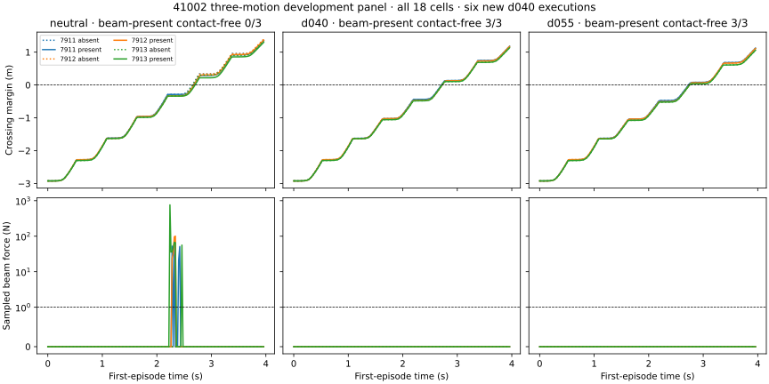

# The fixed beam also admits d040: deep crouch is not necessary

2026-09-06. All six new d040 cells complete with accepted tracking and zero sampled
beam force. At each of seeds 7911–7913, d040 passes both beam-absent and beam-present
first-episode passage. Both registered predictions pass, including the prediction
that d040 can traverse this beam. No failure was replaced or beam adjusted.

| Reference motion | Beam absent: contact-free passage | Beam present: contact-free passage | Present peak beam force |
| --- | ---: | ---: | ---: |
| Upright | 3/3 | 0/3 | 73.6–762.1 N |
| d040 | 3/3 | **3/3** | **0 N** |
| d055 | 3/3 | 3/3 | 0 N |

The upright/d055 rows reuse the original twelve frozen binary-intervention cells;
only the six d040 cells are new. Every cell crosses and stabilizes, with no observed
fall or reset. Upright fails the contact-free criterion through beam contact, not
through inability to cross. Both crouch references pass the unchanged controller.



The [protocol](BEAM_D040_EXECUTION_V1.md) deliberately allowed the intermediate motion
to pass. The user's proposed “d040 scrape/borderline, d055 clear” outcome cannot be
claimed for this nominal beam: **d055 is not necessary relative to the tested d040
reference.** This does not requalify the earlier d040 semantic-effect failures, prove
minimal physical crouch depth, or show that d040 clears every jittered placement.
The separate temporal jitter audit remains mixed for d040.

The full panel has one selected source, one frozen analytic development beam and
three matched physics seeds. Contacts are sampled at 50 Hz with the original >1 N
rejection threshold; crossing uses recorded body origins plus 0.30 s stabilization.
This is neither a continuous-contact guarantee nor learned-generator source transfer.

The six new runs cost **0.051452 contended GPU-hours** (185.226 s summed cell elapsed
time), with no new infrastructure failure. Original controller, motion, scene,
sensor, recorder and prior-result hashes are checked. The report reproduces all
prior binary scores and validates runtime beam transforms, flags, cadence and body
filters for all 18 cells. All first episodes and all contact traces are retained.

Evidence: [complete panel](evidence/d040-beam-execution.json),
[render receipt](assets/middle-progress-receipt.json). Raw data:
`/home/linjiw/research-data/groot-wbc/m2s-d040-beam-execution-v1`.

```bash
PYTHONPATH=. .venv_research/bin/python scripts/research/motion2scene_d040_beam_execution.py \
  prepare --out /path/to/new-d040-output
PYTHONPATH=. .venv_research/bin/python scripts/research/motion2scene_d040_beam_execution.py \
  run --out /path/to/new-d040-output > /path/to/new-d040-output/coordinator.log 2>&1
PYTHONPATH=. .venv_research/bin/python scripts/research/render_motion2scene_icra_progress.py \
  --middle /path/to/new-d040-output/result.json
```

Four focused tests enforce the complete 18-cell denominator and distinguish passage
from tracking. The combined impacted suite passes 43 tests; Black, Ruff and runtime
artifact checks pass. The next depth claim needs a separately frozen height-response
experiment with all alternatives; downstream data labels must retain d040 as feasible
for this scene. See the [ICRA completion plan](ICRA_COMPLETION_PLAN.md).
