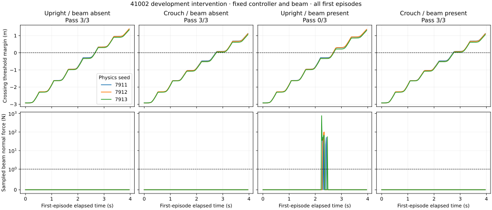

# Fixed-controller beam intervention: contact-free separation

2026-09-06. **The registered development separation criterion passes.** With the
frozen original-clock 41002 walk/d055 pair and release controller, both motions pass
3/3 without the beam. With the frozen beam, d055 passes 3/3 and upright passes 0/3
under the declared contact-free passage criterion. All three upright runs still cross
and stabilize; their failures are prohibited beam contact, not inability to cross.

This completes the execution component of the [bounded counterfactual stage](COUNTERFACTUAL_STAGE_V1.md).
It is one selected source pair, one analytic development beam, and three matched
physics seeds. It does not establish learned-generator execution yield, source-level
generality, minimal crouch depth, or continuous-time clearance.

## Registered outcomes

| Beam condition | Upright contact-free passage | Target d055 contact-free passage |
| --- | ---: | ---: |
| Absent | 3/3 | 3/3 |
| Present | 0/3 | 3/3 |

The four-rate interaction is **Δ_CF = 1.0**. Seeds 7911, 7912 and 7913 are repeated
measurements within one source group. No source-level uncertainty interval or population
success probability is inferred from these counts.

| Seed | Upright peak beam force | Peak-force body | Upright frames >1 N | Crouch peak beam force |
| --- | ---: | --- | ---: | ---: |
| 7911 | 73.574 N | torso_link | 4 | 0 N |
| 7912 | 100.487 N | torso_link | 4 | 0 N |
| 7913 | 762.090 N | torso_link | 7 | 0 N |

Forces are sampled maxima through crossing plus stabilization. Every paired run
completes the geometric crossing/stabilization conditions, with no observed fall or
reset. All six absent runs also record zero beam force. The full-sequence tracker
accepts all nine contact-free successes and rejects all three upright beam-present runs;
that auxiliary verdict remains separate from the registered passage score.

The upper row plots the least-downstream body origin relative to the crossing threshold;
positive values alone do not imply passage success. The lower row plots the maximum
beam-to-body sampled normal force with the registered 1 N threshold. All seeds and
all first episodes are shown, including contact failures. The upright contact spikes
occur before crossing; its later forward progress does not erase those failures.

## Contact controls and the collision contract

The two controls use upright at seed 7910. The raised beam (underside 2.0 m) allows
passage with zero measured beam force. The deliberately intersecting beam (underside
1.1 m) records **131.509 N** peak torso contact, never completes crossing in its first
episode, and resets once during the recording. The control predicate passes. Later
episodes are not substituted for the initial failure.

The runtime recorder successfully captures 199 trajectory frames, synchronized
30-body filtered beam forces at 50 Hz, and a composed native USD collision inventory
for every run. Postprocessing verifies all 14 inventories against the expected beam
position, dimensions, collision-enabled flag, kinematic setting, 30 rigid-body filter
paths, 200 Hz physics cadence and 50 Hz control cadence. The robot inventory contains
26 capsules, one sphere and 18 meshes below collision-marked transforms, with 45 robot
collision declarations. The beam contact offset is 2 mm, rest offset is zero, and
contact-report threshold is zero. The scene has CCD disabled.

This combines imported declarations with positive and negative physical contact
controls. The inventory is not a dump of cooked PhysX shapes, and a contact force is
not a penetration-depth measurement. Forces remain 50 Hz samples. Crossing uses all
recorded body origins, a 0.10 m downstream margin and 0.30 s upright stabilization;
it does not certify that every collider extent has crossed or that no contact occurs
between samples. No trajectories are independently translated to score the fixed beam.

## Frozen scene and resource lineage

The selected analytic `beam_021` was frozen before physics: centre
(2.696616322673983, 0.22645592215640215) m, yaw 0.07179232999993775 rad,
depth × width × thickness 0.1 × 1.2 × 0.1 m, underside 1.2652671813964844 m.
The absent intervention disables beam collision and visibility at the same pose.
The motions, controller checkpoint, scene, thresholds and seeds were not adjusted
after observing any physics result. No scientific refusal was retried or removed.

The [resource-v3 amendment](BEAM_EXECUTION_RESOURCE_V3.md), registered before the first
run, changes only the startup free-memory floor from 9,000 to 7,500 MiB using the
documented trajectory-only precedent and the user's instruction to proceed. It retains
serial execution, 375 seconds per cell and the 1.4583 contended GPU-hour ceiling.
Earlier unexecuted manifests and run records are preserved and hash-bound into v3.

The runner yielded when another workload occupied VRAM. The continuation utility
waited for the registered floor and resumed only unstarted paired cells. It checked
the successful controls and their hashes without rerunning the completed control
batch or rewriting its run record. No other process was stopped.

All **14/14 runs completed**, with **zero infrastructure failures**. Charged execution
cost is **0.130570 contended GPU-hours** (470.05 seconds summed cell elapsed time).
Per-cell median/p90/p95 latency is **31.39/37.69/44.70 seconds**, including startup;
resource waiting and CPU analysis are additional. Fifty memory snapshots covering
part of the paired batch observed at most **3,323 MiB** for our simulator process.
That is a sampled observation, not a complete peak-memory measurement.

Raw outputs, manifests, source hashes, run records, contact arrays, inventories and
memory samples reside in `/home/linjiw/research-data/groot-wbc/m2s-beam-intervention-resource-v3`.
Repository evidence copies retain [controls](evidence/beam-controls-v3.json),
[all twelve paired outcomes](evidence/beam-paired-v3.json), and
[runtime checks, witnesses and costs](evidence/beam-execution-v3.json).
The initial derived summary is retained separately after clarifying the name of its
full-sequence tracker diagnostic; no registered score or verdict changed.

Validation: 23 focused CPU tests pass; four native-geometry tests additionally pass
with Isaac's USD libraries. The ordinary CPU environment skips that optional USD
module. Ruff and Black pass for the reporting script. The report renderer rechecks
artifact hashes and runtime invariants, and its final figure was visually inspected.

## Research decision

Retain this pair as **development-qualified for contact-free binary separation**.
The branch that would return immediately to motion acquisition because native
collision geometry destroyed the interval is not triggered for this pair. The result
does not justify calling d055 necessary relative to shallower alternatives; d040
remains relevant whenever it is a valid executed alternative.

The next execution milestone is source-level qualification: freeze a generator/search
procedure and placement-selection rule before the new outcomes, retain the full
acquisition/refusal funnel, and pursue eight source pairs with three frozen placements
and three physics seeds. The proposed complete design remains 192 runs, with shared
absent controls. A manually adjusted successful beam cannot replace a generated refusal.

On CPU, retain the [analytic quality–coverage competitor](COUNTERFACTUAL_STAGE_V1_RESULT.md)
and implement training-only station-balanced supervision with the existing small
network. The subsequent comparison must charge teacher, fitting, search and audit
cost, preserve the analytic solver's one rejection, and compare yield and reference
coverage across budgets 0/5/9/17. This execution result supplies no evidence yet that
distillation improves that frontier or that generated training data improves selection.
