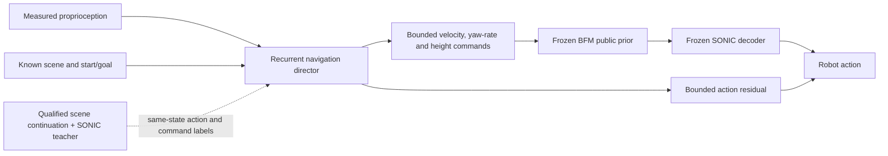

# BFM coverage experiment and scene/navigation implementation — 2026-09-12

The 100-motion experiment completed **12,000 new optimizer updates**, but its final public-prior student completed **1/100 full-command motions and 0/100 navigation-command motions**. This checkpoint is an experimental artifact, not a qualified navigation controller. Scene task preparation and physical teacher qualification now execute end to end; neither of the first two scene probes qualifies.

## Executed foundation experiment

Packet: `/home/linjiw/research-data/m2s-bfm-100motions-20260912`.
Teacher SHA256: `48b3a1c04cdbbcd9ffe8ad10b2591aff781c253c03c61ccb8683348d862c54ed`.
Final student: `fit-2/step-003000.pt`, SHA256 `adfbe78bebb95e5ee269d3ac7af08473fddeca41554588e17e229e7c07f5bc5d`.

| Collection | Attempted motions | Eligible episodes | Retained rows | Control calls / environment transitions | Native completions |
|---|---:|---:|---:|---:|---:|
| Executed teacher, locally supported contiguous prefixes | 100 | 67 | 3,011 | 524 / 52,400 | 64 |
| DAgger round 1, navigation-command student driver | 100 | 100 | 2,503 | 138 / 13,800 | 0 |
| DAgger round 2, full-command student driver | 100 | 100 | 2,816 | 299 / 29,900 | 1 |

The final aggregate contains 267 eligible episodes and 8,330 rows. All attempts, including failed and ineligible motions, remain in the manifests. The teacher prefix screen requires root XY error ≤0.25 m and instantaneous mean body error ≤0.10 m, censors at first unsupported state/native failure, and requires at least 20 rows. Only **two** teacher episodes pass the separate strict whole-motion screen. The executed DAgger screen used a 0.25 m full 3D anchor-distance bound and the same 0.10 m body-error bound; future code now consistently uses the declared XY distance. DAgger queries pass a numerical support screen; they are explicitly **not recovery-qualified** demonstrations. Loader flags enforce those distinctions, including mixed-source aggregates.

Fitting used 6,000 + 3,000 + 3,000 updates, batch 128, AdamW LR 0.0003, KL weight 0.001, prior action weight 0.1, seeds 91210–91212. Each stage warm-started model weights with a fresh optimizer. The selected checkpoint has 12,392 ancestral updates including the earlier 392-update pilot; this experiment itself spent exactly 12,000. No simulator transitions occur in offline fitting. Collection used 96,100 environment transitions / 384,400 physics substeps, excluding final evaluations and initialization/reset overhead.

TF32 was disabled for collection, fitting and final evaluation. Every retained action label was checked through the frozen decoder before each fit. The final aggregate's maximum action discrepancy was 6.68e-6, below the 2e-4 absolute/relative tolerances. The earlier teacher's 63/100 result used different numerics; the new 64/100 is not evidence of a teacher-training improvement.

Final native evaluations, seed 91201, all 100 training motions:

| Public-prior profile | Completed | Mean native progress |
|---|---:|---:|
| Full masked controls | 1/100 (`00490`) | 0.17643 |
| Four navigation controls | 0/100 | 0.17674 |

These are training-set results. No new development fitting or reserved-layout inspection occurred. The original two-motion pilot's result is not a matched baseline for this 100-motion experiment. Low sampled action loss has not established closed-loop reliability. Teacher prefixes average only 45 retained decisions; DAgger episodes average roughly 25–28 supported decisions. Coverage of motion IDs is much broader than coverage of later motion phases. In the entire initial aggregate, only two retained rows occur after the halfway point and none occur in the last quarter. The contiguous-prefix implementation also truncated the two whole-motion-qualified teacher episodes; the collector now retains qualified full episodes alongside prefixes from other motions. This post-experiment correction is regression-tested and was not used to relabel either fitted dataset.

The launch archived research source and configs before execution. A source guard stopped before round 2 because the independent `online.py` scene work changed; a recorded continuation amendment verified unchanged foundation files and executed only the remaining 3,000 updates. No completed stage was retried. The original archive did not include the native wrapper; future runner snapshots now include the wrapper, motion-command implementation and native scorer. The post-experiment source archive is labeled separately.

## Scene/navigation design

BFM motivates masked online distillation with a conditional VAE; its scaling follow-up emphasizes coordinating reference diversity with on-policy rollout quantity. Those support broadening both motion IDs and visited states rather than relying on a larger offline update count. [BFM](https://arxiv.org/abs/2509.13780), [Scaling BFM](https://arxiv.org/abs/2607.15163).

GuideWalk uses navigation guidance plus a locomotion teacher, then DAgger and RL with imitation. Our adaptation is a **qualified continuation selector plus the frozen SONIC reference-tracking teacher**. SONIC alone is not a scene-aware planner. Its reference must already describe a physically feasible response to the requested scene and goal. This is a design inference, not a reproduced GuideWalk result. [GuideWalk methodology](https://arxiv.org/html/2606.10449v1).

| Information | Encoding and role |
|---|---|
| Robot state | Existing 930-value measured proprioceptive history; public |
| Start and goal | Two XYZ vectors expressed in measured pelvis frame; six public values |
| Scene/obstacles | Up to five tokens: center XYZ, full dimensions XYZ, first two orientation columns, box/cylinder/sphere one-hot; validity mask; public known map |
| Navigation requirement | Point goal with fixed 0.25 m tolerance, speed ≤0.1 m/s for 50 control ticks; bounded deadline for episode termination |
| Reference trajectory | Hash-bound candidate continuation; interpolated pelvis targets at 0.2/0.5/1/2 s in measured body frame, with missing-future masks; privileged `label_*` fields only |
| BFM labels | Instantaneous 79-control target and availability mask; four selected navigation controls can directly supervise the director |
| Teacher action | Same-state queried 29-action target with query state/task/teacher/observation hashes and qualification mask |
| Outcomes | Completion, measured goal distance, terminal hold, 200 Hz pair-resolved environment normal forces; failures and censoring retained |

The deployed actor gets no motion ID, reference phase, ground-truth future path or teacher action. Predicted paths could later be an auxiliary model output; currently future trajectory labels are recorded for alignment/audit and future auxiliary objectives, while action and optional command losses train the navigator. The present profile is a known-map prototype, not camera/depth perception, dynamic-obstacle prediction, variable goal-heading conditioning or deadline-conditioned control. The native scene author supports boxes/beams and spheres; the observation encoder also supports cylinders. More than five obstacles is rejected.

Task identity separates public requests from training-only continuation identity. `QualifiedSceneRegistry.select_request` can select a fixed, physically qualified continuation for an identical public request; the caller then loads that exact native reference before constructing the runtime. There is no unqualified mid-episode reference splice or general replanning claim.

## Materialized tasks and executed scene probes

Use `/home/linjiw/research-data/m2s-bfm-navigation-tasks-v2-20260912`: **200 tasks and 200 physics USDs**, all 100 training motions × three/five obstacles. Earlier dataset USDs had only a non-colliding display floor. New scenes preserve obstacle geometry, add a z=0 support floor, and omit reference-animation assets. Original source scenes remain hash-bound and unchanged. The earlier task/probe preparation directories are superseded; they were not physically executed.

These nested scene pairs share the same reference. They are robustness controls, **not route-choice evidence**. To train navigation decisions, the next dataset must contain:

1. Same measured start and goal, changed obstacles requiring a different physically qualified continuation.
2. Same scene/start, changed goal requiring a different continuation.
3. Multiple qualified continuations for a public request, with one fixed expert choice per episode to avoid averaging incompatible actions.
4. Distinct held-out motion groups and scene families, with goal-only/no-scene, shuffled-scene and residual-disabled ablations.

All 100 motions remain useful foundation candidates. Not every motion is a meaningful point-goal navigation demonstration: stationary, interaction, and return-to-start clips can be ambiguous from start/goal alone. Such clips require appropriate task semantics or remain foundation-only; a motion ID cannot be silently supplied to resolve the ambiguity.

Probes: `/home/linjiw/research-data/m2s-bfm-scene-probes-v2-20260912`. Two previously reliable training motions were tested in their three-obstacle scenes with an explicitly new 1.2-second final-pose hold. Read **`scene-qualification-corrected.json`**, not the superseded initial receipts.

| Motion | Native tracking complete | Mean body error | Final goal distance | Max undesired normal contact | Qualified |
|---|---|---:|---:|---:|---|
| 00185 | Yes | 0.14285 m | 0.35236 m | 0 N | No: tracking, goal and hold checks fail |
| 00490 | Yes | 0.09526 m | 0.07522 m | 352.46 N | No: environment contact fails |

For 00490, the peak was the right shoulder yaw link against obstacle 2 at physics sample 263 (about 1.315 s). This is a measured collision despite reference-clear scene geometry. Allowed contact is foot–floor support; any body–obstacle or nonfoot–floor normal force above 1 N rejects the probe. The collector records all 30 articulation bodies against the floor and each obstacle at every 0.005 s physics substep, with native path/filter mappings. These are normal-force measurements, not friction-force measurements. No qualified navigation dataset or navigation optimizer/RL run was produced.

## Trajectory-role correction

The native wrapper returned `robot_body_pos_w` under `ref_body_pos_extend` and `body_pos_w` under `rigid_body_pos_extend`. The mapping is fixed, with an executable method regression test. Previously saved `reference`/`tracked` fields must be swapped for this native wrapper's runs. Completion counts and symmetric position errors are unchanged; visualization labels and asymmetric goal/stopping checks were affected.

Corrected five-video packet: `/home/linjiw/research-data/m2s-sonic-qualification-role-correction-20260912/index.html`. Original evaluation data and videos remain intact. The correction receipt binds each original and corrected NPZ. Corrected scene receipts retain the original evidence and identify the superseded receipt. This correction did not require new physics or fitting.

## Implementation and next training gate

- `collect.py`: contiguous supported teacher prefixes, explicit DAgger query roles, optional seeded teacher interventions.
- `experiment.py`: fixed three-stage 100-motion collection/fit/evaluation, all-label parity audits, source/config provenance and wall/update caps.
- `tasks.py`: task validation, known-map USD generation, public request keys and masked privileged trajectory labels.
- `scene_env.py`, `scene_qualification.py`, `prepare_scene_probe.py`: native contact sensors, physical receipt scoring and bounded terminal-hold probes.
- `online.py`, `train.py`: task/reference binding, label collection and optional normalized command supervision (`navigation_command_weight`).
- Existing residual distillation/PPO code keeps the foundation/decoder frozen, initializes action residuals at zero, bounds them per joint and penalizes magnitude/smoothness. It remains physically unqualified.

The next bounded experiment should collect mixed teacher/student rollouts using the implemented `teacher_probability` and fixed `intervention_seed`, to reach later phases before reducing assistance. Compare prior-focused fitting against the present prior weight using matched collections and physical evaluations. A separate 0.8-intervention, 3,000-update follow-up is reported below; its accounting is separate from the completed 12,000-update experiment. Broader motion coverage requires reporting both covered IDs and temporal coverage; scene training additionally requires valid changed-scene/goal teachers. Residual PPO starts only after a public-prior command controller and scene task pass their physical gates.

Validation: focused tests include prefix censoring, future-label frames/masks, public-input exclusion, command-director gradients, exact optimizer continuation, residual bounds/GAE, contact-pair rejection, missing physics samples and native trajectory roles. Commands and final counts are in the packet's validation receipt.

## Separately bounded assisted follow-up

Packet: `/home/linjiw/research-data/m2s-bfm-assisted-20260912`. The follow-up completed another **3,000 updates**, bringing this work session to **15,000 new optimizer updates**, with no automatic retries. It used the previous final checkpoint, 80% seeded teacher interventions, 524 control calls / 52,400 collection transitions, the same 100 training motions, and prior action weight 1.0. The realized intervention count was 41,867/52,400. All-label FP32 parity passed before fitting.

This collection yielded 4,488 supported rows across 100 motions. Its 49 native completions occurred under the mixed teacher/student driver and are not standalone student successes. Reference-quarter coverage was 3,488 / 611 / 295 / 94 retained rows, spanning 100 / 19 / 10 / 4 motions respectively. Assistance therefore improved late-phase data coverage, but most motions still lack later-phase labels.

Unassisted evaluation of the follow-up student completed **0/100 full-command and 0/100 navigation-command motions**, with mean progress 0.17499 and 0.17518. It is not promoted over the earlier 1/100 full-command checkpoint. The follow-up changed assistance, prior loss weight and the declared XY support screen; it is an exploratory remedy, not an isolated causal ablation. More updates on this distribution are not justified by these results. The next training design must preserve qualified full demonstrations, obtain reliable later-phase/recovery supervision, and measure standalone command control before scene distillation or residual PPO.

Final validation: **64 focused tests passed**; scoped Black, Ruff E/F/I and whitespace checks passed. No training or simulation job remains running after finalization.
