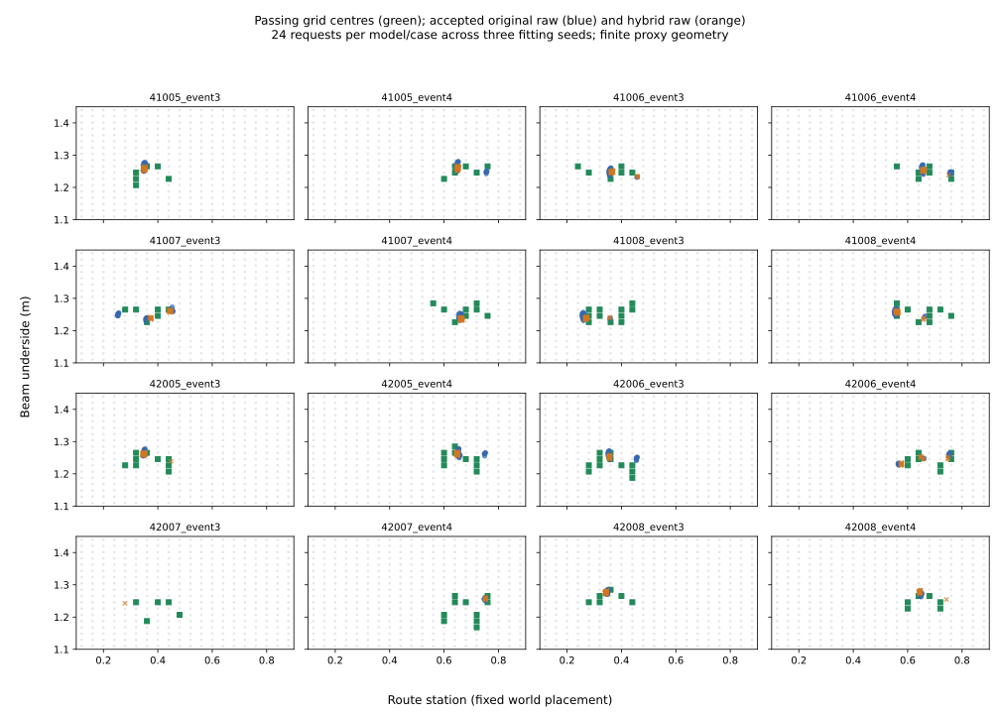

# Counterfactual stage: development results

The [cached native geometry audit](NATIVE_BEAM_AUDIT_V1_RESULT.md) now retains the frozen beam’s two margins on all six recorded 41002 rollouts at all 81 placements. The tightest target clearance is **13.535 mm**, including outer hand-mesh geometry; the weakest upright native-primitive interference is **12.175 mm**. This earlier audit uses existing empty-scene recordings. The subsequent [14-run physics intervention](BEAM_EXECUTION_V3_RESULT.md) now passes the registered contact-free separation test.

2026-09-06. The [next-stage plan](COUNTERFACTUAL_STAGE_V1.md) is registered and its bounded
CPU and selected-pair execution milestone is complete. Both motions pass 3/3 without
the beam; with it, d055 passes 3/3 and upright fails contact-free passage 3/3. Upright
still crosses but contacts the beam. The [execution report](BEAM_EXECUTION_V3_RESULT.md)
retains all fourteen runs, controls, forces and costs. This is development qualification
of one analytic beam and one source pair, not learned-generator execution yield,
fresh-source execution transfer or successful coverage-aware distillation.

## What changed the next research decision

The retained teacher misses independently passing station bins in **24/24 training
cases**. Its 58 placements cover **33.6%** of passing reference station bins on average.
This directly supports investigating teacher support; it does not prove that teacher
coverage alone causes every student failure.

A stronger analytic solver is now competitive at the same online geometry-query cost.
It uses target/upright capsule geometry and the route, without event IDs or a network.
Its distinct-output version accepts **127/128 unique within-case placements** and reaches
**99.0% reference station coverage**, versus the historical learned pattern system's
**384/384 acceptance and 37.3% coverage**. Both request eight outputs per job and use
6,884 online queries including final audit and crosscheck. Analytic generation is
deterministic (16 jobs); learned results include three fitting seeds (48 jobs). All
comparisons involve the same eight observed development source groups and two event
locations per source. They are not new-source confirmation.

This is a quality–coverage tradeoff. The distinct analytic solver **fails its exact-yield
prediction**, so retain both solvers. A learning advantage for this simple two-parameter
beam family must now be demonstrated against this stronger analytic competitor.
Do not increase model size or launch a distillation sweep before incorporating it.

## Reference maps and coverage

We independently evaluated **14,400 grid centres**: 20 station × 18 height centres
for each of 24 training and 16 development cases, at all 113 audit offsets. No map was
empty. Full scores for both constraints, raw outputs and hash references are retained.
These centres are finite geometric witnesses, not certified cells or feasible-volume
estimates. A passing output in a bin absent from the grid support remains a valid
output; its presence exposes the grid's finite resolution.

Coverage is the fraction of passing reference station bins reached by independently
accepted outputs, averaged over fixed eight-request jobs. Teacher support is a separate
diagnostic using the entire retained set per training case. No training teacher is
compared to a different development case as though they shared one feasible set.

| Method | Accepted / requested | Mean reference station coverage | Online queries / 8 requests |
| --- | ---: | ---: | ---: |
| Original raw | 292/384 | 21.8% | 2,260 |
| Existing hybrid raw | 334/384 | 23.2% | 2,260 |
| Original learned pattern17 | 384/384 | 37.3% | 6,884 |
| Hybrid pattern5 | 377/384 | 30.5% | 3,620 |
| Analytic envelope + pattern17 | 103/128 | 69.0% | 6,884 |
| Analytic global, repeated winners | 128/128 (84 unique) | 99.0% | 6,884 |
| Analytic global, distinct outputs | 127/128 (128 unique requested) | 99.0% | 6,884 |

The existing hybrid's reference-relative raw coverage change is **+1.39 percentage
points**, with a descriptive paired-source bootstrap 95% percentile interval of
**[-0.31, +2.88] points** (eight source groups, 10,000 resamples). The previously reported
drop in ordinary accepted 2D-bin occupancy therefore does not establish a drop under
every useful coverage metric. Keep both measurements; do not replace the original result.



The original/hybrid output coordinates and audit labels are inherited from the frozen
distillation experiment. Today's new work evaluates the reference maps and analytic
outputs. The plot uses 24 requests per model/case across three fitting seeds; the
statistical unit is still the source group. See [all source-level coverage data](evidence/coverage-diagnostic.json).

## Analytic development sequence and the preserved failure

The first analytic arm selected promising stations from top-envelope separation, then
used the existing bounded local search. It accepted 103/128 outputs, motivating
[a separately registered global solver](ANALYTIC_GLOBAL_V1.md). Global exploration uses
six height probes at each of 20 stations and 16 nominal-height probes: exactly 136
candidates, each checked at the existing 17 search offsets. Its first selection rule
cycles through passing station winners. The 128/128 count includes duplicate requests
and must not be described as 128 distinct scenes; raw [global results](evidence/analytic-global.json)
preserve the 84 unique placements.

Inspection of search traces found 12–26 distinct passing candidates per case, so
[a separately registered selection correction](ANALYTIC_DISTINCT_V1.md) cycles through
stations and takes the next distinct passing candidate. It reran all candidate geometry
from scratch and independently audited the eight selected outputs. Neither variant uses
the final audit or reference map to rank candidates. Both are development choices made
after earlier results, not pre-acquisition confirmation.

The distinct solver's one failure is `41005_event3`, output index 7:

- Station **0.44000000000000006**, underside **1.237078275263784 m**.
- Search worst-margin slack: **+0.3117 mm**.
- Independent target minimum clearance: **23.6082 mm**, passing.
- Independent upright worst clearance: **-9.8494 mm**, missing the required **-10 mm**.

The final audit rejects that output. No adjustment or retry was made. This is a concrete
example of why passing the search offsets cannot replace independent verification.
See [distinct solver results and raw references](evidence/analytic-distinct.json).

| Source | Analytic distinct accepted / requested |
| --- | ---: |
| 41005 | 15/16 |
| 41006 | 16/16 |
| 41007 | 16/16 |
| 41008 | 16/16 |
| 42005 | 16/16 |
| 42006 | 16/16 |
| 42007 | 16/16 |
| 42008 | 16/16 |

## Execution preparation and limits

The 205 model channels contain 29 target capsules × 7 values, route progress and time.
They omit the alternative. This is a restricted target-only conditional model with a
fixed alternative construction; pair/set conditioning remains needed if alternatives vary.

The old diagnostic USD is an illustration with no collision schema. The new scenes
retain the original floor and surroundings and add a fixed kinematic collision beam.
The registered present/absent pair changes beam collision and visibility only. Both
share its world pose, sensors and controller. Separate raised/lowered controls test
beam-specific contact observation before the 12 paired runs at seeds 7911–7913.

USD parsing verified the beam's pose, dimensions, rigid/kinematic settings and present/
absent collision flags. Inspection of the cached imported robot found **26 capsules,
one sphere, and 18 wrist/hand meshes below collision-marked transforms**. The proxy
checker instead uses 29 capsules and does not represent those meshes. Runtime capture
now traverses instance proxies and includes descendant meshes, physics attributes,
filter relationships and transforms. Cached asset inspection does not establish which
cooked PhysX shapes/filters are active in the future run.

An opt-in environment/recorder adds beam-to-robot filtered normal forces at 50 Hz.
The primary scorer uses the first episode and shared world frame, requires all recorded
body origins to cross and stabilize, and rejects observed beam force >1 N. This remains
a sampled-contact/body-origin passage definition, not continuous zero contact or full
collider-extent crossing. Missing or nonfinite contacts fail closed. Contact, crossing,
stabilization and fall flags are separate from the existing full-trajectory tracker verdict.
The Isaac instrumentation is now runtime validated in all fourteen registered runs,
including positive and negative beam-contact controls.

Earlier manifests passed hash/start-pose preflight but yielded below 9,000 MiB free.
Those unexecuted records remain preserved. Before the first physics run, the
[resource-v3 amendment](BEAM_EXECUTION_RESOURCE_V3.md) registered a 7,500 MiB floor
using the trajectory-only precedent and the user's instruction to proceed. All fourteen
runs completed with unchanged scientific parameters and no infrastructure failures.
See [current execution status](evidence/beam-intervention-status.json).

## Cost and reproducibility

| New experiment | Whole-motion geometry queries | Wall time | GPU time |
| --- | ---: | ---: | ---: |
| Reference maps, including crosschecks | 4,068,000 | Included in diagnostic below | 0 |
| Maps + first analytic baseline | 4,178,144 | 778.91 s | 0 |
| Analytic global, repeated winners | 110,144 | 24.66 s | 0 |
| Analytic global, distinct outputs | 110,144 | 22.42 s | 0 |
| Cached native geometry audit | 486 | 2.78 s | 0 |
| Beam intervention, 14 runs | Not geometry-query work | 470.05 s summed cell time | 0.13057 contended GPU-h |

The first row is a component of the second, not additive. Total new experimental
geometry cost including the cached native audit is **4,398,918 queries**. Static inspection, implementation, tests and
reporting time are additional. These diagnostics do not train a teacher/student.
No runtime advantage over historical learned wall times is claimed. Per-job latency
and each preprocessing/search/audit component remain in the raw results.

Each eight-output job pays 1,808 audit queries plus 452 Torch crosscheck queries.
Thus 17→5 search evaluations reduce online totals from 6,884 to 3,620 queries, **47.4%**.
The 50.7% illustration excludes crosschecking and 70.6% concerns search alone.
Offline fitting/teacher costs must additionally be charged when comparing deployment costs.

Primary artifacts live under `/home/linjiw/research-data/groot-wbc/`:
`m2s-coverage-diagnostic-v1`, `m2s-analytic-global-v1`, `m2s-analytic-distinct-v1`, and
`m2s-native-beam-audit-v1` and `m2s-beam-intervention-resource-v3`. The coverage experiment's executed source files were
archived before Black formatting; `frozen_source_manifest.json` and
`formatting_receipt.json` verify identical Python ASTs and both hashes. Original
registrations/results were not rewritten. Other prior experiment sources are unchanged.

Validation:

```bash
PYTHONPATH=. .venv_research/bin/pytest -q \
  tests/dataset_generation/test_motion2scene_coverage.py \
  tests/dataset_generation/test_motion2scene_passage.py \
  tests/dataset_generation/test_motion2scene_analytic_global.py \
  tests/dataset_generation/test_motion2scene_analytic_distinct.py \
  tests/dataset_generation/test_motion2scene_station_search.py \
  tests/dataset_generation/test_motion2scene_distillation.py
```

**23 tests passed.** Ruff passes on every newly added Python file. Black formatting,
Isaac-module syntax compilation, static USD parsing and both manifest preflights pass.
The report figures were rendered and visually inspected. Four additional native-geometry
tests pass with Isaac USD libraries, and all fourteen registered physics runs completed.

Execution is complete. The [execution report](BEAM_EXECUTION_V3_RESULT.md) links the
immutable control/paired results and the resource lineage. Do not rerun completed
batches into their existing output directories. The standalone report renderer verifies
existing artifact hashes and recreates the plots without changing registered scores.

## Next decision

The 41002 pair passes development contact-free separation, so the immediate failure
branch is not triggered. Next, freeze generated placements for source-level execution
and retain acquisition refusals before selecting the qualified subset.
For CPU work, freeze the distinct analytic solver as a serious comparator before
coverage-aware fitting. The teacher-support deficit warrants station-balanced supervision,
but the analytic frontier substantially raises the bar for a neural beam generator.
A later frozen comparison must retain unique accepted yield, station coverage, the
worst-source table, total costs and new-source grouping. Do not call the analytic
solver a complete replacement while its exact-yield prediction remains false.
