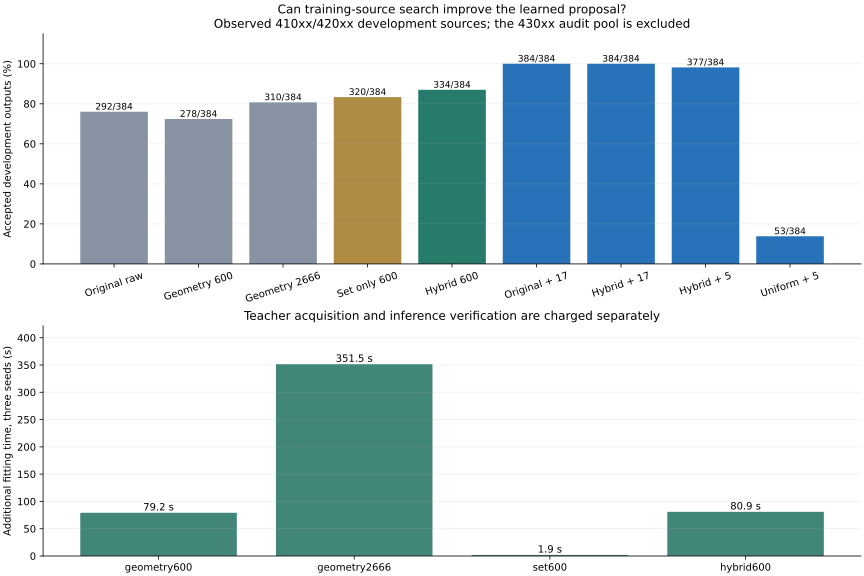

# Search distillation: completed development pilot v1

2026-09-05. This is a **new learning experiment on previously observed development sources**, not another fresh-source confirmation. No 430xx source is loaded, trained on or evaluated. The [protocol](DISTILLATION_V1.md), implementations, source roles and predictions were frozen before teacher generation.

Registration: `sha256:10472587ce58e44c4a737bafc2d6de5eedad18dee88dafb10443f08356ede2f9`. All stages completed without new motion generation, GPU use, replacement targets, reruns or post-result tuning.

## Main result

Hybrid raw proposals accept **334/384**, versus **292/384** for the original model, **278/384** for 600 additional geometry updates, **310/384** for the stronger 2,666-update query control, and **320/384** for set-only distillation.

With correction, hybrid five-evaluation search accepts **377/384**, original seventeen-evaluation search **384/384**, hybrid seventeen-evaluation search **384/384**, and uniform five-evaluation search **53/384**. Five evaluations spend 1,360 queries per job versus 4,624 for seventeen, a fixed **70.6% search-query reduction**. Whether acceptance is preserved is adjudicated source by source below.

One source supplies two excluded event phases, three original checkpoint seeds and eight requested outputs: 48 outputs per arm. There are eight source groups and 384 outputs per arm. All model variants keep the original architecture and training-only normalization.

| Method | 41005 /48 | 41006 /48 | 41007 /48 | 41008 /48 | 42005 /48 | 42006 /48 | 42007 /48 | 42008 /48 | Total /384 |
|---|---:|---:|---:|---:|---:|---:|---:|---:|---:|
| Original raw | 46 | 43 | 44 | 46 | 40 | 39 | 7 | 27 | 292 |
| Geometry 600 | 41 | 48 | 43 | 48 | 31 | 34 | 1 | 32 | 278 |
| Geometry 2666 | 48 | 47 | 48 | 47 | 43 | 39 | 7 | 31 | 310 |
| Set only 600 | 46 | 48 | 42 | 43 | 46 | 46 | 5 | 44 | 320 |
| Hybrid 600 | 48 | 48 | 45 | 47 | 48 | 45 | 9 | 44 | 334 |
| Original + 17 | 48 | 48 | 48 | 48 | 48 | 48 | 48 | 48 | 384 |
| Hybrid + 17 | 48 | 48 | 48 | 48 | 48 | 48 | 48 | 48 | 384 |
| Hybrid + 5 | 48 | 48 | 47 | 48 | 48 | 48 | 46 | 44 | 377 |
| Uniform + 5 | 4 | 7 | 6 | 9 | 7 | 7 | 8 | 5 | 53 |



## All prospective predictions

| Prediction | Result |
|---|---|
| `P0_all_teacher_cases_nonempty` | True |
| `P1_hybrid_raw_no_source_loss_and_total_gain` | True |
| `P2_hybrid_raw_beats_query_control` | False |
| `P3_reduced_search_no_source_loss` | False |
| `P4_raw_accepted_bin_mean_preserved` | False |

| Source | Hybrid raw − original raw | Hybrid raw − query control | Hybrid 5 − original 17 |
|---|---:|---:|---:|
| 41005 | 2 | 0 | 0 |
| 41006 | 5 | 1 | 0 |
| 41007 | 1 | -3 | -1 |
| 41008 | 1 | 0 | 0 |
| 42005 | 8 | 5 | 0 |
| 42006 | 6 | 6 | 0 |
| 42007 | 2 | 2 | -2 |
| 42008 | 17 | 13 | -4 |

P1 and P2 require no source-count loss and a strict total gain. P3 permits ties but no source-count loss. P4 requires preserved mean accepted-bin occupancy; it is not a coverage guarantee. These are descriptive predictions, not significance or noninferiority tests. No model/checkpoint is selected after observing this panel.

## Teacher acquisition and self-supervision

All **24** original training cases yield a nonempty teacher set. Of **192** corrected candidate placements, **106** pass independent checking. Bin deduplication retains **58** targets across the 24 cases. Every failure is retained. Teacher construction takes **34.755 s**, including search and independent checking.

The teacher uses the original 8421 checkpoint for all students, four learned starts, two uniform starts and two starts stratified over route halves. Every source is an original TRAINING source (41001–41004 or 42001–42004), with phases 0.25, 0.50 and 0.75. Evaluation phases 0.35 and 0.65 do not enter the teacher. A shared teacher is an explicit asymmetry across student seeds.

Geometric search constructs supervisory scene coordinates from motion pairs without human obstacle labels. Set-only learning and hybrid learning use a softened weighted energy distance between sampled proposals and retained target sets. This is sample matching, not a likelihood for the bounded decoder or an estimate of natural scene frequency. The hybrid adds ten times this term to the existing geometric/preference objective; no weight sweep is performed.

| Training case | Accepted /8 | Retained bins |
|---|---:|---:|
| 41001_event0 | 5 | 2 |
| 41001_event1 | 4 | 3 |
| 41001_event2 | 6 | 3 |
| 41002_event0 | 5 | 3 |
| 41002_event1 | 4 | 4 |
| 41002_event2 | 5 | 3 |
| 41003_event0 | 4 | 1 |
| 41003_event1 | 4 | 2 |
| 41003_event2 | 4 | 3 |
| 41004_event0 | 4 | 1 |
| 41004_event1 | 4 | 1 |
| 41004_event2 | 5 | 3 |
| 42001_event0 | 5 | 4 |
| 42001_event1 | 4 | 4 |
| 42001_event2 | 4 | 2 |
| 42002_event0 | 4 | 2 |
| 42002_event1 | 4 | 1 |
| 42002_event2 | 5 | 2 |
| 42003_event0 | 5 | 3 |
| 42003_event1 | 4 | 2 |
| 42003_event2 | 4 | 2 |
| 42004_event0 | 4 | 2 |
| 42004_event1 | 4 | 2 |
| 42004_event2 | 5 | 3 |

## Training and query accounting

| Arm | Updates per student | Teacher queries charged per student | Geometry training queries per student | Total fitting seconds, 3 seeds |
|---|---:|---:|---:|---:|
| geometry600 | 600 | 0 | 48,000 | 79.188 |
| geometry2666 | 2666 | 0 | 213,280 | 351.517 |
| set600 | 600 | 165,216 | 0 | 1.912 |
| hybrid600 | 600 | 165,216 | 48,000 | 80.932 |

The common teacher costs **165,216** clearance queries: 110,976 search, 43,392 NumPy audit and 10,848 Torch crosscheck. It is constructed once in the actual experiment, but its full cost is charged to EACH distilled student for the budget comparison. Hybrid per-student teacher-plus-training cost is **213,216**; the geometry2666 control spends **213,280**, 64 more. Geometry600 matches update count, not total queries. Set-only distillation spends no geometry queries during fitting, but teacher acquisition is not free.

Actual additional geometry training across all twelve fits: **927,840** queries. The entire fitting stage takes **514.473 s**. Three original all8/1200 checkpoints are reused; their historical combined fitting time was 161.705 s and is not counted as new training.

## Evaluation cost and failure types

| Method | Search queries/job | Search seconds, 48 jobs | Audit seconds, 48 jobs | Target failures /384 | Neutral failures /384 | Mean accepted bins/job |
|---|---:|---:|---:|---:|---:|---:|
| Original raw | 0 | 0.000 | 20.456 | 31 | 62 | 2.125 |
| Geometry 600 | 0 | 0.001 | 20.501 | 35 | 71 | 1.750 |
| Geometry 2666 | 0 | 0.001 | 20.519 | 24 | 50 | 1.938 |
| Set only 600 | 0 | 0.001 | 20.506 | 17 | 47 | 1.938 |
| Hybrid 600 | 0 | 0.001 | 20.509 | 6 | 44 | 2.021 |
| Original + 17 | 4,624 | 33.731 | 20.481 | 0 | 0 | 3.208 |
| Hybrid + 17 | 4,624 | 34.017 | 20.498 | 0 | 0 | 3.000 |
| Hybrid + 5 | 1,360 | 10.035 | 20.424 | 2 | 5 | 2.521 |
| Uniform + 5 | 1,360 | 9.835 | 20.119 | 191 | 217 | 1.083 |

Failures can violate both margins. Requested-output denominators include rejected samples; no accepted-only rate is presented. Accepted-bin occupancy can decrease as proposals concentrate and does not measure feasible-support coverage. Times are local shared-CPU measurements, not deployment latency guarantees.

All **432** arm/job rows and **3,456** outputs receive the same 113-placement audit. Evaluation search costs **574,464** queries, independent NumPy checking **781,056**, and Torch crosschecks **195,264**. Maximum NumPy/Torch difference is **3.05e-16 m**, within the frozen 1e-8 m threshold. Full evaluation takes **272.872 s**; shared sampling takes 0.061 s and checkpoint setup 0.013 s.

## Both phases and all fitting seeds

| Method | Original seed | Phase 0.35 /64 | Phase 0.65 /64 | Total /128 |
|---|---:|---:|---:|---:|
| Original raw | 8421 | 47 | 43 | 90 |
| Original raw | 8422 | 45 | 60 | 105 |
| Original raw | 8423 | 49 | 48 | 97 |
| Geometry 600 | 8421 | 54 | 43 | 97 |
| Geometry 600 | 8422 | 49 | 50 | 99 |
| Geometry 600 | 8423 | 50 | 32 | 82 |
| Geometry 2666 | 8421 | 44 | 57 | 101 |
| Geometry 2666 | 8422 | 56 | 48 | 104 |
| Geometry 2666 | 8423 | 53 | 52 | 105 |
| Set only 600 | 8421 | 45 | 52 | 97 |
| Set only 600 | 8422 | 55 | 60 | 115 |
| Set only 600 | 8423 | 53 | 55 | 108 |
| Hybrid 600 | 8421 | 54 | 53 | 107 |
| Hybrid 600 | 8422 | 56 | 61 | 117 |
| Hybrid 600 | 8423 | 55 | 55 | 110 |
| Original + 17 | 8421 | 64 | 64 | 128 |
| Original + 17 | 8422 | 64 | 64 | 128 |
| Original + 17 | 8423 | 64 | 64 | 128 |
| Hybrid + 17 | 8421 | 64 | 64 | 128 |
| Hybrid + 17 | 8422 | 64 | 64 | 128 |
| Hybrid + 17 | 8423 | 64 | 64 | 128 |
| Hybrid + 5 | 8421 | 64 | 59 | 123 |
| Hybrid + 5 | 8422 | 64 | 64 | 128 |
| Hybrid + 5 | 8423 | 63 | 63 | 126 |
| Uniform + 5 | 8421 | 0 | 9 | 9 |
| Uniform + 5 | 8422 | 16 | 0 | 16 |
| Uniform + 5 | 8423 | 27 | 1 | 28 |

## Research decision and limits

The registered recipe does not satisfy all of the raw-proposal and reduced-search source-wise criteria. Retain the failed criteria and source deltas. Investigate the teacher-set distribution, source-specific geometry and sample concentration on development data before spending on another fresh confirmation. Do not promote a pooled gain into a claim of uniform transfer or silently increase the search budget.

This experiment evaluates the beam/crouch reference family with a 29-capsule, 13-link proxy and finite sampled time/placement checks. It does not establish continuous collision guarantees, imported-body containment, motion tracking through obstacles, natural scene statistics or policy benefit. Those contracts require separate experiments. The [deep dive](RESEARCH_DEEP_DIVE.md) explains the mathematical and experimental route to complex 3D scenes.

## Reproduce and inspect

```bash
PYTHONPATH=. .venv_research/bin/python scripts/research/motion2scene_distill_study.py register \
  --out /home/linjiw/research-data/groot-wbc/m2s-distillation-v1
PYTHONPATH=. .venv_research/bin/python scripts/research/motion2scene_distill_study.py teacher \
  --registration /home/linjiw/research-data/groot-wbc/m2s-distillation-v1/registration.json
PYTHONPATH=. .venv_research/bin/python scripts/research/motion2scene_distill_study.py fit \
  --registration /home/linjiw/research-data/groot-wbc/m2s-distillation-v1/registration.json
PYTHONPATH=. .venv_research/bin/python scripts/research/motion2scene_distill_study.py evaluate \
  --registration /home/linjiw/research-data/groot-wbc/m2s-distillation-v1/registration.json
PYTHONPATH=. .venv_research/bin/python scripts/research/render_motion2scene_distillation.py \
  --result /home/linjiw/research-data/groot-wbc/m2s-distillation-v1/result.json
```

Existing stages reject overwrites. Reproduction needs the pinned old motion banks and checkpoints in addition to the source snapshot; they are not all bundled in GitHub Pages. Full NPZ traces and checkpoints remain in the local `m2s-distillation-v1` research-data directory.

Validation: **92 impacted tests pass**, including set-matching gradients, mixture-weight learning, empty teacher handling and five-call search versus the original prefix. The renderer regenerates every learned/uniform initial draw, verifies checkpoint normalization, reconciles every trace incumbent, teacher retention set, query total, source count and registered predicate. Black/Ruff and website checks are recorded in the publication report.

Inspect [all evaluation rows](evidence/distillation.json), [teacher funnel](evidence/distillation-teacher.json), [all fits](evidence/distillation-fits.json), [registration](evidence/distillation-registration.json) and [export hashes](assets/distillation-manifest.json).
