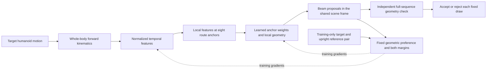

# Next model design: preserve where adaptation occurs

Status: broader architecture proposal; a minimal implementation has now been evaluated
in the separately registered [event/scale study](EVENT_SCALING_V1_RESULT.md).
This design responds to the input-sensitivity diagnosis in the
[grouped carrier experiment](CARRIER_LEARNING_V1_RESULT.md). Keep that experiment's
protocol, checkpoints and failures unchanged. A separate registration is required before
comparing this design with it.

The [event and scale protocol](EVENT_SCALING_V1.md) now freezes a minimal implementation
of this design: 64 encoded route samples, eight local proposal intervals, a normalized
temporal encoder, and separate input/compute/width/data controls. Its
[result report](EVENT_SCALING_V1_RESULT.md) records completion and outcomes. The original
design below is broader than that implementation; velocities, body-region pooling and
masked-motion pretraining are still proposals.



The inference network needs only the target motion. The independent acceptance check
also uses its matched alternative when asserting a motion-preference relationship;
target-only clearance is a different, weaker claim. Every proposal remains subject to
the unresolved body, time and placement contracts described below.

## Research question

Can a motion-only network learn **which part of a motion explains an obstacle**, then
propose obstacle geometry that preserves the target and excludes a qualified alternative?
The model should learn location-dependent proposals through geometric feedback. A larger
global encoder is not the next discriminating experiment.

The existing temporal CNN ends in one global average. Its input contains route position,
so pooling does not mathematically prohibit location learning. However, localized motion
differences can be attenuated, and saturated features can make the output insensitive to
them. A failed pooled model alone cannot distinguish architecture, optimization and data
limitations. Test those explanations with controls rather than claiming a proven cause.

## Minimal implementation

Keep the beam family, explicit 10 mm clearance/interference margins, fixed geometric
decoder and independent rejection checker. Replace only the proposal representation.

1. Derive capsule geometry with forward kinematics. Represent each body part using its
   root-relative midpoint, axis, radius and velocity; retain the root's shared-world
   route and vertical position separately. Include normalized elapsed time and route
   progress as explicit features. Use the same scene transform for target and alternatives.
2. Encode body identity and local geometry with a shared MLP and body-region aggregation.
   Use normalized temporal residual blocks to retain a sequence of features. Do not reduce
   this sequence to one vector before predicting obstacle location. These are proposed
   engineering choices; neither normalization nor a particular activation is a guarantee.
3. Resample encoded features at a fixed set of route-progress anchors covering the allowed
   station domain. Each anchor predicts a logit, a bounded local station offset, and a
   small conditional height distribution. Scene station is the anchor plus its offset;
   scene height comes from the learned distribution. No annotated crouch center, analytic
   feasible height interval or obstacle-placement label enters the network or loss.
4. Train the anchor mixture using the same independent target/alternative geometry and
   preference costs. Use stratified samples across anchors so a collapsed categorical
   distribution cannot silently stop evaluating other parts of the motion. Record the
   probability mass, valid support and gradient contribution per anchor.
5. At inference, sample the categorical anchor and its geometry from the target sequence.
   Check the full sequence and every relevant body against every object. A local feature
   predicts a proposal; it does not restrict the time/body interval being checked.

For anchor index `a` and continuous local geometry `z`, the proposal is

```text
q_theta(scene | motion)
  = sum_a pi_theta(a | motion) q_theta(z | local_sequence_at_a, motion)
scene = fixed_route_builder(anchor_a + bounded_offset(z), height(z))

L = sum_a pi_theta(a | motion) E_z[
      preference_loss + 5 * target_margin_loss + 5 * alternative_margin_loss
    ]
```

The sum over anchors supplies a differentiable expected loss for categorical weights;
reparameterization supplies gradients through each continuous proposal. Keep uncertainty
perturbations and rejected proposals in the accounting. An exploration floor, entropy
term or KL prior changes this objective/distribution and must be a declared ablation,
not a hidden rescue after observing failure.

For the first comparison, use a small fixed anchor set and budget by **geometry queries**,
not only optimizer steps. Evaluating more anchors costs more than the old four-component
mixture. Include preprocessing, fitting, sampling and independent verification when
testing amortization. Choose anchor count, network width, initialization and budgets using
training-only engineering checks, then freeze them before reporting excluded groups.

## Controls that distinguish explanations

| Comparison | What it can resolve |
|---|---|
| Existing pooled model with input normalization and matched geometry budget | Whether a simple optimization/conditioning repair suffices |
| Anchor model with constant local features, retaining the same anchor builder | Whether learned features help beyond hand-designed location coverage |
| Correct versus shuffled training inputs, and swapped event at evaluation | Whether the learned output depends usefully on event identity |
| Motion-derived analytic envelope search | Whether a deterministic event/geometry extractor already solves the family |
| Fixed-budget per-motion search | Whether amortization pays off against adaptation to the target |
| Geometry-only versus masked-motion pretraining, if needed | Whether a self-supervised representation objective helps independently of scene supervision |

Masked-motion reconstruction is optional. It can teach kinematics without scene labels,
but reconstruction quality cannot establish obstacle relevance. Keep reconstruction
training on training carriers only; geometry remains the task-defining feedback.

First reproduce event sensitivity on the existing development groups without presenting
them as a fresh confirmatory test. For the subsequent generalization claim, acquire new
root carriers and freeze splits before inspecting outcomes. Withhold event locations or
durations as a separate test: the current early/middle/late construction shares all three
locations between splits and cannot establish interpolation to new event phases.

Require correct-input gains over constant and shuffled controls on individual source
carriers, reduced validity under an event swap, and competitive end-to-end cost against
search. Report optimizer/event variation and all raw failures. Do not equate larger
input sensitivity with useful conditioning: the changed proposals must pass the correct
target's independent geometry check.

## Path to complex 3D humanoid scenes

Preserve the complete high-DOF motion in the verifier while keeping the first scene latent
small. After the beam test succeeds, add event-associated lateral gaps and step-over
objects with matching, qualified motion alternatives. Represent each object using type,
3D pose, dimensions, support relation and event/body association. Several event proposals
must pass a joint full-sequence scene check; an object placed for a late event can
collide with the robot earlier.

Maintain three separate collision contracts: imported body geometry, motion between
frames, and the continuous placement uncertainty domain. Only the last has an existing
conditional selected-scene demonstration. Outer body enclosures can certify clearance;
interference requires actual geometry or an appropriate inner witness. A sampled capsule
intersection or a low training loss cannot guarantee physical collision behavior.

Motion-only geometry defines feasible and behavior-discriminating scene sets. It does
not identify how often real furniture types, layouts or obstacle combinations occur.
Any realism/frequency prior needs an explicit additional data source or modeling
assumption, evaluated separately from geometric compatibility.
