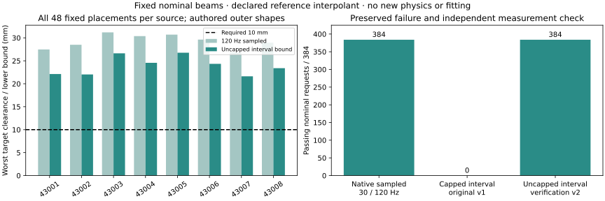

# Full native nominal audit: result and bound verification

**All 384 frozen placements retain sampled native separation at 30 and 120 Hz.** An independently registered uncapped check certifies the declared target interpolant for all 384, with a worst lower bound of **21.623 mm** against the 10 mm requirement. These are authored native enclosures at nominal placements, not obstacle-present executions, cooked-mesh CCD, or the original 113-offset uncertainty domain.

## Original failure retained

The first native audit passes P1 (sampled separation) and P3 (proxy reproduction), but **fails P2: 0/384 pass its capped interval bound**. It clips all target clearances to 20 mm; subtracting motion bounds then produces minima from −2.253 to +3.463 mm. These weak bounds do not establish a collision. All target minima are saturated, so the original capped witness label is not an uncapped nearest-shape claim.

The separately registered U1/U2 check computes uncapped distances with the same scene coordinates, shapes, displacement formula and 1e-5 m allowance. Reapplying the 20 mm cap reproduces **every stored target array exactly**. Both new predictions pass; the original failed P2 remains unchanged. The tightest uncapped witnesses are all on torso_link. No generator is trained or selected on these results; 430xx remains permanently excluded from fitting.

## Complete source denominator

| Source | Requested | Native sampled passes, 30/120 Hz | Uncapped bound passes | Worst target sampled (mm) | Worst interval bound (mm) | Weakest neutral primitive witness (mm) |
| --- | --- | --- | --- | --- | --- | --- |
| 43001 | 48 | 48 / 48 | 48 | 27.469 | 22.122 | -27.722 |
| 43002 | 48 | 48 / 48 | 48 | 28.489 | 22.032 | -30.018 |
| 43003 | 48 | 48 / 48 | 48 | 31.193 | 26.630 | -32.413 |
| 43004 | 48 | 48 / 48 | 48 | 30.380 | 24.557 | -30.621 |
| 43005 | 48 | 48 / 48 | 48 | 30.705 | 26.756 | -30.033 |
| 43006 | 48 | 48 / 48 | 48 | 29.620 | 24.343 | -29.073 |
| 43007 | 48 | 48 / 48 | 48 | 26.825 | 21.623 | -27.190 |
| 43008 | 48 | 48 / 48 | 48 | 28.953 | 23.397 | -26.855 |

Eight motion ancestors, two events and three model seeds produce 48 eight-output jobs. The 384 requests are not 384 independent sources. Target clearance uses 45 native outer shapes; neutral interference uses the 27 native primitives. Mesh spheres provide an outer enclosure, so their overlap alone is never called a mesh collision.

## Frame binding and cost

Before this extension, all fourteen measured-qpos captures pass the frame-binding prediction over 2786 recorded frames. Maximum position discrepancy is 1.407 micrometres; maximum orientation discrepancy is 0.000130 degree. This empirically checks the reference FK/Isaac frame contract; it is not a universal equivalence proof.

| Query setting | Whole-motion queries | Query/bound time (s) |
| --- | --- | --- |
| native_120hz, target + neutral | 768 | 0.5644 |
| native_30hz, target + neutral | 768 | 0.1737 |
| proxy_120hz, target + neutral | 768 | 0.4710 |
| proxy_30hz, target + neutral | 768 | 0.1720 |
| Uncapped native 120 Hz, target only | 384 | 5.2621 |

Original audit total: 7.679 s, including 1.401 s loading and 1.717 s FK/geometry preparation. Uncapped verification total: 10.113 s, including 1.902 s setup. Both use CPU only. The uncapped target-only workload is not a matched timing comparison against the paired capped workloads.

## What remains

The interval result applies to the declared linear-position/shortest-SLERP body interpolant under a stated 1e-5 m allowance. It does not recover unrecorded dynamics. Native cooking/inflation equivalence, the full placement uncertainty domain, noisy sensing, fresh-source closed-loop transfer and downstream learning benefit remain open. Continue the frozen 42-cell interface panel, then prioritize the matched learning-data comparison.

[Original protocol](FRESH_NATIVE_TEMPORAL_V1.md) · [Uncapped verification protocol](FRESH_NATIVE_UNCAPPED_V2.md) · [Frame-binding protocol](NATIVE_FRAME_BINDING_V1.md) · [All 384 original rows](evidence/fresh-native-temporal-v1.json) · [All 384 uncapped rows](evidence/fresh-native-uncapped-v2.json) · [Hash receipt](evidence/fresh-native-batch-receipt.json)

