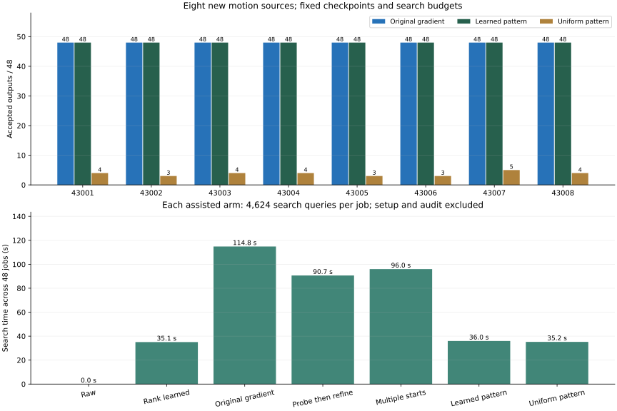

# Fresh-source transfer audit: completed acquisition v1

2026-09-05. The [prospective protocol](FRESH_SOURCE_V1.md) and both acquisition and inference implementations were hash-pinned before generating any new source. Registration:
`sha256:9da4f7903233984f9a764b6f501f8bf7a91711171d8b270950cf6a8dcaf991d9`. No candidate replacement, generation retry, retraining, normalization refit or method tuning.

## Acquisition and lineage

The local metadata inventory scanned **1,197 JSON files**, with zero seed collisions and zero parse failures. It covers three named local roots and excludes dependency directories; it does not establish freshness of unrecorded or remote generation. All **eight** seeds, 43001–43008, were assigned before launch. Their descendants are permanently excluded from training and selection.

The exact cached Kimodo-G1-RP-v1 snapshot, prompt/cache, generator, route predicate and skeleton assets are pinned by 166 implementation/asset references plus inherited provenance. Generation used CPU with four threads, 120 frames at 30 Hz, 100 denoising steps and the original neutral walking prompt. **CPU acquisition changes the backend from the old GPU-generated development bank**; the transfer axis is new seeds under this declared backend, not a backend-isolated experiment.

Generation took **603.94 s**, with **zero GPU use**, within the 1,800 s cap. Complete source CSV/sidecar validation passed for all eight. All generated outputs and the complete generation log are retained. No physical execution was attempted.

All 16 registered derivative constructions were attempted; **16/16** qualified. Construction took **24.83 s** within the 600 s cap. Each source supplies event stations 0.35 and 0.65, 0.055 m crouch drop, unchanged operator and 0.18 window. Persisted target references supply the FK bank.

| Source | Neutral Q0 / Q1 | Route class | Event 0.35 qualified | Event 0.65 qualified |
|---|---|---|---|---|
| 43001 | True / True | valid_straight | True | True |
| 43002 | True / True | valid_straight | True | True |
| 43003 | True / True | valid_straight | True | True |
| 43004 | True / True | valid_straight | True | True |
| 43005 | True / True | valid_straight | True | True |
| 43006 | True / True | valid_straight | True | True |
| 43007 | True / True | valid_straight | True | True |
| 43008 | True / True | valid_straight | True | True |

The generated sources have net travel 3.522–4.998 m. The operator records silhouette drops of 0.054987–0.055013 m; no case reaches the excursion cap. These are input/construction descriptors, not model outcomes.

Qualification requires Q0 embodiment and Q1 self-intersection checks for neutral and target, the frozen straight-route predicate on both, endpoint preservation and shared route/quaternion alignment. It does not mean Q4 admission or execution qualification.

## Frozen inference outcomes

Learned pattern accepts **384/384 (100.0%)** outputs, compared with **30/384 (7.8%)** for uniform pattern and **384/384 (100.0%)** for original gradient. The raw model accepts **296/384**. These are acceptance counts under finite reference geometry tests.

The primary learned-versus-uniform prediction passes on all eight sources. The prediction
of greater acceptance than gradient **fails because all eight source counts tie**; pattern
rescues no gradient failure here. Multiple starts also reaches 384/384; probe/refinement
reaches 383/384. These outcomes support the learned initializer in this bounded-search
setting without establishing a unique best search algorithm.

Pattern uses **68.7% less measured search time** than gradient
(35.99 versus 114.84 s), at equal search-query budgets and equal accepted
counts in this audit. This is search-loop timing on a shared CPU, not end-to-end
throughput; the independent audit and acquisition costs below remain chargeable.

Each independent source contributes 48 outputs per arm: two derivatives × three frozen checkpoints × eight requested outputs. There are eight source groups, not 384 independent motion trials. All sources belong to one fresh audit pool; there is no newly selected validation subset. Both phases were withheld from the original fitting.

| Method | 43001 /48 | 43002 /48 | 43003 /48 | 43004 /48 | 43005 /48 | 43006 /48 | 43007 /48 | 43008 /48 | Total /384 |
|---|---:|---:|---:|---:|---:|---:|---:|---:|---:|
| Raw | 43 | 34 | 45 | 40 | 28 | 37 | 30 | 39 | 296 |
| Rank learned | 48 | 41 | 48 | 48 | 41 | 48 | 48 | 48 | 370 |
| Original gradient | 48 | 48 | 48 | 48 | 48 | 48 | 48 | 48 | 384 |
| Probe then refine | 48 | 48 | 48 | 48 | 48 | 48 | 47 | 48 | 383 |
| Multiple starts | 48 | 48 | 48 | 48 | 48 | 48 | 48 | 48 | 384 |
| Learned pattern | 48 | 48 | 48 | 48 | 48 | 48 | 48 | 48 | 384 |
| Uniform pattern | 4 | 3 | 4 | 4 | 3 | 3 | 5 | 4 | 30 |



All 48 jobs and 336 arm/job rows completed. Six assisted arms each spend 4,624 search queries per job; raw uses zero. Learned draws use checkpoint seed + 80000, uniform draws +90000. The same random streams across cases were fixed prospectively. Uniform starts are independent of the learned outputs and have no paired-output correspondence. Model weights, training normalization, search domains, trust bounds and 1 cm margins remain unchanged.

## All registered predictions

| Prediction | Outcome |
|---|---|
| `learned_pattern_strictly_better_on_every_source` | True |
| `no_source_loss_and_total_gain_over_gradient` | False |
| `no_paired_gradient_loss` | True |

| Source | Pattern − uniform | Pattern − gradient |
|---|---:|---:|
| 43001 | 44 | 0 |
| 43002 | 45 | 0 |
| 43003 | 44 | 0 |
| 43004 | 44 | 0 |
| 43005 | 45 | 0 |
| 43006 | 45 | 0 |
| 43007 | 43 | 0 |
| 43008 | 44 | 0 |

Strict gain predicates treat ties as failures. These are descriptive predeclared comparisons, not significance or noninferiority tests. The learning decision must retain failed predictions even when aggregate acceptance is high.

| Method sharing learned starts | Rescued gradient failures | Lost gradient successes |
|---|---:|---:|
| probe_refine | 0 | 1 |
| multistart | 0 | 0 |
| pattern | 0 | 0 |

The single probe/refinement rejection is source **43007**, phase **0.65**, checkpoint
**8423**, proposal index **0**. Its output is station 0.756095059 and beam underside
1.268995417 m. Target minimum clearance is 21.8143 mm, but worst neutral clearance is
−8.8504 mm, missing the required ≤−10 mm interference margin by 1.1496 mm. The failure
already appears in the 17 search placements and is reproduced by the 113-placement
audit at offset (−0.02, −0.02, +0.01 m, +0.02 rad). This is a retained search failure,
not a new discrepancy between the two checkers. The frozen output is rejected; it is
not repaired or replaced after seeing the audit.

## Both event phases and all fitting seeds

| Method | Checkpoint seed | Phase 0.35 /64 | Phase 0.65 /64 | Total /128 |
|---|---:|---:|---:|---:|
| Raw | 8421 | 58 | 40 | 98 |
| Raw | 8422 | 50 | 51 | 101 |
| Raw | 8423 | 48 | 49 | 97 |
| Rank learned | 8421 | 64 | 57 | 121 |
| Rank learned | 8422 | 64 | 57 | 121 |
| Rank learned | 8423 | 64 | 64 | 128 |
| Original gradient | 8421 | 64 | 64 | 128 |
| Original gradient | 8422 | 64 | 64 | 128 |
| Original gradient | 8423 | 64 | 64 | 128 |
| Probe then refine | 8421 | 64 | 64 | 128 |
| Probe then refine | 8422 | 64 | 64 | 128 |
| Probe then refine | 8423 | 64 | 63 | 127 |
| Multiple starts | 8421 | 64 | 64 | 128 |
| Multiple starts | 8422 | 64 | 64 | 128 |
| Multiple starts | 8423 | 64 | 64 | 128 |
| Learned pattern | 8421 | 64 | 64 | 128 |
| Learned pattern | 8422 | 64 | 64 | 128 |
| Learned pattern | 8423 | 64 | 64 | 128 |
| Uniform pattern | 8421 | 5 | 8 | 13 |
| Uniform pattern | 8422 | 0 | 0 | 0 |
| Uniform pattern | 8423 | 9 | 8 | 17 |

## Failure types, output diversity and cost

| Method | Target failures /384 | Neutral failures /384 | Mean accepted bins per job | Search seconds, 48 jobs |
|---|---:|---:|---:|---:|
| Raw | 42 | 46 | 2.146 | 0.000 |
| Rank learned | 7 | 7 | 1.771 | 35.051 |
| Original gradient | 0 | 0 | 3.167 | 114.836 |
| Probe then refine | 0 | 1 | 3.625 | 90.656 |
| Multiple starts | 0 | 0 | 4.021 | 95.982 |
| Learned pattern | 0 | 0 | 3.104 | 35.990 |
| Uniform pattern | 223 | 223 | 0.625 | 35.241 |

A rejected output can fail both margins; failure columns need not sum to rejected counts. Accepted-bin occupancy measures retained sample diversity, not total feasible support. Search timings exclude source acquisition, inherited fitting, setup, sampling and independent audit; they are local measurements on a shared CPU.

| Cost component | Seconds |
|---|---:|
| Inherited three-checkpoint fitting (no new fitting) | 161.705 |
| Preprocessing / integrity checks, included in search stage | 1.308 |
| Checkpoint setup, included in search stage | 0.011 |
| Shared learned sampling, counted once per job | 0.028 |
| Uniform sampling, counted once per job | 0.001 |
| Entire search stage | 409.396 |
| Entire independent audit loop | 145.025 |

The search spends **1,331,712** clearance queries. The independent NumPy audit checks every output at 113 perturbations: **607,488** queries. Torch crosschecks two outputs per job at all 113 perturbations: **151,872** additional queries. Maximum observed NumPy/Torch difference is **2.78e-17 m**, below the registered 1e-8 m threshold. All values are finite. This tests numerical agreement, not a proof of absolute arithmetic error.

## Interpretation and saved next design

This acquisition tests generated straight walking with the existing local crouch operator and a two-parameter beam family. The 29-capsule/13-link proxy, finite motion frames and finite placement set do not guarantee collision relationships for all imported body geometry, between-frame motion or tracking error. No natural scene-distribution, complex multi-object, physical execution or downstream policy claim follows.

The [train-only distillation design](TRAIN_ONLY_DISTILLATION_DESIGN.md) makes the next learning contribution concrete: generate diverse search targets from TRAINING motions, train the conditional proposal on them plus geometric feedback, and measure acceptance against reduced online query budgets. Keep the complete 430xx pool excluded from fitting and selection. A later confirmatory comparison needs another registered source acquisition. The separate collision work must close imported-body and temporal contracts before stronger scene–motion guarantees.

## Reproduce and inspect

Run registration only into a new empty root, before generation; the recorded seeds are now observed and must not be represented as fresh in a new study. Existing stages reject overwrites. These commands document the completed acquisition, not authorization to re-roll it.

```bash
PYTHONPATH=. .venv_research/bin/python scripts/research/motion2scene_fresh_sources.py register \
  --out /home/linjiw/research-data/groot-wbc/m2s-fresh-source-v1
PYTHONPATH=. .venv_research/bin/python scripts/research/motion2scene_fresh_sources.py generate \
  --registration /home/linjiw/research-data/groot-wbc/m2s-fresh-source-v1/registration.json
PYTHONPATH=. .venv_research/bin/python scripts/research/motion2scene_fresh_sources.py build \
  --registration /home/linjiw/research-data/groot-wbc/m2s-fresh-source-v1/registration.json
```

```bash
PYTHONPATH=. .venv_research/bin/python scripts/research/motion2scene_fresh_audit.py search \
  --registration /home/linjiw/research-data/groot-wbc/m2s-fresh-source-v1/registration.json
PYTHONPATH=. .venv_research/bin/python scripts/research/motion2scene_fresh_audit.py analyze \
  --registration /home/linjiw/research-data/groot-wbc/m2s-fresh-source-v1/registration.json
```

```bash
PYTHONPATH=. .venv_research/bin/python scripts/research/render_motion2scene_fresh_source.py \
  --root /home/linjiw/research-data/groot-wbc/m2s-fresh-source-v1
PYTHONPATH=. .venv_research/bin/pytest -q tests/dataset_generation/test_motion2scene_*.py \
  tests/dataset_generation/test_capsule_box_*.py tests/dataset_generation/test_placement_certificate.py
.venv_research/bin/black --check scripts/research/motion2scene_fresh_sources.py \
  scripts/research/motion2scene_fresh_audit.py scripts/research/render_motion2scene_fresh_source.py \
  tests/dataset_generation/test_motion2scene_fresh_sources.py tests/dataset_generation/test_motion2scene_fresh_audit.py
.venv_research/bin/ruff check scripts/research/motion2scene_fresh_sources.py \
  scripts/research/motion2scene_fresh_audit.py scripts/research/render_motion2scene_fresh_source.py \
  tests/dataset_generation/test_motion2scene_fresh_sources.py tests/dataset_generation/test_motion2scene_fresh_audit.py
git diff --check
```

The impacted suite passes **87 tests**, including missing-output, stale-source, nonfinite-output, implicit seed-range, source-wise comparison and ceiling-tie checks. Black and Ruff pass on all five new Python files; `git diff --check` passes. The local page passes desktop (1440 px) and mobile (390 px) image/overflow checks with zero JavaScript exceptions. All 136 local HTML links and 64 output hashes across 12 evidence manifests verify; the new Markdown links also resolve.

Inspect [acquisition and complete funnel](evidence/fresh-source-acquisition.json), [registration](evidence/fresh-source-registration.json), [local metadata inventory](evidence/fresh-source-inventory.json) and [export hashes](assets/fresh-source-manifest.json). The [complete inference evidence](evidence/fresh-source.json) includes all 336 rows, output verdicts, trace hashes, source summaries and registered predicates.

Full motion CSVs, NPZ geometry/search/audit arrays and the generation log remain under `/home/linjiw/research-data/groot-wbc/m2s-fresh-source-v1/`. Reproduction also requires the pinned local model snapshot, prompt cache, Kimodo source and previous checkpoints. These dependencies are not all bundled in Git. The public-page files are updated locally; this work does not publish or push the site.
