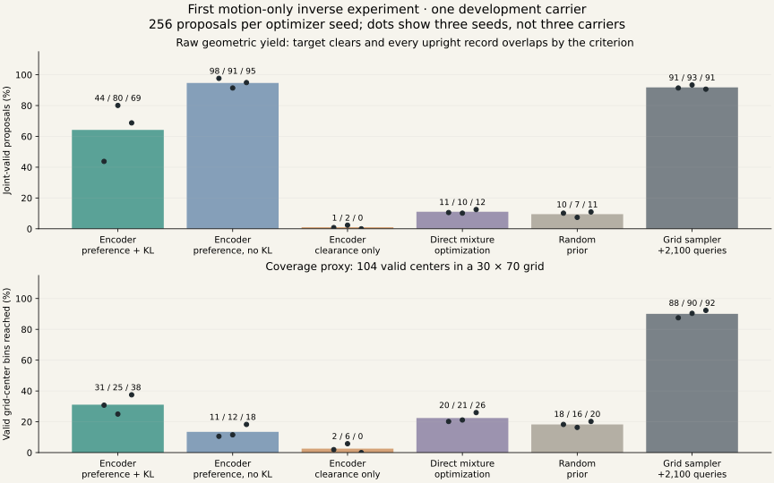
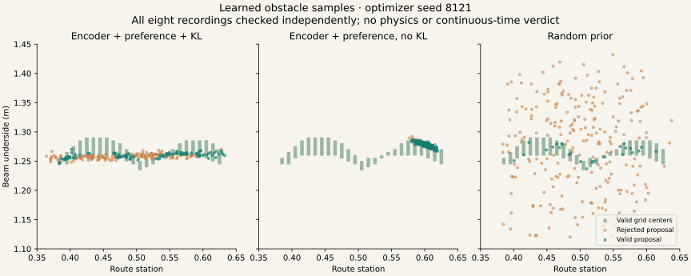

# First working motion-only inverse beam generator

Measured 2026-09-05. The [saved framework](LEARNED_GENERATOR_FRAMEWORK.md) now has a working
PyTorch implementation, saved model checkpoints, a sampling command, and an independently
evaluated development experiment. Obstacle coordinates and analytic intervals are not training
labels. All scene verdicts below are sampled capsule geometry; no execution-qualified scenes
or new physics runs are admitted.

## What was built

- A differentiable piecewise capsule–box query with finite overlap/parallel subgradients and
  yaw-rotated boxes. The independent NumPy query remains separate.
- A temporal whole-body encoder and four-component correlated Gaussian mixture over beam route
  station and underside height. Beam depth, width, thickness and yaw are fixed in this first test.
- A frozen geometric choice evaluator with upright/crouch costs fixed independently of the target
  loss label, a target-clearance barrier, and a genuine marginal-mixture KL term.
- A hash-pinned CPU experiment, independent evaluation, parameter/checkpoint exports, explicit
  proposal rejection, and a URDF collision inventory.

The encoder sees the target reference's whole-body capsule sequence. Its evaluator uses the
upright and crouch references plus executions 7901/7902. Execution 7903 is excluded from gradients
but was previously examined in other development work; it is not a fresh confirmatory holdout.
Everything belongs to the selected carrier 41002. Success on this input does not establish that
the encoder learned useful conditioning across motions; its constant-input mapping can be fit
through biases and weights. That requires a separate multi-carrier study.

## Results under the registered contract

Every row below receives 256 proposals per seed. Joint validity requires target clearance of at
least 10 mm and an upright primitive-overlap criterion of at least 10 mm for **all eight motion
sources**. The overlap criterion is not penetration depth or proof of actual-robot collision.
Counts are ordered by optimizer/sampling seed 8121, 8122, 8123.

| Method | Joint-valid proposals / 256 | Valid grid-center bins reached / 104 | Selected representative jitter passes / 81 |
|---|---|---|---|
| Encoder + preference + KL | 112, 205, 176 | 32, 26, 39 | 72, 81, 81 |
| Encoder + preference, no KL | 250, 234, 243 | 11, 12, 19 | 81, 72, 81 |
| Encoder + clearance + KL only | 2, 6, 0 | 2, 6, 0 | 52, 81, 0 |
| Direct per-motion mixture optimization | 27, 26, 32 | 21, 22, 27 | 76, 81, 81 |
| Random transformed prior | 26, 19, 28 | 19, 17, 21 | 81, 81, 73 |
| Independent grid sampler | 234, 239, 232 | 91, 94, 96 | 81, 81, 81 |

The grid sampler spends an additional 2100 geometric proposal queries and samples from the 114
centers valid on gradient sources. Independent evaluation leaves 104 centers valid on all sources.
Its perfect gradient-source yield follows from filtering, while its excluded-source validity can
fail. Grid-center coverage is resolution-dependent, not a measure of exact continuous support.
It is a strong search baseline, with its extra cost disclosed rather than presented as matched
compute. The direct optimizer shares the 300-update learning rate/budget; it is not demonstrated
to have converged or been optimally tuned.





## Interpretation and prediction reconciliation

1. **Geometry agreement passed.** All 3072 learned/direct-model evaluation proposals were checked
   by both implementations over eight sources. Maximum absolute discrepancy was
   **1.943 × 10^-16 m**, below the registered 10^-8 m limit. Independent primitive agreement does
   not establish equivalence with the imported simulator collision model.
2. **The preference mechanism worked in this diagnostic.** Both preference-trained encoder arms
   exceeded random and clearance-only joint yield in every optimizer seed. Clearance-only target
   safety was high (256, 248, 256 of 256), but upright walking usually remained unconstrained.
   This is the predicted failure of feasibility-only scene generation.
3. **The KL tradeoff appeared.** The full model covered more valid grid-center bins than no KL in
   all three seeds, while no KL had higher joint validity. The full model produced 44–80% valid
   proposals; no KL produced 91–98%. This is a local coverage/yield tradeoff, not evidence of
   calibrated real-world obstacle probabilities or a general solution to mode collapse.
4. **No encoder-generalization claim is supported.** Its higher yield than direct mixture
   optimization may reflect parameterization and effective optimization speed on a constant input.
   The grid baseline covers substantially more of the valid domain than either learned encoder.
5. **Nominal validity did not ensure perturbation robustness.** Representatives were selected
   using gradient-source margins only. Full-model seed 8121 failed nine jitter placements,
   reaching 9.17 mm target clearance, below the 10 mm requirement. No-KL seed 8122 failed nine,
   losing the upright interference margin. Representatives were not replaced after evaluation.

The architecture is a useful starting point for a **learned proposal distribution plus independent
verification**. A raw Gaussian sample is not an admitted scene. A separate fresh sampling check
on the default full-model checkpoint accepted 27 of 64 proposals and explicitly rejected 37;
that sampling check is not pooled with the registered 256-proposal evaluation.

## Geometry and resource limits

The URDF inventory contains 45 collision elements: 26 cylinders, 18 meshes and one sphere.
The diagnostic uses 29 capsule proxies. Sixteen hand/finger links with URDF collision elements
have no individual diagnostic capsule; wrist proxies do not certify enclosure of those shapes.
Importer cylinder conversion and mesh containment remain unresolved. The inventory records
`imported_shape_equivalence_established: false`, with both inner/outer certificates false.

The entire recorded sequence is evaluated (120 frames per reference; 199 per achieved recording),
with complete capsule-axis distance queries. Certified broad-phase exclusions within this
primitive model make computation cheaper without dropping potentially binding frame/axis pairs.
Between-frame motion is still unverified. The finite beam has no support structure in this
abstract geometry diagnostic. It must not be exported as an execution-ready scene.

All twelve registered runs completed: 3600 total updates, approximately **136 seconds of training**
and **148 seconds for the run command including evaluations**, CPU float64 with two threads.
GPU use and new physics rollouts: zero. A separate two-update-per-cell engineering smoke run
preceded this experiment; its outcomes are not pooled. No scientific threshold or hyperparameter
was changed after the registered run started.

## Next experiment

First address the observed robustness gap with explicit execution/placement uncertainty during
inverse learning and independently audited body geometry. Preserve this nominal-only run as the
comparison. In parallel with that code work, build a qualified multi-carrier bank with meaningful
alternative sets; the failed intermediate crouch remains ineligible for an ordinal claim.

The decisive next learning study must split by source carrier, compare against tuned direct
optimization and analytic/grid search, and test whether the encoder saves work on new motions.
Only after geometric and motion qualification should generated scenes enter obstacle-present
target/alternative/removal trials. Lateral gaps and step-over obstacles follow when their motion
and contact data support the corresponding relationship.

## Reproduce and inspect

- [Registered design](INVERSE_LEARNING_V1.md)
- [Portable manifest](evidence/inverse-learning-manifest.json)
- [All samples, losses, distributions, grid values and jitter outcomes](evidence/inverse-learning.json)
- [Collision inventory](evidence/inverse-geometry-inventory.json)
- [Export hashes](assets/inverse-manifest.json)
- [Training/evaluation driver](../../scripts/research/motion2scene_inverse_learning.py)
- [Saved-model sampler](../../scripts/research/motion2scene_sample_beams.py)

The checkpoint/data directory is
`/home/linjiw/research-data/groot-wbc/m2s-inverse-learning-v1/`; checkpoints are under
`runs/<arm>_<seed>/checkpoint.pt`. These binary artifacts are local, not bundled with the public
JSON snapshots. The command refuses existing output paths, so use a new output directory/file.

```bash
MUJOCO_GL=egl .venv_research/bin/python scripts/research/motion2scene_inverse_learning.py prepare \
  --repeatability /path/to/m2s-repeatability-v1/result.json \
  --out /new/path/to/inverse-run --protocol docs/motion2scene/INVERSE_LEARNING_V1.md
MUJOCO_GL=egl .venv_research/bin/python scripts/research/motion2scene_inverse_learning.py run \
  --manifest /new/path/to/inverse-run/manifest.json
MUJOCO_GL=egl .venv_research/bin/python scripts/research/motion2scene_inverse_learning.py analyze \
  --manifest /new/path/to/inverse-run/manifest.json
MUJOCO_GL=egl .venv_research/bin/python scripts/research/motion2scene_sample_beams.py \
  --manifest /new/path/to/inverse-run/manifest.json --arm full --model-seed 8121 \
  --sample-seed 9321 --count 64 --out /new/path/to/proposals.json
```

Validation: 40 focused tests across the new inverse model/query and the impacted timing,
repeatability and teacher modules passed. Black, Ruff and `git diff --check` passed for new code.
The smoke and full runs additionally checked end-to-end backward passes, checkpoint export,
independent query agreement, and sampler checkpoint reload. Chrome checks at 1440×1000 and
390×844 found no JavaScript exceptions or horizontal overflow; both new figures decoded. Five
export hashes and local report/page links were verified. The project remains a local research
snapshot; no commit, push, deployment or physical-robot action is implied.
