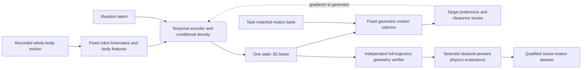

# Learning a humanoid scene generator from motion alone

Research design, 2026-09-05. This document proposes a model and evaluation contract; it does not
report a trained generator. Paper observations, mathematical deductions, proposed components,
and existing project measurements are identified separately. It extends the standalone
Motion2Scene design with explicit identifiability, distribution-learning, and collision contracts.
Reading scope: original LfH and LfLH main text, including implementation and evaluation sections;
related-paper sections linked below; current local geometry/decoder code. The original authors'
LfLH implementation and its optimization guarantees have not been independently reproduced.

The immediate objective is to learn **a distribution of static 3D constraints that leaves an
executable humanoid motion feasible and makes it preferable to disclosed alternatives**. A
motion sequence does not identify the original room or the real-world frequency of obstacles.

## 1. What the original papers actually supply

**Paper observations.** LfH constructs a most-constrained configuration-space explanation of an
open-space motion, synthesizes perception, and learns a forward planner. It explicitly treats the
inverse as ambiguous before imposing that construction; deployment includes uncertainty handling
and MPC checks. Its physical results include a collision, so the whole pipeline is not an
unconditional safety guarantee. [LfH, §III and §IV-B](https://arxiv.org/html/2007.14479v4).

LfLH learns obstacle distributions with a temporal encoder and a fixed differentiable planner
decoder, using plan reconstruction plus obstacle-prior and collision regularization. Ground
implementation: three temporal convolutions, ten obstacles, Ego-Planner reimplemented through
differentiable convex optimization layers. Aerial implementation: fifteen obstacles. It filters
invalid samples and retains runtime collision checks. Aerial training records planner trajectories
in constrained simulation and discards perception; genuinely random open-space aerial exploration
is deferred. [LfLH, §III-B/C and §IV-A/B](https://arxiv.org/html/2108.09793v1).

Dyna-LfLH explicitly reports limited distribution coverage through mode collapse in its dynamic
setting. This observation belongs to that paper's discussion; it is not a measured humanoid
result. [Dyna-LfLH, §IV-E](https://arxiv.org/html/2403.17231v2).

LfH-CP separates learned critical obstacle configurations from procedural generation of dynamic
trajectories through them. Its temporal-presence abstraction is useful inspiration, but a static
humanoid beam must exist throughout the motion. [LfH-CP, §III-D/E](https://arxiv.org/html/2509.26513v1).

SUMMON is a relevant existing motion-to-scene method: it predicts temporal semantic contacts and
fits objects, then adds noninteracting objects. Its contact training uses scene-derived labels
from PROX-E. Inputting only motion at inference is different from training without paired scene
supervision. [SUMMON, §3 and §4.1](https://arxiv.org/html/2301.01424v1).

**Our interpretation.** Preserve LfLH's fixed geometric feedback. Change the decoder's problem
from mobile-base trajectory reconstruction to whole-body motion selection. Borrow the critical
constraint/scene-completion separation, while checking the entire rendered static scene. This
is a proposed combination, not a verified novelty claim or a direct reproduction of those papers.

## 2. How a motion provides its own supervision

Let the recorded target be \(M_i\), the scene be \(S\), and \(x_i\) contain the fixed robot model,
initial state, goal, and task contract. For our proposed implementation:

\[
S=G_\psi(M_i,x_i,z),\quad z\sim p(z),\qquad
P_D(M\mid S,x_i,\mathcal A_i)=\operatorname{softmax}_{M\in\mathcal A_i}[-E(M,S)/T_D].
\]

The generator changes obstacles. The frozen decoder recomputes which candidate is preferred.
The original motion supplies the target selection label; no correct obstacle coordinates are
provided. Geometry and fixed costs supply the relationship between the two.

For a crouch, the gradient should move a beam toward the space occupied by upright alternatives,
while a separate clearance term moves it away from every body part of the target. A beam too high
leaves a cheaper upright walk preferable. A beam too low hits the crouch and fails feasibility.
A beam too short, too lateral, or mistimed spatially may miss the upright body entirely.

This supervision can learn where and how large a constraining obstacle should be. It cannot
learn that beams are more common than shelves in real buildings without a scene prior carrying
that information. Materials, furniture categories, and room statistics need explicit priors or
additional unpaired scene data; they do not follow from a collision objective.

**Correction to a possible reading of our earlier teacher report:** verified scene-motion pairs
are not a prerequisite for training the self-supervised inverse generator. They are needed for
claims about executable synthetic training data and for qualifying the downstream policy dataset.
Training directly on analytic beam coordinates is useful teacher distillation, but must be a
separate baseline from the motion-only inverse objective. Existing `training_eligible: false`
artifacts retain their current status; using them for a declared geometry-only diagnostic does
not promote them into the main bank.

The per-example encoder input can remain just motion. Derive the initial state and endpoint from
it, fix the robot/task policy globally, and retrieve alternatives inside the training evaluator.
Do not require the user to supply an alternative motion at inference. An encoder that also sees
the alternative set is a useful later ablation with a different input contract.

## 3. What can and cannot be identified

### The distribution is defined by assumptions

**Proposed statistical interpretation**, with \(\mathcal E_i\) an acceptable target behavior class:

\[
\pi(S\mid M_i,x_i,\mathcal A_i)
\propto p_0(S\mid x_i)\;
P_D(\mathcal E_i\mid S,x_i,\mathcal A_i)^\alpha\;
\mathbf 1[S\in\mathcal F_i].
\]

Here \(p_0\) is a declared geometric/scene grammar prior, and \(\mathcal F_i\) is the set passing
target-feasibility, scene-validity, and any declared criticality requirements. This is an
engineered conditional distribution of explanations, not a recovered empirical distribution of
the rooms that caused the recordings. Several choices of prior and planner cost can explain the
same motion corpus. Fixing those choices makes the learning problem testable, not identifiable
as real-world causal reconstruction.

### Some motions have no static obstacle explanation

**Geometric deduction.** Define whole-body swept occupancy for static-obstacle checking:

\[
\mathcal V(M)=\bigcup_{t\in[0,T]}\bigcup_b B_b(q(t)).
\]

A target-compatible obstacle must avoid \(\mathcal V(M_i)\). To collide with an alternative
\(M_a\), it must meet \(\mathcal V(M_a)\). Consequently it needs an intersection witness in

\[
\mathcal V(M_a)\setminus\mathcal V(M_i).
\]

If \(\mathcal V(M_a)\subseteq\mathcal V(M_i)\), no static rigid obstacle can both clear the target
and intersect that alternative. The proof is immediate: disjointness from the larger set implies
disjointness from its subset. With uncertainty, replace target occupancy by its allowed execution
tube; the available witness region generally shrinks. A nonempty difference is only necessary:
obstacle thickness, anchoring, other alternatives, and required margins may still make the scene
family infeasible.

This explains three important refusal cases:

- Two motions traverse the same body configurations at different times. Static occupancy cannot
  distinguish their timing; speed preference requires an explicit dynamics/risk cost or a dynamic
  obstacle model.
- A motion includes unnecessary repetitions or articulation entirely inside another motion's
  swept volume. A static obstacle cannot necessarily make that exact sequence uniquely optimal.
- Tracking uncertainty is larger than the geometric difference between crouch depths. No network
  capacity can recreate a robust separation interval that has disappeared.

For a beam at a fixed footprint, a simplified overhead condition is

\[
h\in\left[
\max_{r\in\mathcal R_i} H_i^{(r)}+m_{\rm clear},\;
\min_{a\in\mathcal A_i^{\rm cheaper},r\in\mathcal R_a} H_a^{(r)}-m_{\rm strike}
\right].
\]

\(H\) is the appropriate swept upper-body reach through that footprint, and \(r\) indexes
declared execution realizations. This simplified vertical bound requires a genuine footprint
crossing and sufficiently tall obstacle; a finite box still needs full-body checking for side,
edge, and above-box passages. Empty intervals mean “no separation under this family and margin.”
The bound over three recorded seeds only covers those records, not all future executions.

### Generate in physical space, evaluate in configuration space

A G1 configuration has a floating-base pose and 29 actuated joint coordinates. Arbitrary forbidden
regions in this high-dimensional space need not correspond to any realizable arrangement of 3D
objects. Generate physical objects \(O_j\subset\mathbb R^3\); use forward kinematics to induce

\[
C_{\rm obst}(S)=\{q:\exists b,j,\;B_b(q)\cap O_j\ne\varnothing\}.
\]

This retains all joints' collision consequences without asking a network to generate a 35-DoF
configuration-space occupancy grid. Designated support contacts are treated separately below.

## 4. The first model to build

**Proposed starting configuration, not a tuned architecture:** a small temporal encoder, a
mixture density head over one beam, a frozen library decoder, and an independent verifier.

### Motion encoding

Store timestamps, root position/orientation, joints, velocities, body transforms, contact state
and confidence, reference versus achieved provenance, and controller/asset versions. Compute body
geometry with fixed kinematics. Use body regions to expose head/torso height, shoulders and arms,
pelvis, both shins, both feet, and the corresponding velocities/contact phases. Root trajectory
alone loses the very difference between walking, ducking, and squeezing.

Use one gravity-preserving translation/yaw canonicalization per episode. Transform scene and all
candidates together. Never independently recenter achieved motions or flatten a curved path into
a straight line for collision checking. Arc-length/route-frame coordinates are useful features;
world geometry remains authoritative. Retain timestamps as well as phase: resampling must not
turn a missed fast foot collision into an apparently safe motion.

A reasonable first encoder is a shared per-body MLP into 64 features, body-region pooling, three
temporal convolution blocks of width 128, and temporal attention pooling. These sizes are an
engineering starting point. Downsample encoder input if needed; never silently downsample the
validation trajectory. Keep contacts and event extrema in the features. Compare this encoder
against a simple envelope-feature MLP before introducing a larger Transformer.

### Scene encoding

For the first experiment, output a joint density over

\[
\theta=(s,\ell,h,\psi,d,w,t),
\]

where \(s\) is route station, \(\ell\) lateral offset, \(h\) underside height, \(\psi\) yaw offset,
and \(d,w,t\) are depth, width, and thickness. Route station maps to a fixed world transform;
it is not an instruction to move the obstacle with the robot. Positive sizes and bounded offsets
come from smooth transforms with documented bounds.

Use a fixed test-frame fixture to support the beam, with its posts/walls included in every
candidate's collision checks. If the diagnostic omits a support structure, label it abstract
geometry. A floating box is not evidence of a physically plausible room. Keep fixed fixture
geometry identical across synthesis baselines.

Start with a four-component mixture of transformed Gaussian distributions. Mixture components
allow disconnected station/height solutions; correlations matter because height depends on
station and footprint. Enumerate the four components in the loss expectation and reparameterize
continuous samples, so a hard sampled component does not interrupt gradients to mixture weights.
Evaluate mixture log densities with log-sum-exp and the transform Jacobian. Width floors should
use smooth parameterization, and their effect on coverage must be ablated.

The first model has fixed obstacle count one. After it works, use a small set decoder with presence,
type, pose, size, body/event association, and relation-to-support fields. A two-wall doorway is a
joint object relation with a shared gap, not two independently sampled walls. Sparse presence
penalties and removal tests become useful then. Full SO(3) rotations, meshes, and multi-event
compositions come after gravity-aligned and yaw-rotated primitives.

Conditional flows are a reasonable later density model. Diffusion is not the simplest first
experiment: with no scene samples, ordinary denoising training has no target scene distribution
unless we first generate samples using an analytic teacher, constrained sampler, or energy-based
procedure. Record that supervision source explicitly if we take that route.

### The decoder's information boundary

Build \(\mathcal A_i\) using fixed task-matching rules: compatible initial states/contact modes,
goal region, route and duration contract, and payload if relevant. Include upright, shallower,
target, deeper, and eventually alternative-skill solutions. Admit alternatives based on their
own execution evidence. A dynamically impossible “easy” alternative is not a valid negative.

The decoder receives scene geometry, candidate trajectories, fixed costs, and task state. It must
not receive the desired candidate index, encoder hidden features, target-specific cost offsets,
or an optimizer initialization copied from the desired output. The target index is visible only
to the loss. Randomize candidate order; freeze qualification and costs before generator training.
Including the target in the bank is necessary, but reporting successful retrieval from that bank
does not establish a global humanoid optimum.

Use an acceptable behavior class when several trajectories have the same skill, route, contact
sequence, and adaptation range. Penalizing every other joint sequence would force obstacles to
explain incidental arm motion. Balance class multiplicities or correct the decoder's base measure
so duplicating a candidate cannot manufacture probability mass. Never use a soft weighted average
of the candidates' joint trajectories as the reconstructed motion; that average can be invalid.

## 5. Losses that learn an actual distribution

Let \(J_0(M)\) be a fixed, disclosed task/effort proxy. Initially a matched ladder may use adaptation
magnitude as the proxy; do not call it measured energy. Let \(d_{btj}(M,S)\) be a collision-distance
quantity with documented approximation bounds, and \(\Phi\) aggregate its clearance violations.

\[
E(M,S)=J_0(M)+\lambda_c\Phi(M,S),\qquad
L_{\rm select}=-\log\sum_{M\in\mathcal E_i} P_D(M\mid S,x_i,\mathcal A_i).
\]

For target safety, separately penalize the worst violation over bodies, times, obstacles, and the
declared perturbation/recording set:

\[
L_{\rm clear}=\max_{r,b,t,j}
\left[\frac{m_{btj}-d_{btj}(M_i^{(r)},S)}{d_{\rm scale}}\right]_+^2.
\]

Intended support contacts use a different contract; they are not included as forbidden
floor-contact terms. Collision penalties must dominate the finite range of the candidate cost
when selection is used as an approximation to feasible planning. Hard validation still rejects
any target collision, regardless of its favorable aggregate energy.

Use the initial objective

\[
\mathbb E_{M_i,S\sim q_\psi}[L_{\rm select}+\lambda_f L_{\rm clear}]
+\beta\,D_{\rm KL}(q_\psi(S\mid M_i,x_i)\Vert p_0(S\mid x_i)).
\]

Scene support/size rules are built into the parameterization and verifier. For multiple obstacles,
add a size/count cost and test removal-based criticality. Keep a preference-margin diagnostic
\(\min_{a\notin\mathcal E_i}E(M_a,S)-\min_{M\in\mathcal E_i}E(M,S)\), and compare it with the
empty-scene margin. A scene cannot be called causally necessary merely because the target was
already cheapest without obstacles.

**Why KL matters here, as a deduction about this proposed objective:** minimizing only expected
loss over a freely chosen distribution admits concentrating all probability at a single best
scene. It does not reward covering other good explanations. Since

\[
D_{\rm KL}(q\Vert p_0)=\mathbb E_q[\log q-\log p_0],
\]

the entropy contribution is present; minimizing just \(\mathbb E_q[-\log p_0]\) is not the same
objective. Over unrestricted densities, finite normalizer, and shared support, minimization of
\(\mathbb E_q L+\beta D_{\rm KL}(q\Vert p_0)\) gives
\(q^*(S)\propto p_0(S)\exp[-L(S)/\beta]\). A restricted neural mixture can still miss modes.
This is a design rationale, not a theorem that the learned network will cover the inverse set.

Measure geometric coverage conditioned on the same motion, including disconnected station/height
regions, under a fixed sample budget. Report valid yield as well as coverage. Random textures do
not count as obstacle-placement diversity. If sampling is followed by rejection, the returned
density is proportional to \(q_\psi(S)\mathbf1[\mathrm{pass}(S)]\); report rejection rates and do
not claim raw network likelihoods are calibrated probabilities of accepted scenes.
Cap proposal attempts and return an explicit refusal when none pass. Record that outcome in the
yield denominator. Do not let an unconstrained learned refusal option bypass the training loss
for every difficult motion.

An analytic map \(h=L+(U-L)\sigma(z)\) can enforce a valid one-dimensional interval when its
premises hold. That is useful engineering. Validity alone then measures the analytic map, so the
learned contribution must be station/type prediction, sampling efficiency, distribution coverage,
or generalization beyond those hand-solved coordinates.

## 6. What a collision guarantee would require

Three claims need different evidence: target clearance, alternative interference, and successful
controller execution. A small differentiable loss proves none of them by itself.

### Body geometry and opposite approximation directions

For each link, fit or extract an outer approximation \(B^+\supseteq B\) of the actual collision
geometry. Disjoint outer body/obstacle volumes certify geometric clearance within that model.
However, overlap between outer volumes does **not** prove the actual robot hits the obstacle.
For guaranteed interference, use actual narrow-phase geometry or inner volumes
\(B^-\subseteq B\), \(O^-\subseteq O\), with a strict interior intersection witness.

This distinction matters for our binary teacher: one enlarged capsule cannot simultaneously
serve as a conservative clearance certificate and a conservative proof of necessary contact.
Record separate `target_clearance_lower_bound` and `alternative_collision_witness` evidence.
If the approximation has no certified enclosure, label both tests proxy geometry.

The current simulator robot configuration imports a URDF with cylinder-to-capsule replacement;
its collision shapes and wrist/hand geometry are not established to match the hand-transcribed
diagnostic capsules. Extract the actual imported collision model, transformations, and scales;
version its hash. [Robot configuration](../../gear_sonic/envs/manager_env/robots/g1.py),
[URDF](../../gear_sonic/data/assets/robot_description/urdf/g1/main.urdf).

### Differentiable training geometry versus independent checking

The new NumPy [capsule-box query](../../gear_sonic/dataset_generation/capsule_box_exact.py) minimizes
segment-to-box distance analytically at a fixed pose. Rigidly transform a capsule into an OBB's
local frame to reuse it. Positive distance-minus-radius gives separation; negative values establish
primitive overlap but are not general penetration depths. This is spatial exactness for those
primitives, up to floating point, not continuous-time exactness or simulator-geometry agreement.

For training, implement the same piecewise query in PyTorch, check gradients away from feature
switches, and keep the NumPy/narrow-phase evaluator independent. A certified surface/axis sample
cover is another option: a 1-Lipschitz distance query with covering radius \(\epsilon_s\) satisfies

\[
\min_{\rm samples} d-\epsilon_s\leq\min_{\rm continuous\ cover}d
\leq\min_{\rm samples}d.
\]

Subtract the cover bound for clearance certification. Finite point samples without it can miss
contacts. An unnormalized log-sum-exp soft minimum lies below the sample minimum and can provide
a further conservative surrogate; it is still necessary to account for spatial/temporal sampling.
Its temperature and sample-count bias must be disclosed.

**Code audit measured in this research session.** The archived
[SDF decoder](../../gear_sonic/dataset_generation/hallucination/sdf_decoder.py) samples capsule axes
and computes a softmax-weighted average of distances. Its “conservative” sampling comment has the
wrong safety direction: sampling can overestimate clearance, and that average is above the minimum.
Running its actual `clearance` function on a regression capsule gave **+183.680 mm**, while the
analytic primitive query gave **-5.000 mm**. Independently, distances [-1, 10] mm at temperature
10 mm yield a weighted “minimum” of **+1.747 mm**. These are constructed counterexamples, not
population error rates. Historical code/results remain unchanged for reproducibility; do not
reuse its stated exactness as a certification contract.

Reproduce the first example with a capsule from (0,0,0) to (1,1,0), radius 0.005 m, box lower
(0.30,0.32,-0.01), upper (0.40,0.34,0.01), three evenly spaced axis samples, and default
`SdfChoiceDecoder` temperatures. The existing exact-query regression also tests a missed
intersection with five axis samples.

### Continuous time and tracking error

**Sufficient-condition derivation.** Suppose predicted clearance for one body-obstacle pair is
\(L\)-Lipschitz in time on an interval whose endpoint samples are separated by \(\Delta t\).
Every time lies within \(\Delta t/2\) of a sample. If combined geometric, tracking, and scene-pose
distance error is bounded by \(\epsilon\), then

\[
d(t_k)\geq m+\epsilon+L\Delta t/2\quad\text{at both endpoints}
\quad\Longrightarrow\quad d_{\rm actual}(t)\geq m.
\]

Apply this to all forbidden pairs and intervals, with endpoints covering the complete episode.
\(L\) must bound the speed of body surface points, including joint-induced and rotational motion,
plus obstacle motion when relevant. Measured frame-to-frame velocities alone are not certified
bounds on between-frame motion. Subdivide intervals that fail the bound, or use continuous
collision detection with an explicitly specified interpolation/motion model. FCL exposes
continuous collision queries, but the chosen primitive support, solver, interpolation, and
tolerances still need validation. [FCL documentation](https://github.com/flexible-collision-library/fcl).

For alternative interference, a verified strict intersection at any one time is enough for that
specific motion; claiming interference for every allowed tracking perturbation requires a robust
witness or checking that whole uncertainty set. Finite jitter grids establish only those points.

The displayed implication is conditional on valid bounds, actual geometry containment, and the
specified motion model. Until those assumptions are implemented, report sampled geometric
validity and empirical rollout success, without calling them continuous or physical guarantees.

### Contact and dynamics

Flat-ground traversal permits specific foot-floor contacts; forbid other external contacts.
Do not globally exempt all foot-object collisions: the swing foot hitting a step is a failure,
while the scheduled stance sole touching a designated support is intended.

Stairs, climbing, sitting, and hand-supported traversal need generated support surfaces with
contact identity, phase, normal, and friction. A later dynamics check must assess whether there
exist contact forces and joint torques satisfying floating-base equations, unilateral forces,
friction constraints, actuator limits, and the prescribed contact mode. Positions and approximate
contact labels alone do not establish that existence. Foot support polygons alone are also
insufficient for general dynamic humanoid motions.

Start with static avoidance around an unchanged flat support surface. Validate selected scenes
with the frozen controller in obstacle-present physics. Record completion, route and behavior
retention, falls, external contacts, contact body/time/object, and repeat outcomes. Replay under a
virtual obstacle overlay is a geometric counterfactual; after real contact, the achieved motion
can change, so the replay does not establish the rollout's outcome.

## 7. Experiments that should decide whether to continue

**Existing evidence.** The selected original-clock 41002 upright/deep-crouch development pair
repeats across three seeds. Its analytic beam study finds 13 nonempty intervals out of 27
placements, and two tested heights pass all 81 discrete jitter placements for the binary pair.
The intermediate crouch remains ambiguous under the frozen beams and retains its required effect
in only one of three executions. These observations establish a useful binary geometry debugging
case, not a Q4-qualified bank, ordinal minimality, or obstacle-present success.
[Full measurements and evidence](TEACHER_V1_RESULT.md).

| Milestone | Concrete deliverable | What would falsify the intended mechanism |
|---|---|---|
| Geometry contract | Imported-body geometry audit; independent static queries; time/error-bound contract; recorded closest body/time/object | Claimed safe samples collide under the independent checker, or the proxy cannot enclose the imported model |
| One-carrier diagnostic | Motion-only inverse loop on the existing development pair; analytic interval and dense-grid comparisons withheld from its loss | Optimizer obtains good selection loss through target collision, irrelevant obstacles, or target-index leakage |
| Multi-carrier learning | Separately qualified source carriers with matched alternatives, grouped train/validation/test splits, fixed losses and margins | Held-out carrier performance does not improve over a matched random proposal or per-motion optimizer at the same evaluation budget |
| Execution validation | Target/cheaper-alternative trials in identical generated scenes, plus obstacle removal and placement controls | Target loses execution quality, alternatives remain feasible and cheaper, or failure comes from tracker instability rather than the predicted obstacle |
| Downstream usefulness | One fixed scene-to-skill learner trained on different synthesis arms and tested on independent scenes | Lower generator loss or larger datasets do not improve held-out traversal decisions/execution |

Use these comparison arms with the same motion bank, geometry contract, number of proposals,
independent verification, and disclosed compute:

1. Random scene-prior sampling with rejection.
2. Analytic interval sampler for the beam family.
3. Per-motion numerical optimization, without amortized learning.
4. Learned generator with target-clearance supervision only.
5. Learned generator with fixed-decoder preference and clearance, without distribution KL.
6. Full proposed generator, with declared prior and KL.

Arm 4 tests the empty/irrelevant-scene degeneracy. Arm 5 tests concentration versus valid coverage.
Arm 3 asks whether a network saves repeated optimization cost. Arm 2 is a strong baseline that may
remain best for a scalar beam; a network must earn its additional complexity. In the first
diagnostic, test each predicted mode against a dense independent station/height grid. Where the
analytic support is known, measure coverage against that support rather than only pairwise spread.

Use the source carrier as the unit for generalization. Keep all edited levels, time warps,
overlapping windows, physics seeds, and generated scenes from a carrier in one split. The current
41002 example is development-only. Report the entire motion qualification funnel and failed
scene proposals. Raw proposal validity, accepted-sample validity, preference reversal, conditional
coverage, time per accepted scene, and downstream success are separate metrics.

Freeze the meaning of “simpler” before training. For a claim specifically about crouch necessity,
upright-versus-deep-crouch is a binary test. For minimum crouch depth, all relevant shallower
qualified motions must be included. For choosing crouching over detouring, admit detours under the
same goal and time/effort contract. A constrained straight-route bank cannot support a claim about
all possible humanoid navigation strategies.

## 8. Extension to complex 3D scenes

Progress from overhead beams to lateral gaps, then step-over obstacles, then composed events.
Each stage adds a new collision/contact mechanism and a corresponding alternative bank.

For long sequences, propose a few event-associated objects and compose them into one scene.
Check every object against the full sequence and every candidate. An obstacle explaining a late
crouch may hit an early arm swing; independent per-event validity does not imply global validity.
Joint scene sampling should condition later objects on earlier ones, task geometry, and support
relations. Add background objects only after checking that they preserve the intended feasibility
and preference relationship. Recheck the final collision geometry after mesh substitution.

When adding a learned furniture prior, distinguish motion-only training of the critical geometry
from the unpaired scene data used for semantic realism. SUMMON is an appropriate related method
for contact-conditioned object placement; it does not remove the need to establish executable G1
avoidance or preference over alternatives in our task.

The downstream first model should predict skill, adaptation range, event location, and uncertainty
from scene observations and task state, then use a fixed motion compiler/tracker. Only later try
direct high-DoF scene-conditioned motion generation. That ordering lets us determine whether
learned obstacle distributions improve a clear decision before coupling two large generators.

**Proposed research claim:** under a specified robot, controller, task prior, and candidate bank,
motion-only inverse learning can generate useful distributions of whole-body scene constraints
with independently verified geometric relationships. Population transfer and execution robustness
must come from their own held-out measurements. Recovering the true scene distribution, globally
optimal humanoid motion, and unconditional collision-free execution are outside the present claim.
