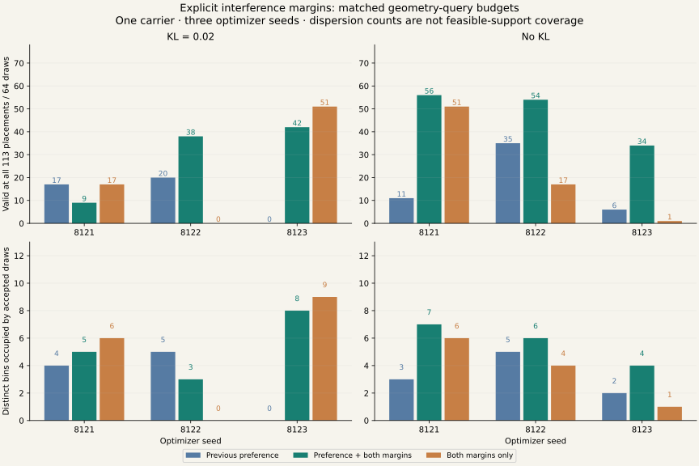

# Explicit collision margins in inverse scene learning

Explicit interference margins improve the preference model in all three optimizer
seeds without KL, and in two of three seeds with KL. The registered majority-of-seeds
prediction is met in both families. The **preference-plus-margins model without KL**
is the next development candidate; remaining failures, one source carrier and a small
distribution family prevent a generalization or execution claim.

## Results

Every count has denominator **64 unfiltered proposals**, including rejected proposals.
Passing all 113 placements requires both margins for all eight motion recordings.
The six baseline evaluations are reused; the twelve new cells add 768 new proposals.

| Method | Seed | Nominal | All 113 | All 113, gradient sources | Target clears all 113 | Upright interferes all 113 | Accepted bins |
|---|---:|---:|---:|---:|---:|---:|---:|
| robust_full | 8121 | 63 | 17 | 23 | 56 | 25 | 4 |
| robust_full | 8122 | 61 | 20 | 24 | 61 | 23 | 5 |
| robust_full | 8123 | 27 | 0 | 0 | 64 | 0 | 0 |
| robust_no_kl | 8121 | 64 | 11 | 11 | 64 | 11 | 3 |
| robust_no_kl | 8122 | 64 | 35 | 41 | 51 | 48 | 5 |
| robust_no_kl | 8123 | 59 | 6 | 8 | 64 | 6 | 2 |
| constraints_full | 8121 | 64 | 17 | 36 | 22 | 59 | 6 |
| constraints_full | 8122 | 63 | 0 | 11 | 0 | 64 | 0 |
| constraints_full | 8123 | 64 | 51 | 61 | 54 | 61 | 9 |
| constraints_no_kl | 8121 | 64 | 51 | 51 | 64 | 51 | 6 |
| constraints_no_kl | 8122 | 64 | 17 | 37 | 64 | 17 | 4 |
| constraints_no_kl | 8123 | 61 | 1 | 3 | 63 | 2 | 1 |
| margin_full | 8121 | 64 | 9 | 32 | 11 | 62 | 5 |
| margin_full | 8122 | 64 | 38 | 43 | 48 | 54 | 3 |
| margin_full | 8123 | 64 | 42 | 44 | 62 | 44 | 8 |
| margin_no_kl | 8121 | 64 | 56 | 63 | 57 | 63 | 7 |
| margin_no_kl | 8122 | 64 | 54 | 54 | 64 | 54 | 6 |
| margin_no_kl | 8123 | 64 | 34 | 34 | 64 | 34 | 4 |

Without KL, preference-model validity rises from **11 / 35 / 6** to **56 / 54 / 34**:
87.5%, 84.4% and 53.1% after the change. The pooled descriptive yield is 144/192 (75.0%)
versus 52/192 (27.1%), an increase of 47.9 percentage points. This pooling does not turn
optimizer seeds into independent carriers or provide a significance test. The full KL
model changes from **17 / 20 / 0** to **9 / 38 / 42**, including one regression.

The constraint-only models yield **17 / 0 / 51** with KL and **51 / 17 / 1** without KL.
Retaining preference helps all three no-KL seeds, but only one of three KL seeds relative
to the corresponding constraint-only arm. This supports its optimization value in the
selected no-KL setting, not a universal advantage of the preference term.



Accepted-bin counts for the no-KL preference model rise from 3/5/2 to 7/6/4. These are
counts in a fixed 30-by-70 partition, not measured fractions of robust feasible support.
More accepted samples can themselves reach more bins. No distribution-coverage or
real-scene calibration claim is established.

## Failures and next decision

The selected no-KL family still rejects 48/192 proposals: **41 fail only upright
interference and 7 fail only target clearance**. Its first seed loses seven target-clear
samples relative to its baseline, even while joint yield rises sharply. In that seed,
63/64 pass on gradient-source recordings but only 56/64 pass across all recordings.
The other two seeds have equal gradient-source and all-recording validity, so execution
seed exclusion is not the sole source of remaining failures.

The fresh sampling-interface check uses the predefined default `margin_full`, optimizer
seed 8121 and new sample seed 9521: **0/8 accepted, 8/8 rejected**. Keep this result;
it was not retried or replaced with a better checkpoint. It is distinct from the
registered comparison and from the chosen no-KL development family.

Retain the no-KL preference-plus-margins checkpoints as a candidate and preserve the
other arms as controls. Next determine whether accepted proposals can meet a continuous-
placement contract, then test independent motion carriers and conditional coverage.
The mixture's full-support Gaussian components can always assign mass to invalid parts
of the output domain: finite soft penalties cannot guarantee every raw draw. The
independent acceptance gate remains part of the generator system. A future accepted
conditional distribution must specify its gate and account for rejected-draw cost.
Do not continue weight tuning inside this frozen experiment.

## Evidence and cost

All twelve training cells complete without a recorded failure, using **651.61 seconds
of CPU training** and **212.81 seconds of independent evaluation**. No GPU training,
controller change or new physics execution is used. The new preference arms and prior
uncertainty baselines have matched update, latent-sample and placement-query budgets.

The new evaluation makes 768 × 113 × 8 = **694,272** proposal/placement/recording queries.
The first eight proposals per new cell receive the independent PyTorch cross-check,
covering 86,784 recording queries. The maximum absolute disagreement is
**2.78e-17 m**.
This supports implementation agreement on the static primitives, not actual-body or
between-frame collision equivalence.

The [portable evidence](evidence/margin-learning.json) contains all proposal coordinates,
worst clearances, per-proposal verdicts, failure categories and raw-array hashes. The
[registration manifest](evidence/margin-learning-manifest.json) pins the complete source
chain; [export hashes](assets/margin-manifest.json) identify the exported-file copies.
The local checkpoints, NPZ arrays, histories and unfiltered fresh draw are in the
artifact directory below. All execution/training admission flags remain false.

Frozen main manifest:
`sha256:a6ba7d7d95f185da6bdd5b77c6494c7eea8052fef3ef2d573fb1406a86e70918`.

## What changed

The [registered experiment](MARGIN_LEARNING_V1.md) adds an explicit 10 mm upright-
interference penalty to the existing target-clearance penalty. Four new arms cross
preference present/absent with KL 0.02/0. Twelve CPU training cells share optimizer
seeds, initialization, 300 updates, latent noise, corner draws and geometry-query counts.
Six prior uncertainty-trained cells are frozen baselines; their raw evaluations are
verified and reused. No prior source or checkpoint is modified.

Each model proposes beam station/height from the same whole-body motion sequence.
Training checks nominal pose plus four sampled corners; evaluation checks every one
of 64 proposals at all 113 registered placements and all eight motion recordings.
The independent NumPy geometry checker evaluates complete capsule axes and all recorded
frames. The 7903 execution seed is excluded from gradients but has been previously
observed in development. All motions still derive from one selected source carrier.

## What the ablation can establish

This binary candidate bank already encodes a strong geometric preference when both
margins hold. At target clearance +0.01 m and upright clearance −0.01 m, the frozen
cost/clearance decoder gives energies at most 1.693147 for the target and at least
4.018150 for upright. Thus enforcing both audit margins implies an energy advantage
of at least 2.325003 for the target under this decoder. The associated preference loss
is below 0.000092.

This is a sufficient-condition calculation, not a new rollout result. It means the
constraint-only ablation can test optimization benefits of the preference term here;
it cannot establish a need for preference learning across arbitrary motions, task costs
or scene families. A richer candidate bank with competing feasible alternatives is
needed to investigate that broader question.

## Reproduce and inspect

Training and independent evaluation commands are in the [protocol](MARGIN_LEARNING_V1.md).
The full local artifact directory is
`/home/linjiw/research-data/groot-wbc/m2s-margin-learning-v1/`.

```bash
.venv_research/bin/python scripts/research/render_motion2scene_margin_report.py \
  --result /home/linjiw/research-data/groot-wbc/m2s-margin-learning-v1/result.json \
  --certificate /home/linjiw/research-data/groot-wbc/m2s-placement-certificate-v1/result.json \
  --certificate-audit /home/linjiw/research-data/groot-wbc/m2s-placement-certificate-v1/audit.json \
  --out docs/motion2scene
.venv_research/bin/python scripts/research/motion2scene_sample_margin_beams.py \
  --manifest /home/linjiw/research-data/groot-wbc/m2s-margin-learning-v1/manifest.json \
  --arm margin_full --model-seed 8121 --sample-seed 9521 --count 8 \
  --out /path/to/new-margin-sample-audit.json
```

Outputs must be new paths. The sampler keeps every draw and rejection, audits the
original development carrier with the independent geometry implementation, and emits
no executable simulator scene. Saved models have not established generalization.

The separate [continuous-placement diagnostic](PLACEMENT_CERTIFICATE_V1.md) checks two
fixed arm/seed representatives under conservative subdivision. Its deliberately selected
examples cannot be pooled with raw proposal yield. Any conditional success assumes a
numerical-error bound and the static primitive contract; it cannot certify imported
robot geometry, time between recorded frames or physical execution.

Both representatives in the separate placement study receive conditional passes; see
[the certificate results and assumptions](PLACEMENT_CERTIFICATE_V1_RESULT.md).

Validation: 61 impacted tests pass across static NumPy/Torch queries, inverse learning,
uncertainty, explicit margins, placement subdivision, beam teaching, repeatability and
timing. Ruff E/F/I and Black pass for all nine new Python files. Main training and
certificate manifests preserve their pinned source hashes and all earlier export hashes.

The local page passes headless Chrome checks at 1440 × 1000 and 390 × 844: the new
figure decodes, no page JavaScript exception is recorded, and there is no horizontal
overflow. All 76 local page links/anchors and six related Markdown documents resolve;
the new export and four earlier export manifests verify. Changes remain local and
were not pushed or published.
