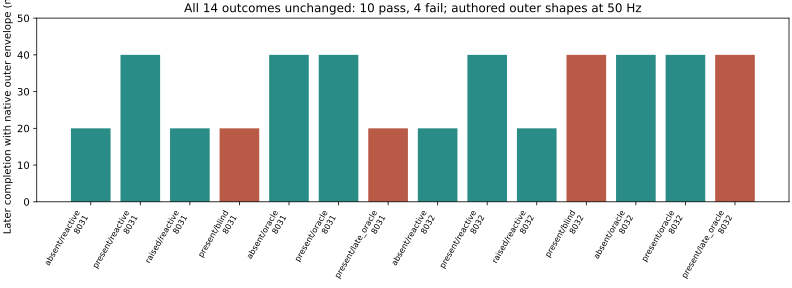

# Native outer-envelope crossing: result

The registered CPU audit preserves **all 14 classifications: 10 passes and four failures**. Requiring the complete authored outer envelope to cross shifts completion **20–40 ms later** than the body-origin criterion. Measured 200 Hz contact through the later horizon preserves the original verdicts.

| Cell | Body-origin finish frame | Outer-envelope finish frame | Delay (ms) | Outer-envelope passage | Peak force (N) |
| --- | --- | --- | --- | --- | --- |
| evalbank_8031_absent_reactive | 149 | 150 | 20 | pass | 0.000 |
| evalbank_8031_present_reactive | 152 | 154 | 40 | pass | 0.000 |
| evalbank_8031_raised_reactive | 149 | 150 | 20 | pass | 0.000 |
| evalbank_8031_present_blind | 151 | 152 | 20 | fail | 1010.303 |
| evalbank_8031_absent_oracle | 152 | 154 | 40 | pass | 0.000 |
| evalbank_8031_present_oracle | 152 | 154 | 40 | pass | 0.000 |
| evalbank_8031_present_late_oracle | 151 | 152 | 20 | fail | 1010.303 |
| evalbank_8032_absent_reactive | 149 | 150 | 20 | pass | 0.000 |
| evalbank_8032_present_reactive | 152 | 154 | 40 | pass | 0.000 |
| evalbank_8032_raised_reactive | 149 | 150 | 20 | pass | 0.000 |
| evalbank_8032_present_blind | 151 | 153 | 40 | fail | 1622.827 |
| evalbank_8032_absent_oracle | 152 | 154 | 40 | pass | 0.000 |
| evalbank_8032_present_oracle | 152 | 154 | 40 | pass | 0.000 |
| evalbank_8032_present_late_oracle | 151 | 153 | 40 | fail | 1622.827 |

All 45 native outer shapes are included. CPU time: 0.070 s; no simulator execution or GPU spend. Asset-layer hashes were checked before and after computation. This is a **conditional authored-envelope audit at recorded 50 Hz poses**, not cooked-mesh equivalence or continuous collision detection. The old result remains immutable.

[Protocol](NATIVE_CROSSING_AUDIT_V1.md) · [Full evidence](evidence/native-crossing-audit.json) · [Hash receipt](evidence/native-crossing-receipt.json)

Supplementary quaternion-normalization sensitivity bounds endpoint displacement by 3.33e-7 m, below the 0.00200001 m outward allowance. [Supplement](evidence/native-crossing-quaternion-supplement.json).
