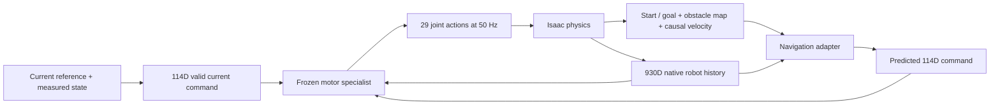

# Expanded motor/navigation comparison

Status: registered panel running; this document will be replaced by the completed readout.

The preserved research baseline is committed in `5a66860` and `4ad0f47`.
This increment compares the latest `d3789474…` navigation checkpoint against
its own inherited full-command motor, with identical checkpoint construction,
seed 91262, scene, motion initialization and scoring. The full-command arm
receives privileged current motion commands and is an execution control.
The navigation arm receives history, goal/map and causal localization only.

The registered panel includes three known diagnostic tasks (00908 clear,
00413 corridor, 00265 corridor) and five additional motion IDs: 00399, 00770,
00677, 00120, 00707, each in clear space and a synthetic corridor. They are
selected by endpoint kinematics before new simulation outcomes. All attempts
remain in the denominator, including failures of the full-command control.
These are motor-training motions absent from the navigation demonstration set;
this is not held-out motor ancestry or an independent final benchmark.

Each new motion receives a two-second repeated endpoint candidate. Only 00399
has audited tail speed below the scored 0.10 m/s threshold. The other four
candidates therefore test stopping support as well as downstream transfer.
No appended tail or proposed scene is assumed physically qualified.
The clear/corridor scenes do not force alternate routes or posture choices.

Both policies run at 50 Hz. Success requires 3D pelvis goal distance ≤0.25 m,
3D speed ≤0.10 m/s, and 50 consecutive valid ticks before the task deadline;
prohibited contacts above 1 N and pelvis height below 0.25 m terminate.
There is no independent posture or heading success criterion. Native Isaac
physics states are captured, then mesh-rendered in MuJoCo without resimulation.

A separate next experiment adds an explicit replay-motion weighting control:
62.5% 00908 and 12.5% each other training motion, matching the expected motion
exposure of the prior 50% fresh-recovery mixture. It retains the old replay
examples, initialization, optimizer reset, loss and 3,000-update budget.
This tests the sampling confound before attributing a gain to fresh query quality.
No expanded-panel motion will be used in this fit.

External artifacts: `/home/linjiw/research-data/m2s-navigation-expanded-replay-20260913/`.
The compact registered plan and selection audit are in
[`evidence/navigation-expanded-replay-20260913/`](evidence/navigation-expanded-replay-20260913/).

## What the two policies receive and execute

| Component | Full-command execution control | Navigation student |
|---|---|---|
| Native robot history | 930 normalized values | The same 930-value interface |
| Task input | 114 current motion-command coordinates; arrival coordinate 7 unavailable | Body-frame start/goal, stopping requirements, known obstacle map, causal localization velocity |
| Command production | Reconstructed from the current reference and measured robot frame | Learned 512-wide MLP predicts the 114 coordinates |
| Motor backend | Frozen forecaster → reference encoder → FSQ → decoder | Exactly the same frozen path |
| Simulator output | 29 joint-control actions at 50 Hz | 29 joint-control actions at 50 Hz |

The 930-value history contains gravity, angular velocity, joint positions,
joint velocities and previous actions over ten observations. Its native term
layout must be preserved; it is not an arbitrary chronological reshape.
The full-command schema comprises heading (2), root linear velocity (3), root
height (1), yaw rate (1), unavailable arrival (1), fourteen body keypoints (42),
joint positions (29), joint velocities (29), and relative anchor orientation (6).

The navigation context has ten values: start XYZ and goal XYZ in the measured
body frame, goal tolerance, terminal speed, hold duration, and a complete-map
bit. Up to five obstacles have 15-value primitive records and a padding mask;
a small encoder pools them into 64 values. Four localization values supply
body-frame velocity from a five-interval backward pose difference plus validity.
This is a known-map, localized-pose experiment with zero assumed estimator delay.
It does not supply a camera observation model.

The two command arrows represent alternative modes. Navigation receives no
reference, clip identifier, reference clock, future demonstration trajectory,
or externally selected continuation after initialization. This evaluator starts
both policies from the clip's seeded native initialization. It does not yet
establish arbitrary-start robustness. The navigation score measures reaching
and stopping at the goal; it does not require copying the original motion's
path, gesture, or semantic prompt. For example, a box/door prompt does not
imply a scored manipulation task in these scenes.

Freezing the motor preserves its function under the same inputs and runtime.
It does not make arbitrary predicted commands coherent or make every generated
scene compatible with the supplied reference. The previous 8/8 oracle pilot
used a different seed/runtime construction from this matched checkpoint control;
its existence result should not be substituted for execution on the new tasks.
