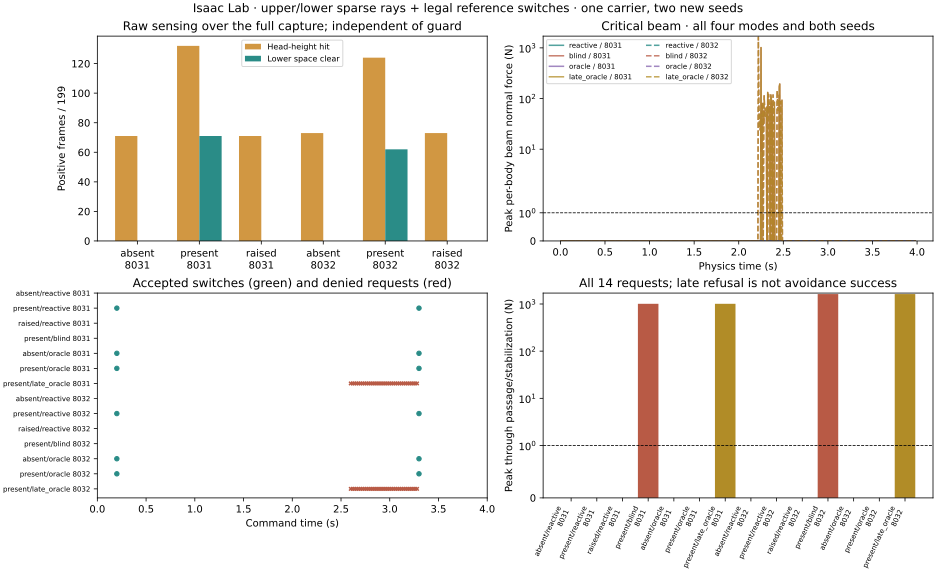
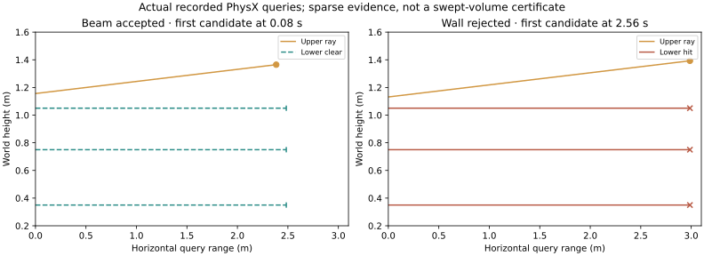

# Overhang sensing and guarded switching: Isaac Lab result

Completed 2026-09-06. Two 14-cell batches are reported separately: 28 new closed-loop executions on development carrier 41002, using seeds 8031 and 8032. The second batch repairs the alternate reference loader; it does not change the observer, guard, scenes, thresholds or SONIC checkpoint. This is an interface experiment, not a learned traversal-policy comparison.

## Evaluation-bank batch: all fourteen requests

| Scene / mode | Contact-free passage | Raw overhang frames, 8031 / 8032 | Actual switches, 8031 / 8032 | Peak beam force through passage (N), 8031 / 8032 |
| --- | --- | --- | --- | --- |
| absent/reactive | 2/2 | 0 / 0 | 0 / 0 | 0.000 / 0.000 |
| present/reactive | 2/2 | 71 / 62 | 2 / 2 | 0.000 / 0.000 |
| raised/reactive | 2/2 | 0 / 0 | 0 / 0 | 0.000 / 0.000 |
| present/blind | 0/2 | 81 / 78 | 0 / 0 | 1010.303 / 1622.827 |
| absent/oracle | 2/2 | 0 / 0 | 2 / 2 | 0.000 / 0.000 |
| present/oracle | 2/2 | 71 / 62 | 2 / 2 | 0.000 / 0.000 |
| present/late_oracle | 0/2 | 81 / 78 | 0 / 0 | 1010.303 / 1622.827 |

Registered results: **{'p1': True, 'p2': True, 'p3': True, 'p4': True}**. Loaded-reference audit P5: **True**.

P1 scores raw overhang classifications across the full capture, separately from allowed command phases. P2 tests the ten normal reactive/oracle cells and the two blind contact controls. P3 checks accepted transitions and deliberately late denials; P4 checks 200 Hz measurement. A denied late request does not count as successful avoidance.

## What changed and what the controls show

The observer keeps twelve upper rays, then checks three horizontal lower rays for each head-height hit. Only a hit with clear lower rays is treated as an overhang. It uses known flat-floor heights and ignores the robot itself; obstacle identity is recorded for audit but never used for classification. The original far wall remains in every control scene. Sparse clear rays are not a whole-body clearance certificate.

For each requested switch, the guard checks an onset window of 0.2–0.4 s or return window of 3.3–3.5 s, joint-reference position difference <=0.05 rad, and anchor-reference position difference <=0.01 m. It logs denied requests while leaving the robot state and clock unchanged. It does not certify velocity or torque continuity.

- evalbank_8031_absent_reactive: 71 upper-positive frames, 383 candidates rejected by lower-space checks, 0 raw overhang frames, 0 switches.
- evalbank_8031_raised_reactive: 71 upper-positive frames, 383 candidates rejected by lower-space checks, 0 raw overhang frames, 0 switches.
- evalbank_8032_absent_reactive: 73 upper-positive frames, 383 candidates rejected by lower-space checks, 0 raw overhang frames, 0 switches.
- evalbank_8032_raised_reactive: 73 upper-positive frames, 383 candidates rejected by lower-space checks, 0 raw overhang frames, 0 switches.
- evalbank_8031_present_late_oracle: 35 denied frames (joint_reference_jump, outside_legal_phase, root_reference_jump), 0 executed switches; passage outcome False.
- evalbank_8032_present_late_oracle: 35 denied frames (joint_reference_jump, outside_legal_phase, root_reference_jump), 0 executed switches; passage outcome False.

Across all fourteen cells: 0 recorded resets, 0 observed falls, and maximum last-substep/50 Hz force discrepancy 0 N. Each trajectory has 199 control frames and 796 physics samples. Crossing still uses body origins; a colliding walk may still physically cross.

## Preserved failure: training augmentation in the alternate bank

The first complete batch reports **{'p1': False, 'p2': False, 'p3': True, 'p4': True}**. Its four absent/raised reactive controls have 0 raw false-positive frames, but seed 8031 stalls after switching. Its alternate reference repeats one pose for 175 adjacent frame pairs after frame 23. Zero beam force there is not a traversal success.

The inherited alternate library used `load_motions_for_training`; the installed loader permits random freeze-frame augmentation outside evaluation. The frozen tail and code path support this diagnosis, although the original batch did not log the sampled augmentation flag. The second seed continues moving, exposing a seed-dependent reference-contract failure. The new guard correctly refused the resulting large return-reference jump.

V2 explicitly reloads the alternate library for evaluation, restoring Python/NumPy/Torch random-generator states around that reload. Before the first command update it checks each loaded root XY route against interpolation of the hashed source. It saves realized root and DOF arrays so that all fourteen banks can be compared independently.

Maximum loaded/source root-XY error: 5.7220459e-07 m. Maximum cross-cell root/DOF array difference: 0. These are numerical reference-binding checks, not physical tracking accuracy.

## Costs and lifecycle correction

New batch costs: v1 0.112422599 GPU h; evaluation-bank v2 0.126494043 GPU h; total new executions 0.238916642 GPU h.

Separately, a verified orphan from the earlier interrupted reactive-v2 attempt retained GPU memory after its wrapper exited. It was terminated and charged an additional conservative 0.381184276 reserved GPU h from the prior recorded interruption until cleanup. This supplements the old cost without rewriting it; it is not another scientific execution. Other workloads were left running. See the [cleanup record](evidence/reactive-orphan-cleanup.json).

## Next research gate

The remaining interface test is a preregistered variation panel over beam height, longitudinal position and observation delay, including blocked-underpass and wall controls. This pilot remains one observed source and an ideal sparse lidar sensor. It does not demonstrate sensor noise tolerance, arbitrary skill transitions, source transfer or downstream learning benefit.

After that gate, freeze the sensor and command API before comparing generated training environments against uniform placement, the strong analytic/grid generator, and an unconstrained model with the same scene representation and matched budgets. Keep source-family splits and the permanent exclusion of 430xx audit sources.

## Evidence and verification

[V1 protocol](OVERHANG_INTERFACE_V1.md) · [evaluation-bank protocol](OVERHANG_EVALUATION_BANK_V2.md) · [first-batch result](evidence/overhang-interface-v1.json) · [evaluation-bank result](evidence/overhang-eval-bank-v2.json) · [bank audit](evidence/overhang-reference-bank-audit.json) · [hash receipt](evidence/overhang-eval-bank-v2-receipt.json)





```bash
PYTHONPATH=. .venv_research/bin/python scripts/research/render_motion2scene_overhang.py \
  --result /home/linjiw/research-data/groot-wbc/m2s-overhang-eval-bank-v2/result.json \
  --name overhang-eval-bank-v2
```

Focused verification covers geometric beam/wall discrimination, lower occlusion, independent phase/position guards, frozen-reference rejection, existing contact synchronization, and geometry/passages. **58 tests passed.** Ruff and Black pass for the new Python files. The [final lifecycle audit](evidence/overhang-lifecycle-audit.json) verifies 57 frozen dependencies and finds no remaining overhang/reactive rollout processes.
