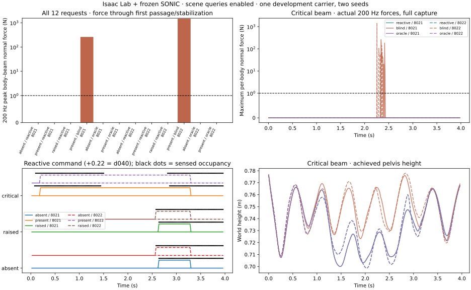

# Isaac Lab reactive-interface result

Completed 2026-09-06. V1 and V3 each complete 12 closed-loop executions. The interrupted V2 retains five completed captures, one interrupted run and six unstarted requests: 29 completed executions plus one interrupted launch overall. Each batch uses one carrier (41002), six conditions and two seeds (8021, 8022). This is a scripted sparse collision-lidar selector driving frozen SONIC, not policy training or a fresh-source transfer test.

## Typed-ray observer results (V3)

| Scene / selector | Contact-free passage | 200 Hz peak force through passage, seeds 8021 / 8022 (N) | Observed resets / falls |
| --- | --- | --- | --- |
| absent / reactive | 2/2 | 0.000 / 0.000 | 0 / 0 |
| present / reactive | 2/2 | 0.000 / 0.000 | 0 / 0 |
| raised / reactive | 2/2 | 0.000 / 0.000 | 0 / 0 |
| present / blind | 0/2 | 261.463 / 1470.396 | 0 / 0 |
| absent / oracle | 2/2 | 0.000 / 0.000 | 0 / 0 |
| present / oracle | 2/2 | 0.000 / 0.000 | 0 / 0 |

Registered predicates: **P1 (selective switching) fails; P2 (passage/contact contrast) and P3 (measurement) pass.** The result is partial: contact-free beam adaptation works, but the selector is not qualified for downstream training.

Switch audit:
- typed_8021_absent_reactive: 2.64 s: 0→1, joint-reference jump 0.635588 rad; 3.30 s: 1→0, joint-reference jump 0 rad. State/clock contract: False.
- typed_8021_present_reactive: 0.20 s: 0→1, joint-reference jump 0 rad; 3.30 s: 1→0, joint-reference jump 0 rad. State/clock contract: True.
- typed_8021_raised_reactive: 2.64 s: 0→1, joint-reference jump 0.635588 rad; 3.30 s: 1→0, joint-reference jump 0 rad. State/clock contract: False.
- typed_8021_absent_oracle: 0.20 s: 0→1, joint-reference jump 0 rad; 3.30 s: 1→0, joint-reference jump 0 rad. State/clock contract: True.
- typed_8021_present_oracle: 0.20 s: 0→1, joint-reference jump 0 rad; 3.30 s: 1→0, joint-reference jump 0 rad. State/clock contract: True.
- typed_8022_absent_reactive: 2.58 s: 0→1, joint-reference jump 0.635589 rad; 3.30 s: 1→0, joint-reference jump 0 rad. State/clock contract: False.
- typed_8022_present_reactive: 0.20 s: 0→1, joint-reference jump 0 rad; 3.30 s: 1→0, joint-reference jump 0 rad. State/clock contract: True.
- typed_8022_raised_reactive: 2.58 s: 0→1, joint-reference jump 0.635589 rad; 3.30 s: 1→0, joint-reference jump 0 rad. State/clock contract: False.
- typed_8022_absent_oracle: 0.20 s: 0→1, joint-reference jump 0 rad; 3.30 s: 1→0, joint-reference jump 0 rad. State/clock contract: True.
- typed_8022_present_oracle: 0.20 s: 0→1, joint-reference jump 0 rad; 3.30 s: 1→0, joint-reference jump 0 rad. State/clock contract: True.

Skill 0 is neutral and skill 1 is d040. Switching preserves measured root state, joint state and motion clock exactly; no explicit reset or state write is called. The critical-beam and oracle switches occur where references coincide. The four negative controls instead switch late at 2.58–2.64 s with approximately 0.636 rad reference jumps, even though the simulated state itself is not overwritten. This does not validate arbitrary gait transitions or responses to late obstacles.

The direct 200 Hz contact view matches the last substep of every 50 Hz sample: maximum absolute difference 0 N. Every 199-frame trajectory has 796 captured physics steps. Peak force, duration above 1 N and integrated sum of per-body normal-force magnitudes are in the evidence JSON. This integral is not net vector impulse; tangential friction forces are not included.

## Why the negative controls fail

The [post-outcome hit audit](evidence/reactive-interface-false-positive-audit.json)
traces all four absent/raised first detections to `Structure/WallEast`, at world
X = 6.1502 m and about 2.99 m sensor range. The ray-height band [1.15,1.50] m
accepts a wall as well as a beam; it does not check traversable free space below.
The critical beam itself is first detected at 0.08/0.10 s for the two seeds.
Later wall detections also occur in those trials but the skill is already latched.

No post-outcome threshold tuning or scientific rerun is admitted. The next
observer must represent both upper occupancy and lower free space, while the
command interface must reject switches outside a declared legal transition set.
A deadline alone would hide the late false positives without solving perception.
Do not fix this by using beam identity or removing the wall from the controls.

## Preserved first attempt and resource lineage

V1 predicates: **{'p1': False, 'p2': False, 'p3': True}**. Both critical-beam reactive trials made no switches because the scene-query runtime was disabled by default. The rule received zero ray hits. Their peak forces were 261.463, 1470.396 N. Oracle switching tests independently measured the control interface. All failures remain in the first-attempt table and raw records.

V2 enables scene queries but its typed `RaycastHit` callbacks raise exceptions that PhysX swallows; five ordinary runtime completions therefore do not qualify as valid sensing. We stopped its sixth run. V3 adds typed-hit normalization and explicit callback-error propagation. The ray geometry, thresholds, switching rule, motion references and recorder remain unchanged. All three attempts are development diagnostics, not independent confirmatory samples.

The initial prelaunch manifest had zero physics spend; a second prelaunch manifest corrected only raised-beam analysis handling. The first physics batch yielded after six completed cells at the 9000 MiB startup floor. A registered 7500 MiB resource continuation reused those six artifacts without rerunning them and completed the remaining six. V2 and V3 use the same trajectory-only floor. V3 also preserves a formatting-only prelaunch manifest revision with zero spend. Original yielded records and all lineage hashes are preserved.

Actual charged GPU time: v1 0.116886939 h (including the original six cells exactly once); interrupted v2 0.051544658 h; v3 0.106737813 h; total 0.275169410 h.

## Claim boundary and next experiment

This measures ideal simulator collision-ray sensing and phase-aligned closed-loop reference selection. Hit identity is logged for auditing but is not a selector input. The rule assumes a flat known floor and uses a fixed world-height occupancy band. It is not RGB/depth perception, noisy lidar, a trained policy, evidence of generator superiority, or a hardware result. Passage still checks body origins rather than full collider extents. Contact does not establish that upright walking cannot cross.

Next repair and separately test overhead/free-space discrimination and legal switch timing; then freeze a beam-height/longitudinal-position/observation-delay interface panel before running the matched training-data comparison described in [the downstream design](DOWNSTREAM_SENSOR_POLICY_PILOT_DESIGN.md). Keep the strong analytic baseline and source ancestry splits; never fit on 430xx audit sources.

## Reproduction and artifacts

[V1 protocol](REACTIVE_INTERFACE_V1.md) · [resource continuation](REACTIVE_INTERFACE_RESOURCE_V1.md) · [V2 protocol](REACTIVE_INTERFACE_QUERY_V2.md) · [V3 protocol](REACTIVE_INTERFACE_TYPED_V3.md) · [V2 failure record](evidence/reactive-interface-v2-failure.json) · [V1 complete evidence](evidence/reactive-interface-v1.json) · [V3 complete evidence](evidence/reactive-interface-typed-v3.json) · [hash receipt](evidence/reactive-interface-receipt.json)



[Watch the seed-8021 body-origin execution replay](assets/reactive-interface-replay.mp4). This is a side projection of recorded dynamics with kinematic chains, not a mesh rendering or another simulation; body origins omit collider extents such as the head.

The immutable result writer refuses replacement. Verify existing results and imported beam inventories with the hash-checking renderer:

```bash
PYTHONPATH=. .venv_research/bin/python scripts/research/render_motion2scene_reactive_interface.py \
  --prior /home/linjiw/research-data/groot-wbc/m2s-reactive-interface-resource-v1/result.json \
  --current /home/linjiw/research-data/groot-wbc/m2s-reactive-interface-typed-v3/result.json
```

Validation: 51 focused tests passed across passage scoring, physics-substep capture checks, reference/geometry audits, and the approved-manifest runner. All new Python files pass Ruff and Black.

## Later follow-up and resource supplement

The [overhang follow-up](OVERHANG_INTERFACE_V2_RESULT.md) retains this failed specificity
result and tests lower free-space sensing plus legal transitions. A later lifecycle
audit found an orphan from the interrupted v2 runtime holding GPU memory; it was
terminated and charged separately in the [cleanup supplement](evidence/reactive-orphan-cleanup.json).
The original result and its cost fields are unchanged; the supplement adds
0.381184276 conservative reserved GPU-hours to the historical accounting.
