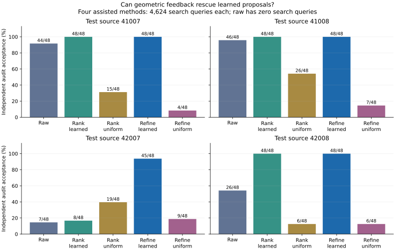

# Matched-query search and refinement: completed v1

Reference-only development study, 2026-09-05. The [protocol](REFINEMENT_V1.md) and
implementations were frozen before search. Registration hash:
`sha256:689159717e5e346820f3691ccea1de2c84881f77c435a1a0179255dbeecae083`. All 48 jobs and 192 new audit rows completed.
No model fitting, new source motion, new edit operator, physics run or scene admission.

## Main finding and next decision

Learned proposals followed by bounded geometric refinement reach **189/192 (98.4%)**
valid test outputs, versus **123/192 (64.1%)** raw: +34.4 percentage points. Refinement
rescues 66 failures and introduces zero newly failed raw successes in this audit.
It improves over raw and uniformly initialized refinement on all four test parents.
Uniform refinement reaches 26/192 (13.5%); ranking 136 uniform draws reaches 66/192
(34.4%). The learned starting distribution supplies useful information under this
specific bounded search budget; these controls do not establish superiority to all
classical or exhaustive analytic searches.

Ranking additional learned samples reaches **152/192 (79.2%)** at the same query count,
with 35.53 s total search time versus 112.72 s for learned refinement across 48 jobs.
Refinement ties ranking on three test parents and improves the hard source 42007 from
8/48 to 45/48. Its strict prediction of beating ranking on every source therefore
fails. This supports a hybrid generator and motivates selective refinement, not a
claim that gradients are always worth their extra computation.

The hard 42007/0.35 event improves from 0/24 to **21/24**, establishing positive finite
reference witnesses where raw sampling found none. The three remaining test failures
all miss neutral interference. Mean accepted occupied bins per test job rise from
2.17 raw to 3.83 refined; ranking learned samples has 1.50. These small-bin diagnostics
help expose concentration but do not measure complete feasible-support coverage.

Keep **learned proposal → bounded geometric correction → independent rejection** as
the current research direction. Next register a fixed-budget station-perturbation or
derivative-free fallback at stalled proposals, with a ranking/early-stop cost control.
Freeze its rule before fresh-source evaluation; do not enlarge the trust region or
retry the failed batches reported here. Later, distill training-source refinements into
the proposal model while keeping excluded sources/phases out of training. Conditional
placement checking, imported body geometry and temporal checks remain separate needs.

## Method and contribution

A new bounded refinement layer optimizes eight learned or uniform proposals using both
target and neutral motion geometry. This adds an inference component to the existing
motion-conditioned generator. The comparator ranks 136 learned or uniform candidates
using the same two margins. All four assisted methods use exactly 4,624 reference
clearance queries per job; raw neural proposals have zero search queries. Gradients
cost more than forward queries, so query matching does not imply matched wall time.
These searches use both references at inference, whereas the neural forward pass uses
only target motion. The alternative is not supplied as an extra neural input.

Use the three existing all8/1200 checkpoints (seeds 8421–8423), preserving their exact
raw draw prefixes. All eight excluded validation/test parents are evaluated at both
previously unseen phases, 0.35 and 0.65. They have now been observed in development;
this study does not create fresh confirmatory evidence. Each parent supplies 48 outputs
per method: three optimizer seeds × two motion variants × eight proposals. Source
parents are the independent groups; counts are not independent Bernoulli trials.

## Test outcomes

| Method | 41007 /48 | 41008 /48 | 42007 /48 | 42008 /48 | Total /192 |
|---|---:|---:|---:|---:|---:|
| Raw learned | 44 | 46 | 7 | 26 | 123 |
| Rank learned | 48 | 48 | 8 | 48 | 152 |
| Rank uniform | 15 | 26 | 19 | 6 | 66 |
| Refine learned | 48 | 48 | 45 | 48 | 189 |
| Refine uniform | 4 | 7 | 9 | 6 | 26 |



Every assisted method returns eight candidates, including failures. No audit-based
replacement or retry is allowed. Top-eight selection uses nominal plus 16 corners;
reported acceptance uses the separate 113-placement, full-sampled-motion NumPy audit.
A valid candidate clears the target by at least 10 mm and interferes with the neutral
by at least 10 mm at every audit placement.

## Predictions and paired effects

| Registered predicate | Outcome | Per-test-parent differences |
|---|---|---|
| Learned refinement beats raw on every test parent | True | [4, 2, 38, 22] |
| Learned refinement beats uniform refine on every test parent | True | [44, 41, 36, 42] |
| Learned refinement beats learned rank on every test parent | False | [0, 0, 37, 0] |
| Any learned-refinement witness on 42007 / 0.35 | True | 21/24 |

Differences are in source order 41007, 41008, 42007, 42008. Ties do not pass strict
improvement predictions. Paired learned-refinement changes are measured against each
same-index raw input; the final incumbent was chosen using search geometry only.

| Test parent | Rescued raw failures | Newly failed raw successes |
|---|---:|---:|
| 41007 | 4 | 0 |
| 41008 | 2 | 0 |
| 42007 | 38 | 0 |
| 42008 | 22 | 0 |

Positive witnesses establish feasibility only under these finite reference checks.
Failed search is not a proof that no placement exists. Boundaries between sampled
placements, between motion frames and actual imported body geometry remain unvalidated.
No obstacle-present execution or downstream policy benefit follows from these counts.

## Validation outcomes

| Method | 41005 /48 | 41006 /48 | 42005 /48 | 42006 /48 | Total /192 |
|---|---:|---:|---:|---:|---:|
| Raw learned | 44 | 42 | 39 | 35 | 160 |
| Rank learned | 48 | 48 | 48 | 48 | 192 |
| Rank uniform | 13 | 14 | 20 | 21 | 68 |
| Refine learned | 48 | 48 | 48 | 48 | 192 |
| Refine uniform | 6 | 6 | 6 | 5 | 23 |

Validation is reported separately and does not select a method or checkpoint here.

## Cost and failure audit

| Method | Search seconds (48 jobs) | Search queries | Test target failures | Test neutral failures | Mean accepted bins per test job |
|---|---:|---:|---:|---:|---:|
| Raw learned | 0.000 | 0 | 22 | 47 | 2.17 |
| Rank learned | 35.527 | 221,952 | 0 | 40 | 1.50 |
| Rank uniform | 35.145 | 221,952 | 76 | 65 | 2.58 |
| Refine learned | 112.722 | 221,952 | 0 | 3 | 3.83 |
| Refine uniform | 113.024 | 221,952 | 114 | 87 | 1.00 |

Failure types can overlap. Accepted bins use station width 0.02 and height width
0.01 m; the mean is over 24 test jobs per method. This describes concentration and
near-duplicate outputs, not feasible-support coverage or independent scene counts.
Search time excludes shared preprocessing/sampling, listed below. All outputs retain
their raw arrays, search trajectories and selected indices for verification.

- Search-stage wall time: 297.173 s (4.95 min).
- Initial shared loading/features: 0.561 s; checkpoint setup: 0.010 s.
- Independent audit: 84.541 s (1.41 min).
- Total search minima: 887,808; new audit minima: 347,136; Torch cross-check minima: 86,784.
- Maximum NumPy–Torch error, including reused raw rows: 1.11e-16 m, below the 1e-8 m stop threshold.
- Three checkpoint fits are inherited from the source/phase study and are not rerun or free. This experiment does not establish training-cost amortization.
- Python 3.11.16, NumPy 2.4.6, PyTorch 2.11.0+cu128 using CPU float64/two threads; zero GPU spend.

Both learned arms share one measured neural draw batch per job; uniform arms share one
uniform batch. Per-arm sample times in the JSON represent standalone arm attribution;
adding them double-counts shared sampling in the measured total stage. File I/O and
loop overhead are included in stage wall time. Raw verification costs are inherited
and reused, so zero search time must not be interpreted as zero deployment cost.

## Fixed fresh sampler check

After the main outcome was known, a separate [plan](evidence/refinement-sampler-plan.json)
fixed the first checkpoint seed 8421, hard case 42007_event3, fresh draw seed 9521 and
eight outputs before sampling. This is a prospective fresh-draw check on an observed
case, not a fresh source test or an additional original registered prediction.
The [saved batch](evidence/refinement-fresh-sampler.json) accepts **5/8** without retries.
All targets clear by 18.8–27.2 mm. Three outputs fail because their worst neutral
clearances are +4.4 to +8.2 mm instead of at most −10 mm.

Post-hoc trace inspection: all three rejected candidates leave their station unchanged
and reach the −0.03 m height-movement bound. The five accepted candidates move +0.05 in
station, reaching that bound. This motivates testing station perturbations against a
possible flat-gradient failure; it does not prove the precise cause or authorize
relabeling the three refusals. The sampler returns world-frame box proposals, accepted
indices, every rejection and the raw refinement/audit trace. Acceptance is reference
geometry only. The measured fresh call takes 0.181 s setup, 2.432 s refinement and
0.413 s independent audit, without model training.

```bash
.venv_research/bin/python scripts/research/motion2scene_sample_refined_beams.py \
  --registration /home/linjiw/research-data/groot-wbc/m2s-refinement-v1/registration.json \
  --case 42007_event3 --checkpoint-seed 8421 --draw-seed 9521 --out /path/to/fresh-output
```

[Fresh sampler export hashes](assets/refinement-sampler-manifest.json).

## Reproduce and verify

From the repository with its existing research environment and hash-pinned source
artifacts available, register to an empty new directory. Stages refuse overwrites.

```bash
.venv_research/bin/python scripts/research/motion2scene_refinement_study.py register --out /path/to/new-study
.venv_research/bin/python scripts/research/motion2scene_refinement_study.py search --registration /path/to/new-study/registration.json
.venv_research/bin/python scripts/research/motion2scene_refinement_study.py analyze --registration /path/to/new-study/registration.json
.venv_research/bin/python scripts/research/render_motion2scene_refinement.py --result /path/to/new-study/result.json --out /path/to/new-export
```

The exporter verifies all 240 raw rows, search-trace hashes, ranking/incumbent selection,
trust/domain bounds, paired effects, grouped counts and all registered predicates.
All 74 focused tests pass: the previous 71 geometry/learning/lineage tests plus three
new synthetic constraint and trust-region tests. Black and Ruff pass for the six new
Python files. Desktop (1440 px) and mobile (390 px) browser checks pass with no
horizontal overflow or JavaScript exceptions; the plot and mobile section were visually
inspected. All 120 local HTML links and 56 export hashes across ten follow-up manifests
pass. The website changes are local and have not been published.

[All outcomes](evidence/refinement.json), [registration](evidence/refinement-registration.json),
[export hashes](assets/refinement-manifest.json), [updated plan](NEXT_RESEARCH_PLAN.md).

Exact focused test command:

```bash
.venv_research/bin/python -m pytest \
  tests/dataset_generation/test_capsule_box_exact.py \
  tests/dataset_generation/test_capsule_box_torch.py \
  tests/dataset_generation/test_motion2scene_inverse.py \
  tests/dataset_generation/test_motion2scene_uncertainty.py \
  tests/dataset_generation/test_motion2scene_margins.py \
  tests/dataset_generation/test_placement_certificate.py \
  tests/dataset_generation/test_motion2scene_carriers.py \
  tests/dataset_generation/test_motion2scene_events.py \
  tests/dataset_generation/test_motion2scene_beam_teacher.py \
  tests/dataset_generation/test_motion2scene_repeatability.py \
  tests/dataset_generation/test_motion2scene_timing_diagnostic.py \
  tests/dataset_generation/test_motion2scene_source_phase.py \
  tests/dataset_generation/test_motion2scene_refinement.py -q
```
