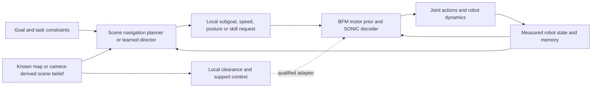

> User clarification: Direct masked scene/navigation conditioning is a primary candidate, not merely a later compression step. See [the direct-conditioning addendum](DIRECT_MASKED_SCENE_NAVIGATION_20260913.md). The hierarchy below is an interpretable comparison, not a required architecture.

# From motion foundation to scene-and-goal navigation

Research/design review, 2026-09-13 UTC. This document proposes the downstream interface and experiments; it does not change the running transformer/DAgger experiment or claim that navigation is already trained.

## Recommendation and final inference contract

The intended product interface is feasible: **the user supplies a navigation request and scene context, and the robot generates and executes motion toward the request.** The robot must additionally consume its measured state/history continuously. Scene and goal alone cannot determine balancing actions after a disturbance, localization change or unexpected contact.

A useful final API is `act(robot_history, scene_belief, navigation_request, memory) -> joint_action, memory`. Goal, constraints and an initial map may be supplied once; live sensing, localization and local scene updates continue. No reference clip, motion ID, phase, ground-truth future trajectory, manually supplied velocity sequence or externally selected skill is required at deployment. Internal planning may still generate waypoints, commands or motion candidates.

I recommend a hierarchical context-conditioned controller first, followed by optional distillation of the working hierarchy into a more compact policy:

The scene/navigation context is broader than an instantaneous motor command, but it must produce a *time-varying* decision from the current state. A single scene embedding attached once to a clip is insufficient for route switching, stop timing, occlusion, or recovery. Stable task intent and continuously updated local belief are different quantities.

Suggested first timing, to be tested: task/subgoal decisions at 5 Hz, native motor actions at 50 Hz, with immediate replanning on a detected blockage or large deviation. Any latched subgoal needs an explicit coordinate frame. Store a waypoint in the map frame and transform it using the current measured pose each motor tick; do not hold stale body-frame coordinates while the robot turns. These timing changes are a proposal, not part of the present 50 Hz navigator.

## What the current training actually learns

Current foundation inputs are 930D measured history and 79 command values with masks. Full commands include root/body/joint targets; the navigation mask exposes only forward/lateral velocity, yaw rate and anchor height. Training targets come from the frozen SONIC tracker and its reference motion. Neither scene obstacles nor final destination are inputs to the currently running foundation experiment.

The existing downstream prototype adds recurrent start/goal and five known primitive-obstacle tokens and emits four motor commands. It has strict query/scene contracts and an optional action residual, but no qualified learned scene-navigation result. The registry contains exact task/continuation bindings; it is not an algorithm for inventing a route around a newly moved obstacle.

Through DAgger round 4, the current transformer has completed 3/89 train clips in both full and navigation-command evaluation, with 0/20 development completions. Train mean progress reached about 29.9%/31.1%, versus roughly 7.5%/7.3% for the longer MLP control. This is progress in tracking, not evidence of scene understanding. The frozen training snapshot is stored beside this document; later stages may finish after that snapshot.

The corrected scene probes are informative: clear/corridor continuations can get close to a goal but fail terminal hold or strict tracking; the low-beam continuation collides. These expose missing arrival transitions and posture/clearance capability. A global scene model cannot compensate reliably for absent low-level behaviors without additional motor training.

## Lessons from related work

| Work | Evidence-supported lesson | Application here |
|---|---|---|
| [BFM](https://arxiv.org/html/2509.13780v1) | Masked control and online CVAE distillation connect multiple motor-control interfaces. | Keep the reusable motor prior and explicit command masks. Our scene planner is an additional learned task layer. |
| [BFM-Zero](https://arxiv.org/html/2511.04131v1) | Forward-backward unsupervised RL learns task-conditioned behavior latents and supports reward/pose prompts and latent adaptation. | Explore task/skill latent planning as a separate algorithmic branch. Its pose-goal examples do not establish spatial obstacle navigation. |
| [MaskedMimic](https://research.nvidia.com/labs/par/maskedmimic/) | Partial motion constraints can compose path, posture and object-conditioned behavior in simulated characters. | Convert scene intent to useful sparse motor constraints; qualify transfer to our G1 dynamics. |
| [ViNT](https://arxiv.org/abs/2306.14846) | A visual navigation model can use goal tokens and adapt its goal interface across task types. | Give navigation requests a modality-independent encoding; keep the humanoid motor policy separate. |
| [RPL](https://arxiv.org/abs/2602.03002) | Humanoid terrain experts with privileged height maps are distilled into a multi-depth-camera transformer. | Use privileged scene expertise to supervise a deployable perceptual policy with latency/noise/missing-view training. |

BFM-Zero is not simply the present masked CVAE with a different prompt. Adopting its method would require transition replay, forward/backward representation learning and the corresponding policy objectives. Our current action-label fitting does not implement those mechanisms. Its authors also state that behavior scope depends on the training motions. A learned task latent is not evidence that an unseen collision geometry is traversable. These are reasons to borrow its task-conditioning/latent-adaptation ideas first and treat a full algorithm port as a separately budgeted research branch.

The architectural recommendation below is our inference from those works and our evidence, not a result established by any one paper.

## Improve the task definition before adding global context

Use a navigation request with a goal region, final heading if relevant, terminal-speed/hold requirements, deadline and posture/contact constraints. Treat `start` as measured initial state; the robot's current pose, velocity and previous actions continue to evolve. For the known-map stage, explicitly assume localization in that map. For visual goals, use a separate goal modality and grounding procedure.

Scene geometry needs enough structure to describe traversal. A maximum-five-obstacle list is a useful fixture but a poor final representation. Use variable object tokens for semantic/geometric structure plus an egocentric geometric representation for free space, ground support and body clearance. A single-valued terrain height map cannot faithfully represent an overhang and its free space underneath; low beams call for layered height/clearance channels or 3D occupancy/distance information. Keep unknown space distinct from observed free space.

The first director may use bounded velocity/yaw/height commands for flat navigation. Traversal should additionally expose a supported posture/skill request or sparse body-point targets using the existing richer interface. Those commands must be physically tested. For fast local foot-placement adaptation, a separately trained local-geometry adapter to the motor module may be needed; freeze the global foundation initially and compare this adapter against command-only control. Do not assume all geometry can be compressed into four numbers without losing necessary information.

An internal local-plan generator is a sensible eventual place for a transformer or flow-matching model. It can represent different left/right routes or walk/crouch choices over a short horizon. Keep one coherent branch, check it against geometry and feasible motor behavior, and replan from feedback. Averaging incompatible routes or resampling unrelated motion latents every motor tick can produce an invalid middle path. Flow matching requires useful conditional trajectory data and does not supply collision guarantees on its own.

## The missing supervision: scenes must change the correct behavior

The hypothesis to test is `policy(history, goal, scene)` chooses different *successful* behavior when the scene or goal requires it. Our older scenes largely attach variants to the same motion. Such associations may teach compatibility or recognition while leaving route choice unidentified.

Build task families, not just one scene label per clip:

1. Same initial robot state and goal; block the left passage versus the right passage. Supply distinct executed continuations where each is valid.
2. Same scene and initial state; different goals requiring different turns.
3. Same route corridor; different overhead clearance requiring walking versus a qualified lowered posture.
4. Same destination; different stopping distances/speed constraints. Include an executed approach-decelerate-hold transition.
5. Same task; perturbed initial states or mid-execution disturbances. Record whether the scene expert can actually recover.
6. Unreachable or temporarily blocked goals: distinguish waiting/replanning/failure from blindly following a reference.

Do not label a changed goal with the original goal's teacher action. Do not call a fixed reference a scene expert when the obstacle invalidates it. A geometric planner may propose a continuation; dynamic execution and goal/contact checks determine which proposals are demonstrations. Existing Motion2Scene generation can propose geometry, but should now be paired with a continuation search/selection procedure and executed evidence. The corrected scene exporter protects joint order, not physical feasibility.

Preserve all failures. For learning, distinguish whole-qualified nominal execution, task-qualified continuation, and numerically supported exploratory query. A moving goal or obstacle changes the task binding and may invalidate an old receipt. A reference path is allowed as a planner/posterior target during training, not secretly as a deployment input.

## Training sequence and objectives

**A. Motor capability and diagnosis.** Continue the bounded foundation comparison unchanged. Add independent command tracking evaluation with fall/contact limits and no exact-reference-pose requirement; retain the original scorer alongside it. Check stop, turn, lateral movement, low posture and recovery. Compare scene planning with a strong native SONIC tracking backend as an oracle baseline so navigation research can proceed while the distilled motor policy is weak. This oracle is an evaluation/training aid, not a public deployed student.

**B. Privileged scene expert.** Use the known geometry to choose route and posture, then generate or retrieve compatible continuations and execute them through the trusted tracker. Train an expert for goal progress, clearance, acceptable contacts, falls and stable arrival when retrieval is insufficient. High-level imitation cannot exceed the coverage of its action labels just by receiving more context. Start with qualified stopping and turns before broad traversal.

**C. Context-conditioned navigation.** Freeze the reliable motor backend. Train the director using executed subgoal/command/skill decisions, same-state action matching through the differentiable motor, and auxiliary progress/arrival predictions. Use valid multimodal targets rather than a single averaged route. Add DAgger on the actual director+motor visited states; record expert interventions and unavailable recovery labels. Geometry/collision losses can guide proposals, but physical success remains the promotion criterion.

**D. Task optimization and residual comparison.** Optimize scene/goal returns after warm start. First compare command-only against a bounded, zero-initialized action residual with the same task pool and compute budget. Penalize residual magnitude and temporal changes, retain nominal replay, and report whether the residual is repairing motor errors or exploiting task/scorer gaps. A residual cannot be assumed to solve route planning or compensate for an untrained crawling skill. After a hierarchy works, distill it into a compact context-to-action policy and test whether this preserves its task outcomes.

**E. Camera student.** Train an encoder from synchronized depth/RGB, camera calibration and robot history to a persistent scene belief. Distill task actions and useful local geometry from the privileged map expert, then collect on the camera student's visited states. Geometry supervision is useful on observed areas; hidden-space prediction needs uncertainty and exploration, not an assumption that all truth-map information is available.

No changes to active source files or training configuration are required for this review. The above are next-stage designs and discriminating experiments, not completed policies.

## Camera extendability designed now

Keep the motor and goal interfaces stable while versioning the scene-observation contract. A scene feature should record frame, timestamp/age, known/observed mask, confidence, source modality and optional object velocity, in addition to geometry. Recurrent memory handles occlusion and stale observations. A missing depth return must not become the existing “absent obstacle” padding bit.

Begin with depth and fixed calibration, then vary noise, delays, dropout, lighting/appearance where RGB is used, and camera/view coverage. Robot self-occlusion matters during crouching and turning. Add RGB semantics only when the task needs object/region goals; geometry-first depth navigation is already a substantial problem.

Separate two deployment modes: (1) a coordinate goal in a map, which needs localization or odometry/map registration; (2) a visual/semantic goal, which needs goal recognition and exploration. A camera alone does not resolve where an arbitrary global-coordinate goal lies. Give the goal encoder an explicit modality tag instead of conflating these tasks.

There is value in sharing a scene-belief interface between perfect-map and camera modes, but forcing exact feature equality can demand hidden information from vision. Prefer task/action distillation plus visibility-aware geometric objectives and uncertainty-aware planning. Compare oracle full map, oracle visible-only map, noisy depth, and RGB-D. The differences separate planning/control failure from observability and perception failure.

## Minimal decisive experiment matrix

| Comparison | Keep fixed | What it identifies |
|---|---|---|
| Geometric director + trusted tracker vs learned director + same tracker | Task starts, goals, maps, motor backend | Scene/goal decision learning |
| Same director + trusted tracker vs distilled motor | Plan and task conditions | Motor bottleneck |
| Four commands vs commands + posture/sparse targets | Task pool, compute, motor initialization | Traversal interface adequacy |
| Per-clip context concatenation vs recurrent hierarchical context | Valid demonstrations, inputs and budget | Value of sequential task interpretation |
| Correct context vs swapped/removed scene or goal | Initial state and rollout noise | Causal dependence on required context |
| Full map vs visible-only map vs depth student | Goal and motor backend | Observability and perception costs |
| Command-only vs bounded residual | Same qualified task pool and total interaction budget | Residual contribution |

Evaluate goal success with terminal hold, falls, task-appropriate contacts/clearance, completion time/path length, interventions, recovery success, and command/profile violations. Path-length metrics need a valid feasible reference and cannot replace whole-body contact checks. Split by source-motion family, scene-layout family and task family; hold all variants of one family together. The repeatedly inspected 20 development motions are not a fresh final research test set. Use multiple evaluation seeds and report uncertainty rather than promoting a one-clip change.

A suitable project contribution is whether executed, counterfactual Motion2Scene task families improve scene-and-goal control and transfer to partial visual observations under fixed motor/data/compute budgets. Merely concatenating a scene vector to a larger student would not establish that claim.
