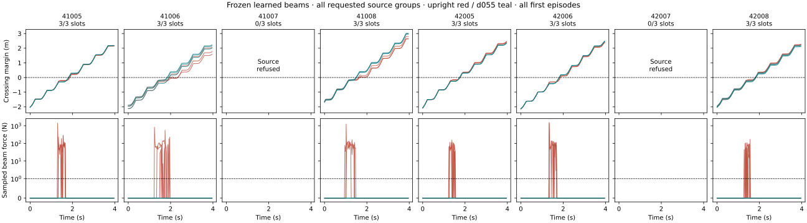

# Frozen learned beams: 18/24 requested slots separate in simulation

2026-09-06. The [eight-source pilot](SOURCE_EXECUTION_V1.md) completes **52 physics
cells**: 16 beam-absent and 36 conditionally prescribed beam-present cells. All three
registered development predictions pass. Six source pairs qualify; every one of
their three frozen generated scenes admits contact-free d055 passage and induces
upright beam contact. Two refused source pairs remain in the original denominator:
**18/24 requested source-scene slots (75%)**, not a filtered 100% generation rate.

This is closed-loop validation of a **frozen learned-proposal + pattern-search +
independent-rejection procedure**, using one physics seed per cell and previously
observed development source motions. It is not a newly acquired confirmatory source
test, a pure-network result, or a downstream traversal-policy learning experiment.

## Full source funnel

| Source | Absent pair qualified | Executed separating slots / 3 requested | Upright peak beam force across its three scenes |
| --- | --- | ---: | ---: |
| 41005 | Yes | 3/3 | 275.6–1,418.5 N |
| 41006 | Yes | 3/3 | 94.3–834.4 N |
| 41007 | No | 0/3 | Not executed |
| 41008 | Yes | 3/3 | 124.0–1,251.2 N |
| 42005 | Yes | 3/3 | 114.0–154.3 N |
| 42006 | Yes | 3/3 | 131.2–1,542.0 N |
| 42007 | No | 0/3 | Not executed |
| 42008 | Yes | 3/3 | 93.7–168.3 N |

Source qualification requires both first-episode passage and the separate
full-sequence tracker accepting both motions. All 16 absent first episodes pass
the registered passage test, but the following tracker refusals exclude two pairs:

- 41007 d055: reference endpoint tracking error.
- 42007 upright: disallowed robot contact; its recording contains one reset.
- 42007 d055: reference endpoint error, disallowed robot contact and foot contact
  away from the allowed ground.

No source was replaced, no achieved path moved a beam, and no candidate was refilled
after audit. All original proposals and selected slots remain in the
[proposal evidence](evidence/source-execution-proposals.json); every absent outcome
is in the [qualification evidence](evidence/source-execution-qualification.json).

## Paired dynamic outcomes

| Condition on the 18 executed source-scene slots | Upright contact-free passage | d055 contact-free passage |
| --- | ---: | ---: |
| Beam absent, shared source controls scored at each candidate plane | 18/18 | 18/18 |
| Beam present | 0/18 | 18/18 |

The absent row reuses six executions per motion, each scored at three scene planes;
it is not 36 independent absent executions. The per-slot counterfactual interaction
is 1 for each of these 18 executed slots. Seeds, scene requests and repeats remain
nested within eight source groups; no source-population success probability is
estimated from 18 correlated successes.

All 18 target runs measure zero beam force and pass the full-sequence tracker.
Every upright run measures prohibited beam contact, with sampled peaks
**93.713–1,542.012 N**, and receives a tracker rejection. **All 36 present runs still
cross and stabilize, with no observed fall or reset.** Upright is contact-obstructed
under the stated objective; the beam does not make forward crossing impossible.



The upper panels show the trailing recorded body origin relative to the crossing
threshold. Lower panels show maximum body-filtered beam normal force at 50 Hz.
All three frozen placements are shown for each executed source; refused groups
remain visible. Red is upright and teal is d055. Crossing does not erase earlier
contact. No illustrative replay supplies a physics verdict.

The report independently rechecks all 52 runtime inventories against the authored
beam translation, yaw, dimensions, collision/kinematic flags, 30 body filter paths,
200 Hz physics and 50 Hz control cadence, and reproduces the passage scores. The
original positive/negative beam-contact controls and frozen instrumentation are
hash-bound prerequisites. Forces remain sampled, and crossing uses body origins
rather than every native collider extent; neither a continuous contact guarantee
nor a cooked PhysX shape audit follows.

## Recovery, cost and reproduction

The earlier pilot stopped with a wrapper `driver exited -13` after the second
absent cell had saved its complete trajectory, contacts and success marker. The
[recovery protocol](SOURCE_EXECUTION_RECOVERY_V1.md) preserves the original failure
record, validates both saved cells and admits them without rerunning either.
The remaining 50 cells completed in this continuation with no additional
infrastructure failure or scientific retry. Output pipes were redirected to a
persistent coordinator log. The original wrapper-error cause remains inferred,
not proven; its result is distinguished from a failed robot trial.

Charged source-pilot execution cost is **0.497748 contended GPU-hours**:
0.170319 absent + 0.327429 present, including the earlier 0.044968-hour interrupted
attempt exactly once. Median/p90/p95 cell latencies are **32.21/37.81/60.37 s**
for absent and **30.98/37.46/38.10 s** for present. GPU-memory waiting, analysis,
original model fitting and the **55,072** frozen proposal/search/audit queries are
additional. This is not an end-to-end cost advantage over the analytic baseline.

The original manifest and raw output paths remain under
`/home/linjiw/research-data/groot-wbc/m2s-source-execution-v1`; recovered run records,
qualification and final results are under `m2s-source-execution-recovery-v1`.
The [complete present result](evidence/source-execution.json) and
[report receipt](assets/source-progress-receipt.json) retain original/public hashes.

```bash
PYTHONPATH=. .venv_research/bin/python scripts/research/motion2scene_recover_source_execution.py \
  --source /path/to/original-interrupted-pilot --out /path/to/new-recovery
PYTHONPATH=. .venv_research/bin/python scripts/research/motion2scene_source_execution.py \
  run --out /path/to/new-recovery > /path/to/new-recovery/coordinator.log 2>&1
PYTHONPATH=. .venv_research/bin/python scripts/research/render_motion2scene_icra_progress.py \
  --source /path/to/new-recovery/result.json
```

The recovery command is deliberately restricted to this recorded failure and
complete saved artifacts; it is not a generic retry mechanism. Use the original
source protocol's preparation command for an entirely new reproduction. Forty-three
focused tests pass across this work's geometry, passage, panel-denominator and
manifest checks. Source-runtime scores are also rechecked directly against artifacts.

## Research decision

P1 (at least four qualified pairs), P2 (at least half of qualified sources separate
on all three slots) and P3 (at least 12/24 separating slots) all pass. This supports
proceeding to the downstream sensing/command-interface pilot and a separately
registered multi-seed generated-scene comparison. Keep the analytic generator as a
required comparator. The six-source result does not establish minimum crouch depth,
perception-policy learning, arbitrary-scene transfer or superiority to analytic
scene generation. Those remain open in the [ICRA completion plan](ICRA_COMPLETION_PLAN.md).
