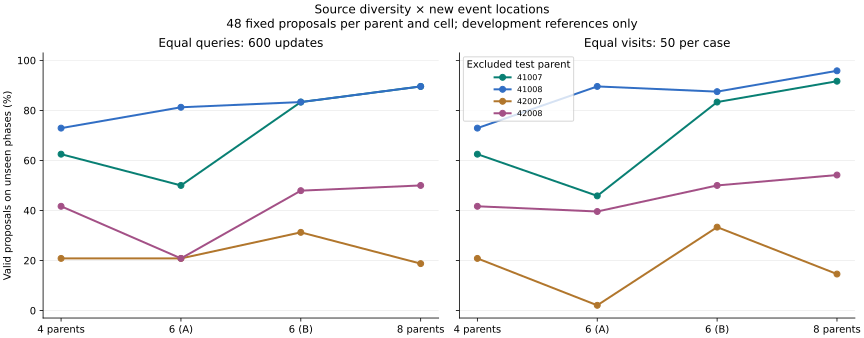

# Source diversity and unseen event phases: completed v1

Reference-only development study, 2026-09-05. The [frozen protocol](SOURCE_PHASE_V1.md)
was registered before target construction or fitting. Its registration hash is
`sha256:d76bb56568717ceac853748b7fca7689a79d6cdae96a946ef7c96652addd5192`. All 12 fits and 24 fixed checkpoints completed;
no checkpoint selection, proposal retries or replacement source motions.

## Main comparisons

- **equal_queries**: base4/600 95/192 (49.5%) → all8/600 119/192 (62.0%), +12.5 percentage points. Improvement on every test parent: **False**. Per-parent count differences (41007, 41008, 42007, 42008): [13, 8, -1, 4].
- **equal_visits**: base4/600 95/192 (49.5%) → all8/1200 123/192 (64.1%), +14.6 percentage points. Improvement on every test parent: **False**. Per-parent count differences (41007, 41008, 42007, 42008): [14, 11, -3, 6].
- **extra_update_control**: base4/1200 100/192 (52.1%) → all8/1200 123/192 (64.1%), +12.0 percentage points. Improvement on every test parent: **False**. Per-parent count differences (41007, 41008, 42007, 42008): [16, 0, -4, 11].

The four test parents are the independent source groups; three optimizer seeds and
five variants per parent are repeated measures. The seen and unseen phase totals have
different denominators. No confidence interval or population scaling law is inferred
from these four previously observed development sources.

## Interpretation and next decision

More sources improve pooled yield, but every predeclared across-all-test-parents
prediction fails. The equal-query six-parent subsets produce 83/192 (43.2%) and
118/192 (61.5%) unseen-phase successes, versus 95/192 for four parents. Adding a
particular pair can therefore hurt even while adding all four helps on average.
Do not select the better six-parent subset using these test results for a new claim.

Retain the small local event model as the research baseline. Before increasing model
size or acquiring a much larger training pool, compare a registered per-motion geometric
search and bounded refinement against raw learned proposals on the same excluded cases,
with matched query accounting and no replacement draws. This will help distinguish
narrow feasible placement regions from poor amortized prediction. Search failure alone
cannot prove the feasible set is empty; only certified exclusion could establish that.

The final all8/1200 unseen-phase failures expose two different problems. Source 42007
accepts 7/48: all 41 failures miss the neutral-interference margin, and its 0.35 event
accepts 0/24. Source 42008 accepts 26/48, with 19 target-clearance failures and three
neutral-interference failures. These are descriptive post-hoc diagnoses, not new
registered hypotheses. A proposal/feasible-set comparison should report both margins
separately and retain these difficult cases rather than replacing them.

Then test geometry-guided source acquisition on a fresh, preassigned source pool.
Use only training-pool geometry to define source selection; freeze selection before
examining validation/test outcomes. Broader obstacle families and downstream learning
remain later stages requiring joint scene checks and executed motion qualification.

## Acquisition and lineage

Sixteen neutral parents produced 80 target references; all 16 neutral and all 80 target
Q0/Q1 screens passed. Endpoint poses, root routes and source ownership were preserved.
All 24 targets shared with the previous bank retain exactly the same CSV hashes and
source splits. New phases are 0.35 and 0.65; training phases are 0.25, 0.50 and 0.75.
Each neutral is counted once here, although its gate is repeated in five registry rows.

Original 410xx source roles remain 4/2/2. Previously observed 420xx route-retention
sources receive separate development roles 42001–42004 train, 42005–42006 validation,
42007–42008 test. The historical route study and its flags remain unchanged. There are
no fresh confirmatory sources, no new physics runs and no Q4 scene admissions.
Training_eligible/execution_eligible flags remain false for the original qualification
pipeline; geometric diagnostic fitting is explicitly separate.

## Test results

Each parent has 72 seen-phase draws and 48 unseen-phase draws per arm/checkpoint:
three optimizer seeds × three/two phases × eight proposals. Tests were excluded from
normalization and training, including all new-phase derivatives of training sources.

| Arm / updates | 41007 unseen /48 | 41008 unseen /48 | 42007 unseen /48 | 42008 unseen /48 | Seen /288 | Unseen /192 |
|---|---:|---:|---:|---:|---:|---:|
| base4 / 600 | 30 | 35 | 10 | 20 | 169 | 95 |
| add_a6 / 600 | 24 | 39 | 10 | 10 | 146 | 83 |
| add_b6 / 600 | 40 | 40 | 15 | 23 | 187 | 118 |
| all8 / 600 | 43 | 43 | 9 | 24 | 191 | 119 |
| base4 / 1200 | 28 | 46 | 11 | 15 | 150 | 100 |
| add_a6 / 900 | 22 | 43 | 1 | 19 | 172 | 85 |
| add_b6 / 900 | 40 | 42 | 16 | 24 | 180 | 122 |
| all8 / 1200 | 44 | 46 | 7 | 26 | 194 | 123 |



The 600-update rows match geometry-query budgets. Equal visits compare base4/600,
add_a6/900, add_b6/900 and all8/1200: exactly 50 visits per training case. Base4/1200
controls for extra updates. The two six-parent subsets are fixed complementary halves
of the additional training pool; the paths share their four/eight-parent endpoints.
They are subset-sensitivity checks, not independent scaling experiments.

## Validation results

Validation was descriptive and did not choose the architecture, hyperparameters or
checkpoint. Its four parents remain separate from the test totals.

| Arm / updates | 41005 unseen /48 | 41006 unseen /48 | 42005 unseen /48 | 42006 unseen /48 | Seen /288 | Unseen /192 |
|---|---:|---:|---:|---:|---:|---:|
| base4 / 600 | 32 | 36 | 29 | 26 | 204 | 123 |
| add_a6 / 600 | 39 | 30 | 36 | 22 | 200 | 127 |
| add_b6 / 600 | 33 | 44 | 29 | 40 | 210 | 146 |
| all8 / 600 | 38 | 43 | 33 | 35 | 239 | 149 |
| base4 / 1200 | 40 | 39 | 33 | 21 | 210 | 133 |
| add_a6 / 900 | 42 | 30 | 34 | 28 | 204 | 134 |
| add_b6 / 900 | 40 | 39 | 38 | 37 | 228 | 154 |
| all8 / 1200 | 44 | 42 | 39 | 35 | 216 | 160 |

## Failure audit and scope of collision evidence

| Arm / updates | Test proposals | Target-clearance failures | Neutral-interference failures | Joint valid |
|---|---:|---:|---:|---:|
| base4 / 600 | 480 | 32 | 184 | 264 |
| add_a6 / 600 | 480 | 63 | 195 | 229 |
| add_b6 / 600 | 480 | 46 | 129 | 305 |
| all8 / 600 | 480 | 42 | 128 | 310 |
| base4 / 1200 | 480 | 29 | 203 | 250 |
| add_a6 / 900 | 480 | 37 | 187 | 257 |
| add_b6 / 900 | 480 | 32 | 146 | 302 |
| all8 / 1200 | 480 | 43 | 120 | 317 |

Both failure types may overlap. A valid draw must clear the target by at least 10 mm
and interfere with the neutral by at least 10 mm at all 113 specified placements.
Every raw clearance array is retained. These finite reference checks do not establish
continuous-time collision safety, imported robot geometry agreement, continuous
placement uncertainty, executed motion retention or downstream policy benefit.
The learned proposal distribution still requires independent checking and rejection.
The objective learns a distribution shaped by geometric compatibility and the chosen
motion-preference assumptions. Motion-only input does not identify a unique natural
scene distribution or provide obstacle realism labels. The acquisition comparison also
refits normalization using each training subset, so it measures the complete data
pipeline effect rather than isolating additional examples from normalization changes.

## Cost and reproducibility

- Construction: 140.864 s CPU wall time.
- Fitting/sampling stage: 563.163 s (9.39 min).
- Independent audit: 407.127 s (6.79 min).
- Training reference-clearance minima: 1,008,000; saved prefix snapshots are not double-counted.
- Independent NumPy minima: 1,735,680; Torch cross-check minima: 433,920.
- Audited 960 rows / 7,680 proposals; maximum NumPy–Torch disagreement 2.08e-16 m (stop threshold 1e-8 m).
- CPU float64, two threads, width 32 / 12,118 parameters, three fixed seeds 8421–8423.
- Python 3.11.16, NumPy 2.4.6, PyTorch 2.11.0+cu128 (CPU used), Matplotlib 3.11.1.

Run from the repository with the existing `.venv_research` environment. The original
source CSVs, MJCF and prior hash-pinned implementations must be available. Register to
a new empty directory; subsequent stages are append-only and refuse overwrites.

```bash
.venv_research/bin/python scripts/research/motion2scene_source_phase.py register --out /path/to/new-study
.venv_research/bin/python scripts/research/motion2scene_source_phase.py build --registration /path/to/new-study/registration.json
.venv_research/bin/python scripts/research/motion2scene_source_phase.py train --registration /path/to/new-study/registration.json
.venv_research/bin/python scripts/research/motion2scene_source_phase.py analyze --registration /path/to/new-study/registration.json
.venv_research/bin/python scripts/research/render_motion2scene_source_phase.py --result /path/to/new-study/result.json --out /path/to/new-export
```

Focused validation: 71 tests passed across capsule-box geometry, inverse learning,
placement uncertainty/margins/certificates, carriers/events, teacher/repeatability/timing
and the new source/phase leakage and aggregation tests. Black and Ruff pass for the
three new Python files. The exporter independently verifies all 960 raw rows,
checkpoint/sample hashes, summary counts and registered directional predicates. Desktop
(1440 px) and mobile (390 px) browser checks pass with no horizontal overflow or
JavaScript exceptions. All 110 local HTML links and 51 export hashes across eight
follow-up manifests pass; the new plot and mobile section were visually inspected.
The website changes are local and have not been published.

[Full portable results](evidence/source-phase.json),
[registration](evidence/source-phase-registration.json),
[all reference attempts](evidence/source-phase-registry.json),
[export hashes](assets/source-phase-manifest.json).

Exact test command used:

```bash
.venv_research/bin/python -m pytest \
  tests/dataset_generation/test_capsule_box_exact.py \
  tests/dataset_generation/test_capsule_box_torch.py \
  tests/dataset_generation/test_motion2scene_inverse.py \
  tests/dataset_generation/test_motion2scene_uncertainty.py \
  tests/dataset_generation/test_motion2scene_margins.py \
  tests/dataset_generation/test_placement_certificate.py \
  tests/dataset_generation/test_motion2scene_carriers.py \
  tests/dataset_generation/test_motion2scene_events.py \
  tests/dataset_generation/test_motion2scene_beam_teacher.py \
  tests/dataset_generation/test_motion2scene_repeatability.py \
  tests/dataset_generation/test_motion2scene_timing_diagnostic.py \
  tests/dataset_generation/test_motion2scene_source_phase.py -q
```
