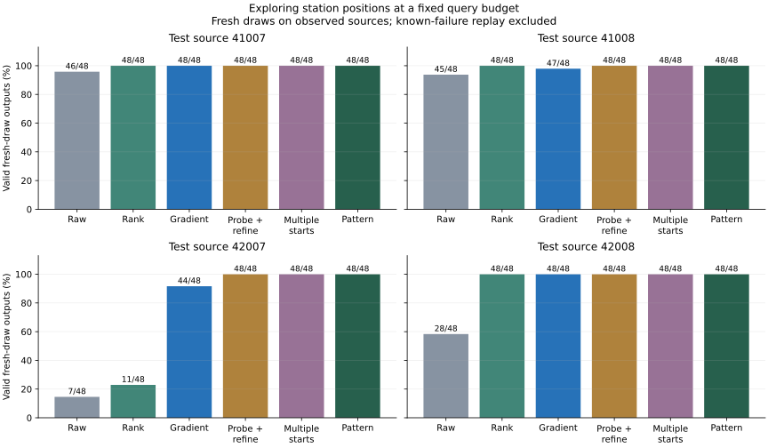

# Station search under a fixed query budget: completed v1

Development study, 2026-09-05. The [prospective protocol](STATION_SEARCH_V1.md) was
hash-pinned before all searches. Registration:
`sha256:adc38d663454431d2b7e63c87dd8a45f9e4e4b30ae778c49fc12fe7ac36677ce`. All 49 jobs and 294 audit rows completed; no tuning,
retries, replacement draws, larger trust region or model retraining.

## Main finding and research decision

All three station-exploring methods accept **192/192** main test outputs, compared
with **187/192 (97.4%)** for the original gradient method: +2.6 percentage points.
Each rescues five original-gradient failures without losing a valid paired output.
All three also improve the separate known-failure replay from **5/8 to 8/8**. All nine
predeclared descriptive predicates pass. Validation is 192/192 for all local methods.
These observations do not establish perfect reliability outside the tested draws.

The main-panel search times are 114.23 s for original gradient, 89.58 s for probe then
refine, 94.86 s for multiple starts and **35.19 s for pattern search**, across 48 jobs.
Pattern uses about **69.2% less search time** than the original gradient method with
the same query budget. This excludes shared setup, sampling and final audit and is a
single measured CPU comparison, not an end-to-end latency or real-time guarantee.
Ranking additional learned samples takes 34.48 s but reaches only 155/192 test outputs.

The three new methods tie on acceptance, so this result does not select a unique
winning method. Pattern search's cost makes it a useful candidate for the next frozen
comparison. Mean accepted bins per test job are 3.21 for pattern, 3.46 for original
gradient, 3.62 for probe/refinement and 3.79 for multiple starts: equal acceptance does
not imply identical output distributions or coverage.

Stop tuning on these observed sources. The [fresh-source design](FRESH_SOURCE_AUDIT_DESIGN.md)
keeps all methods fixed and adds uniformly initialized pattern search, because the
older uniform-gradient control cannot establish the value of learned initialization
for a different search algorithm. Qualify a newly assigned source pool before reading
its inference outcomes. Then study train-only distillation and the remaining geometric
and execution contracts. The current deployment sampler is not silently replaced by
a method selected from this development comparison.

## Main fresh-draw results

Use the three existing all8/1200 checkpoints and draw seeds checkpoint_seed+60000.
The 16 motion cases comprise two withheld phases on four validation and four test
sources. These are fresh draws on previously observed sources, not fresh-source
confirmatory evidence. Source parents are the independent groups; phases, checkpoint
seeds and outputs are repeated measures. Each parent contributes 48 outputs per arm.

| Method | 41007 /48 | 41008 /48 | 42007 /48 | 42008 /48 | Total /192 |
|---|---:|---:|---:|---:|---:|
| Raw | 46 | 45 | 7 | 28 | 126 |
| Rank learned | 48 | 48 | 11 | 48 | 155 |
| Original gradient | 48 | 47 | 44 | 48 | 187 |
| Probe then refine | 48 | 48 | 48 | 48 | 192 |
| Multiple starts | 48 | 48 | 48 | 48 | 192 |
| Pattern search | 48 | 48 | 48 | 48 | 192 |



Each assisted method receives exactly 4,624 search clearance queries per job, while
raw has zero search queries. Gradient, probe/refinement, multistart and pattern search
stay within the ORIGINAL input's station ±0.05 and height ±0.03 m bounds. Ranking
instead evaluates 136 samples from the same learned distribution; its search domain
is the full beam domain. Both target and neutral geometry are used by assisted methods.
No neural inputs or model weights change. All outputs, including failures, receive the
same independent 113-placement capsule–box audit over complete sampled motions.

## Registered predicates and paired changes

| Method | No parent loses, total gains | No paired loss | Rescued / lost gradient outputs | Replay exceeds 5/8 |
|---|---|---|---:|---|
| multistart | True | True | 5 / 0 | True |
| pattern | True | True | 5 / 0 | True |
| probe_refine | True | True | 5 / 0 | True |

The first predicate requires all four test-parent count changes to be nonnegative and
the total change to be strictly positive. It is descriptive, not a statistical
noninferiority test. The second checks same-index paired outputs against original
refinement. The third pertains only to the replay below. All nine predeclared predicates
are reported. Validation/test outcomes do not justify a new confirmatory claim for any
selected method, and every measured failure remains retained.

## Separate known-failure replay

Checkpoint 8421, source 42007, event 0.35, draw seed 9521 reproduce the previous fixed
fresh batch. Its raw inputs are identical; original-gradient outputs reproduce to
absolute tolerance 1e-12 and still accept 5/8. This replay is deliberately targeted to a known
failure, so it is excluded from all main-panel totals.

| Method | Replay valid /8 |
|---|---:|
| Raw | 0 |
| Rank learned | 1 |
| Original gradient | 5 |
| Probe then refine | 8 |
| Multiple starts | 8 |
| Pattern search | 8 |

A replay gain tests whether the method can address the motivating failure. It does
not establish transfer to new sources. Positive outputs witness finite reference
feasibility; failed searches cannot prove an empty feasible set.

## Validation panel

| Method | 41005 /48 | 41006 /48 | 42005 /48 | 42006 /48 | Total /192 |
|---|---:|---:|---:|---:|---:|
| Raw | 40 | 46 | 39 | 39 | 164 |
| Rank learned | 48 | 48 | 48 | 48 | 192 |
| Original gradient | 48 | 48 | 48 | 48 | 192 |
| Probe then refine | 48 | 48 | 48 | 48 | 192 |
| Multiple starts | 48 | 48 | 48 | 48 | 192 |
| Pattern search | 48 | 48 | 48 | 48 | 192 |

No architecture, threshold, budget or checkpoint is chosen using this panel.

## Cost, concentration and failure types

| Method | Main search seconds (48 jobs) | Target failures /192 | Neutral failures /192 | Mean accepted bins per test job |
|---|---:|---:|---:|---:|
| Raw | 0.000 | 22 | 44 | 2.17 |
| Rank learned | 34.475 | 0 | 37 | 1.58 |
| Original gradient | 114.233 | 0 | 5 | 3.46 |
| Probe then refine | 89.584 | 0 | 0 | 3.62 |
| Multiple starts | 94.862 | 0 | 0 | 3.79 |
| Pattern search | 35.194 | 0 | 0 | 3.21 |

Target and neutral failure categories can overlap. Accepted-bin occupancy uses .02
station × .01 m height bins, averaged over 24 test jobs per arm. This diagnostic is
not a measure of feasible-support coverage or independent scene diversity. Query
matching is not wall-time/FLOP matching; pattern search has no backpropagation.
Search times exclude shared model setup and sampling. Per-row sampling times repeat
shared batches and must not be added across all six arms.

- Whole search stage, including replay, setup, sampling and I/O: 376.313 s (6.27 min).
- Independent audit: 125.077 s (2.08 min).
- Search reference minima: 1,132,880; independent audit minima: 531,552; Torch cross-check minima: 132,888.
- Maximum NumPy–Torch disagreement: 2.78e-17 m; registered stop threshold 1e-8 m.
- 288 main audit rows / 2,304 outputs; six replay rows / 48 outputs. All 2,352 outputs are audited anew.
- Python 3.11.16, NumPy 2.4.6, PyTorch 2.11.0+cu128 using CPU float64/two threads. No GPU spend or new model fits.

These are finite reference-geometry results. Continuous placement/time, imported robot
collision geometry, obstacle-present execution, natural obstacle distributions and
downstream policy benefit remain unvalidated. The beam generator is still a two-parameter
scene family conditioned on full sampled humanoid motion geometry.

## Reproduction and verification

From the repository using the existing research environment and prior pinned source
artifacts, register a new empty study directory. Every stage refuses overwrites.

```bash
.venv_research/bin/python scripts/research/motion2scene_station_study.py register --out /path/to/new-study
.venv_research/bin/python scripts/research/motion2scene_station_study.py search --registration /path/to/new-study/registration.json
.venv_research/bin/python scripts/research/motion2scene_station_study.py analyze --registration /path/to/new-study/registration.json
.venv_research/bin/python scripts/research/render_motion2scene_station_search.py --result /path/to/new-study/result.json --out /path/to/new-export
```

The exporter verifies all raw-array and search-trace hashes, selected incumbents,
original trust bounds, grouped counts, paired rescues/losses, replay reproduction and
all registered predicates. All 81 focused tests pass, including seven new tests of
flat-gradient escape, original trust/domain bounds and invalid/nonfinite inputs.
Black and Ruff pass on the four new Python files. Desktop (1440 px) and mobile
(390 px) checks pass without horizontal overflow or JavaScript exceptions; the plot
and mobile section were visually inspected. All 128 local HTML links and 59 export
hashes across eleven follow-up manifests pass. Website changes remain local and
have not been published.

[All rows](evidence/station-search.json), [registration](evidence/station-search-registration.json),
[export hashes](assets/station-search-manifest.json), [research plan](NEXT_RESEARCH_PLAN.md).

Exact focused validation command:

```bash
.venv_research/bin/python -m pytest \
  tests/dataset_generation/test_capsule_box_exact.py \
  tests/dataset_generation/test_capsule_box_torch.py \
  tests/dataset_generation/test_motion2scene_inverse.py \
  tests/dataset_generation/test_motion2scene_uncertainty.py \
  tests/dataset_generation/test_motion2scene_margins.py \
  tests/dataset_generation/test_placement_certificate.py \
  tests/dataset_generation/test_motion2scene_carriers.py \
  tests/dataset_generation/test_motion2scene_events.py \
  tests/dataset_generation/test_motion2scene_beam_teacher.py \
  tests/dataset_generation/test_motion2scene_repeatability.py \
  tests/dataset_generation/test_motion2scene_timing_diagnostic.py \
  tests/dataset_generation/test_motion2scene_source_phase.py \
  tests/dataset_generation/test_motion2scene_refinement.py \
  tests/dataset_generation/test_motion2scene_station_search.py -q
```
