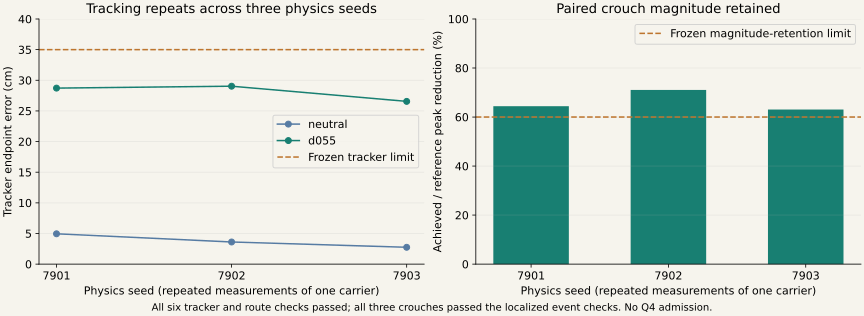
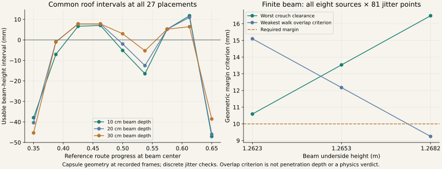
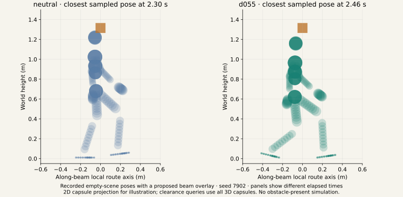
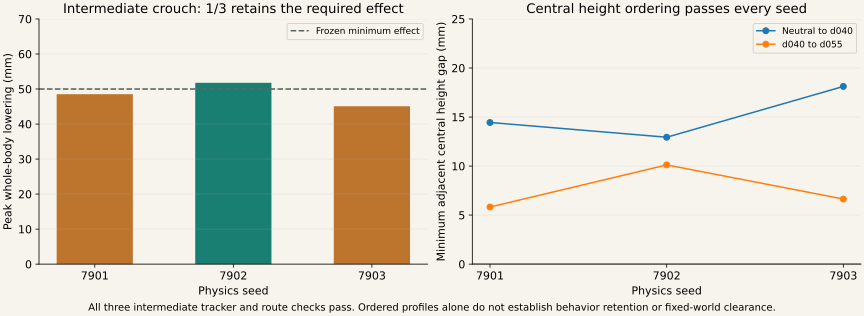

# A repeated motion pair and an analytic beam-placement teacher

Measured 2026-09-05. Original-clock carrier 41002 passed the complete six-run development
repeatability experiment. An analytic beam teacher now proposes finite obstacle positions and
heights from its reference and achieved body geometry. This is progress toward motion-conditioned
scene generation; no learned model, Q4-qualified ladder or obstacle-present preference reversal
is reported.

## The motion pair repeats

The original-clock neutral/d055 pair was selected from the preceding timing diagnostic, so this
is explicitly development-only. All three new seeds passed every registered prediction:

| Physics seed | Walk tracker endpoint (m) | Crouch tracker endpoint (m) | Crouch magnitude retained | Event IoU | Both routes and paired behavior |
|---|---:|---:|---:|---:|---|
| 7901 | 0.0495 | 0.2872 | 64.4% | 88.4% | Pass |
| 7902 | 0.0361 | 0.2903 | 71.1% | 88.4% | Pass |
| 7903 | 0.0275 | 0.2656 | 63.1% | 88.4% | Pass |

Both levels have three distinct achieved-state fingerprints. The experiment used **0.0453
contended GPU-hours**, with six completed runs and no scientific retries or dependency skips.
Seeds are repeated measurements of one selected carrier. Distinct trajectories establish that
these are different executions; three repeats do not establish generalization or broad robustness.
The 60% magnitude threshold is close to the weakest result, which matters for further qualification.



## A more reliable primitive clearance query

The new `capsule_box_exact.py` computes segment-to-box distance by minimizing its piecewise
quadratic squared-distance function. The breakpoints are crossings of the box's six planes.
Subtracting the capsule radius yields exact positive primitive separation and an overlap
criterion; its negative branch is not a penetration-depth measurement.

A focused regression demonstrates a capsule striking a small box between all five axis samples,
while the sampled query reports positive clearance. Additional analytic cases, invariance checks
and an independent scalar minimizer validate the new calculation. The historical sampled geometry
code and all frozen experiment labels remain unchanged. The new teacher uses this new query.

Exactness here applies to the capsule model at each sampled pose. It does not establish agreement
with the complete Isaac collision asset, mesh geometry, unrecorded hand geometry, or motion between
recorded frames. Those distinctions remain explicit in the exported results.

## Finite beam proposals from the complete pair evidence

The teacher consumes **eight sources**: two canonicalized reference motions and six full achieved
trajectories. All sources share the scene's world frame. Achieved paths are not recentered,
rotated or phase-warped to improve clearance.

It tests **27 placements**: nine reference-route stations from 0.35 to 0.65, crossed with beam
depths 0.10, 0.20 and 0.30 m. Across-route width is 1.20 m. At each placement it intersects every
source's roof-height constraints, reserving 10 mm of clearance/strike margin and a further 10 mm
vertical-placement allowance on both sides. **13/27** common intervals are nonempty. The rule
selects the widest interval, with shorter beam depth and ID as deterministic tie-breakers.

The selected candidate is `beam_021`:

| Parameter | Value |
|---|---:|
| Reference route station | 0.6125 |
| World XY center (m) | (2.696616, 0.226456) |
| World yaw (rad) | 0.071792 |
| Depth × width × thickness (m) | 0.10 × 1.20 × 0.10 |
| Reserved underside-height interval (m) | [1.259373, 1.271161] |
| Interval width after reserves | 11.79 mm |

The roof only proposes an interval. Each proposed height is then checked against the **finite**
beam, whose top is 0.10 m above its underside. Every reference and execution must pass at all
**81 discrete jitter placements**: world X and Y offsets in {-20, 0, +20} mm, height offsets in
{-10, 0, +10} mm, and yaw offsets in {-0.02, 0, +0.02} rad.

| Height quantile | Underside (m) | Worst crouch clearance | Weakest walk overlap criterion | Jitter placements passing |
|---|---:|---:|---:|---:|
| 0.25 | 1.262320 | 10.59 mm | 15.10 mm | 81/81 |
| 0.50 | 1.265267 | 13.54 mm | 12.17 mm | 81/81 |
| 0.75 | 1.268214 | 16.48 mm | 9.25 mm | 72/81 |

Both criteria must be at least 10 mm. The higher beam loses the required weaker-motion
interference margin in nine placements and is refused. Do not silently keep it as an easy scene.
Positive clearances are capped at 20 mm after certified horizontal broad-phase exclusion; the
reported minimum for these proposals lies below that cap. This is a discrete jitter check,
not a certificate over every point of a continuous perturbation region.





The pose illustration uses seed 7902 empty-scene recordings with a virtual beam overlay. Each
panel shows its own closest sampled pose, at different elapsed times. It is not an obstacle-present
simulation. The report also includes [diagnostic-beam.usda](assets/diagnostic-beam.usda), a visual-only primitive with
no physics collision schema. These are two-motion proposals: the intermediate d040 level is not
part of this teacher's clearance constraints, so this does not identify the minimal feasible
member of a three-level ladder.

## Next decision before learned scene generation

The intermediate d040 reference completed its separately registered three-seed extension, using
the same recorded neutral and d055 comparators. Its original 9000 MiB manifest launched zero cells;
a resource-only amendment restores the prior 7500 MiB trajectory-only startup guard. All
scientific inputs, predictions and thresholds remain unchanged. Both lineages are preserved.

All three new d040 runs passed tracking and route retention, and all three central profiles
were strictly ordered. However, only one of three passed the fixed 50 mm effect threshold:

| Seed | Achieved d040 reduction | Paired behavior retained | Minimum neutral–d040 gap | Minimum d040–d055 gap |
|---|---:|---|---:|---:|
| 7901 | 48.53 mm | Fail | 14.44 mm | 5.82 mm |
| 7902 | 51.79 mm | Pass | 12.94 mm | 10.12 mm |
| 7903 | 45.08 mm | Fail | 18.12 mm | 6.64 mm |

The extension used **0.0228 contended GPU-hours**. Prediction 1 (tracking/route) and prediction 3
(ordering) passed; prediction 2 (all behavior-retained) failed. A sub-threshold effect is a measured
small crouch, not evidence of zero movement. We retain its raw value and the failed frozen label.



A separate audit tested that intermediate motion against the already selected beam, without
moving the beam to improve the result. At the midpoint height, intermediate executions 7901 and
7902 have positive separation at all 81 jitter placements, though neither meets a 10 mm margin
at every placement. Execution 7903 and the intermediate reference mix separation and overlap.
**The beam does not establish that the deeper crouch is the minimal feasible adaptation.** This
is precisely why the teacher must consider the complete qualified alternative set. All three
height proposals remain ambiguous for robust separation of the intermediate motion; all learning
eligibility stays false. [Complete intermediate clearance audit](evidence/intermediate-beam-audit.json).

An ordered and retained intermediate level is needed before claiming ordinal minimality.
The existing Q4 protocol and held-out route validation also remain separate requirements.
Then test the verified target/alternative pair in the same obstacle-present scene, with removal
and placement-jitter controls. Geometry proposes; those executions establish preference reversal.

Only verified scene–motion pairs should train an LfLH obstacle generator. Retain failures,
refusals, source hashes and explicit eligibility fields. Keep a carrier and every derivative
in one dataset split. Start with beam type, pose, size and event position as the learned output;
compare with this analytic teacher and random placement on fresh carriers before expanding to
lateral gaps, step-over obstacles and richer scene context. This turn's geometric proposals
remain `training_eligible: false`.

## Evidence and reproduction

- [Repeatability registration](REPEATABILITY_V1.md) and [all six outcomes](evidence/repeatability.json)
- [Intermediate-level registration](LADDER_EXTENSION_V1.md), [resource amendment](LADDER_EXTENSION_RESOURCE_V2.md), and [all three outcomes](evidence/ladder-extension.json)
- [All 27 intervals and 243 jitter audits](evidence/beam-teacher.json)
- [Source and public artifact hashes](assets/teacher-manifest.json)

```bash
.venv_research/bin/python scripts/research/motion2scene_repeatability.py prepare \
  --output /home/linjiw/research-data/groot-wbc/m2s-repeatability-v1
.venv_research/bin/python scripts/research/hallucination/run_approved_manifest.py \
  --manifest /home/linjiw/research-data/groot-wbc/m2s-repeatability-v1/manifest.json \
  --run-record /home/linjiw/research-data/groot-wbc/m2s-repeatability-v1/run_record.json
.venv_research/bin/python scripts/research/motion2scene_repeatability.py analyze \
  --output /home/linjiw/research-data/groot-wbc/m2s-repeatability-v1
.venv_research/bin/python scripts/research/motion2scene_beam_teacher.py \
  --repeatability /home/linjiw/research-data/groot-wbc/m2s-repeatability-v1/result.json \
  --output /home/linjiw/research-data/groot-wbc/m2s-beam-teacher-v1
.venv_research/bin/python scripts/research/render_motion2scene_teacher_report.py \
  --repeatability /home/linjiw/research-data/groot-wbc/m2s-repeatability-v1/result.json \
  --teacher /home/linjiw/research-data/groot-wbc/m2s-beam-teacher-v1/result.json \
  --extension /home/linjiw/research-data/groot-wbc/m2s-ladder-extension-resource-v2/result.json \
  --middle-audit /home/linjiw/research-data/groot-wbc/m2s-beam-teacher-v1/intermediate_audit.json
```

Use fresh output directories for preparation and teacher generation. Reproduction requires the
trusted local research bundle and standalone Motion2Scene motion-analysis source identified by
the manifests. Existing completed outputs are deliberately not overwritten by experiment drivers.


The recorded resource-v2 manifest can be rerun/resumed with the same hardened manifest driver.
Analyze the extension and its separate fixed-proposal audit with:

```bash
.venv_research/bin/python scripts/research/motion2scene_ladder_extension.py analyze \
  --output /home/linjiw/research-data/groot-wbc/m2s-ladder-extension-resource-v2
.venv_research/bin/python scripts/research/motion2scene_middle_clearance.py \
  --teacher /home/linjiw/research-data/groot-wbc/m2s-beam-teacher-v1/result.json \
  --extension /home/linjiw/research-data/groot-wbc/m2s-ladder-extension-resource-v2/result.json \
  --out /home/linjiw/research-data/groot-wbc/m2s-beam-teacher-v1/intermediate_audit.json
```

## Validation

**99 focused tests passed**, including analytic geometry cases, independent numerical checks,
all-source beam constraints, finite extent, jitter denominators, repeatability accounting and
existing motion/trajectory tests. Black, Ruff and whitespace checks passed. All new public
artifact hashes and the original report's media/evidence hashes were verified. Registered
physics code and prediction hashes remain unchanged.

Chrome/Playwright checks passed at 1440 × 1000 and 390 × 844 with no page overflow or JavaScript
errors and all new report links resolving. Figures were visually inspected. The USD library
bundled with the Isaac environment parsed the downloadable beam and verified its world position
and dimensions against the selected teacher token; no simulator was started for that check.

```bash
.venv_research/bin/python -m pytest -q \
  tests/dataset_generation/test_capsule_box_exact.py \
  tests/dataset_generation/test_motion2scene_repeatability.py \
  tests/dataset_generation/test_motion2scene_beam_teacher.py \
  tests/dataset_generation/test_motion2scene_timing_diagnostic.py \
  tests/dataset_generation/test_deployable_retiming.py \
  tests/dataset_generation/test_kimodo_motion_adapter.py \
  tests/dataset_generation/test_trajectory_segments.py \
  tests/dataset_generation/test_trajectory_acceptance.py \
  tests/dataset_generation/test_reference_payload.py
```
