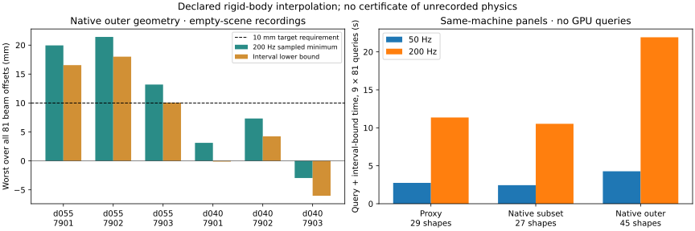

# Native temporal audit: the fixed deep-crouch margin survives

2026-09-06. All three registered predictions pass on the nine existing 41002
empty-scene recordings. At all 81 frozen beam offsets, each d055 recording retains
the required 10 mm native-outer clearance at 200 Hz and under the conservative
between-sample bound. Each upright recording retains a native-primitive interference
witness of at least 10 mm. No new physics or fitting occurred in this audit.

| Physics seed | d055 200 Hz sampled minimum | d055 interval lower bound | Upright weakest interference witness |
| --- | ---: | ---: | ---: |
| 7901 | 19.952 mm | 16.542 mm | -20.013 mm |
| 7902 | 21.417 mm | 18.006 mm | -12.175 mm |
| 7903 | 13.189 mm | **10.075 mm** | -22.840 mm |

The weakest bound leaves only **0.075 mm** beyond the required 10 mm margin. This is
a lower bound for the specified linear-translation/shortest-SLERP body interpolant
with an assumed 1e-8 m numerical allowance. It is not a measured tracking-error
reserve, a formal floating-point certificate, or a bound on unrecorded simulator
dynamics. The 81 placement offsets remain finite.

The 50 Hz native results reproduce the earlier native audit to a maximum difference
of **1.231e-9 m**, below the registered 1 micrometre check. Normalization of near-unit
recorded quaternions explains a possible last-bit difference; no old result was
replaced. The denser d055 sampled minima decrease by approximately 0.33–0.35 mm,
so simply reusing the old sampled clearance would overstate this interpolant's margin.

## Intermediate alternative and geometry cost

| Physics seed | d040 200 Hz sampled minimum | d040 interval lower bound | Offsets with >=10 mm interval bound |
| --- | ---: | ---: | ---: |
| 7901 | +3.118 mm | -0.123 mm | 52/81 |
| 7902 | +7.324 mm | +4.235 mm | 54/81 |
| 7903 | -2.961 mm | -6.030 mm | 27/81 |

A negative lower bound is unresolved, not a collision finding. The negative sampled
primitive clearance for 7903 is an overlap witness at some placement offsets. The
first two recordings retain positive sampled clearance at every offset; these data
cannot establish that d055 is the minimum necessary motion at the nominal beam.



| Geometry | Shapes | 50 Hz panel time | 200 Hz panel time |
| --- | ---: | ---: | ---: |
| Historical proxy | 29 | 2.744 s | 11.358 s |
| Native primitive subset | 27 | 2.444 s | 10.530 s |
| Native outer union | 45 | 4.276 s | 21.920 s |

Each cell times the same nine-recording × 81-offset panel, including queries and
interval-bound evaluation but excluding pose/geometry preparation and artifact I/O.
At 200 Hz the outer-union panel costs **1.93×** the proxy panel on this shared CPU;
at 50 Hz it costs **1.56×**. These are single measured panels under concurrent GPU
simulation, not repeated latency benchmarks or pure mesh-query timings. The native
outer representation uses enclosing spheres for 18 hand/wrist meshes; it is not
direct mesh collision or a cooked PhysX convex-decomposition query.

Total: **4,374 whole-motion queries**, **65.858 s** audit wall time, **zero GPU time**,
54 geometry/cadence/recording rows. All per-offset sampled minima, witnesses and
interval lower-bound arrays remain in the external data directory (about 513 MiB).
The [portable results](evidence/temporal-native-audit.json) include their hashes; the
[render receipt](assets/temporal-progress-receipt.json) distinguishes original and
public JSON hashes.

## Reproduce and limitations

```bash
PYTHONPATH=. OPENBLAS_NUM_THREADS=2 OMP_NUM_THREADS=2 .venv_research/bin/python \
  scripts/research/motion2scene_temporal_native_audit.py \
  --out /path/to/new-temporal-audit
PYTHONPATH=. .venv_research/bin/pytest -q \
  tests/dataset_generation/test_motion2scene_temporal_geometry.py \
  tests/dataset_generation/test_capsule_box_exact.py
```

**13 tests pass**, including translational tunneling, rotation of an offset sphere,
quaternion sign equivalence, invalid data, analytic primitive distance cases and
randomized dense checks of the interval bounds. Ruff and Black checks pass. The
report figure was inspected. Protocol: [temporal native audit](TEMPORAL_NATIVE_AUDIT_V1.md).
Raw lineage: `/home/linjiw/research-data/groot-wbc/m2s-temporal-native-audit-v1`.

This closes a limited temporal-model question on one development carrier. The full
384-output native audit, continuous placement batch, cooked collision truth, actual
physics-step contact capture and downstream policy learning remain separate open
gates in the [ICRA completion plan](ICRA_COMPLETION_PLAN.md).
