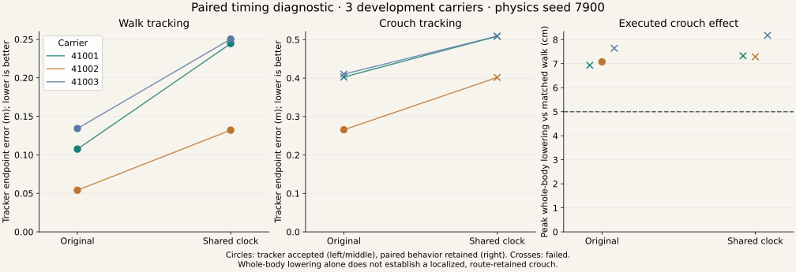
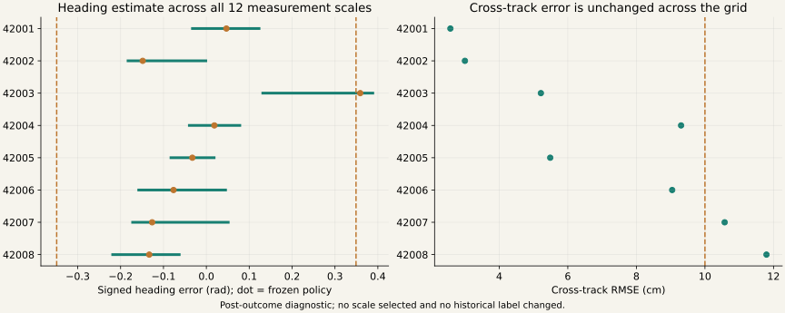

# Timing diagnostic: retain original timing for the next repeatability test

Measured 2026-09-05. All 12 registered obstacle-absent Isaac/SONIC runs completed, with no
dependency skips or scientific retries. Three development carriers, two timing conditions,
neutral/d055, one common physics seed (7900). Runtime was **0.106 contended GPU-hours**.
The controller and acceptance thresholds were unchanged. GPU contention caused pauses under
the 9000 MiB startup guard; other workloads were left running.

The shared-clock intervention made tracking worse in this pilot. Crouch endpoint error increased
in all three carriers by **9.9–13.6 cm**, with no tracker-accepted slowed crouches. Both endpoint
improvement and increased crouch acceptance predictions failed. The neutral-survival prediction
passed. This is a small development comparison, not a population estimate.

| Timing / level | Completed | Tracker accepted | Relative route passed | Paired behavior retained |
|---|---:|---:|---:|---:|
| Original / neutral | 3/3 | 3/3 | 3/3 | N/A |
| Original / d055 | 3/3 | 1/3 | 1/3 | 1/3 |
| Shared clock / neutral | 3/3 | 3/3 | 3/3 | N/A |
| Shared clock / d055 | 3/3 | 0/3 | 0/3 | 0/3 |

| Carrier | Original neutral endpoint (m) | Slowed neutral (m) | Original d055 (m) | Slowed d055 (m) | Crouch change (m) |
|---|---:|---:|---:|---:|---:|
| 41001 | 0.1074 | 0.2445 | 0.4027 | 0.5090 | +0.1063 |
| 41002 | 0.0541 | 0.1321 | 0.2656 | 0.4017 | +0.1361 |
| 41003 | 0.1341 | 0.2503 | 0.4103 | 0.5090 | +0.0987 |

All five rejected crouch runs had endpoint tracking error as their sole tracker rejection.
The tracker's endpoint diagnostic and the route audit's independently translated endpoint
metric are different measurements. Neither threshold was relaxed.



## A candidate to investigate

Original-clock carrier 41002 retained a localized **7.08 cm** whole-body reduction against its
matched walking execution, **72.9%** of the reference magnitude and **88.4%** event IoU. Both
members passed tracking and the existing relative-route rule in this run. This is a descriptive
single-seed behavior-retention result. The other five crouches also elicited localized height
reductions, but failed route retention and tracker acceptance.

Do not adopt the tested shared-clock slowdown. The next proposed development experiment is
original-clock 41002 neutral/d055 repeatability on three new physics seeds, followed by an
ordered third level if the pair repeats. Selection is explicitly based on these outcomes;
fresh generation carriers remain necessary for generalization. No positive learning labels,
Q4-qualified ladder, exact critical scene, or obstacle-present preference reversal is admitted.

## Route sensitivity and physical drift

The separate CPU audit reproduced all eight held-out frozen outcomes and scalar route metrics,
then evaluated every cell of the earlier 4 × 3 smoothing/spacing grid. This is post-outcome
instrument diagnosis, not a new held-out validation. No measurement scale was selected.

Carrier 42003's heading error spans **0.132–0.388 rad** across the grid; its frozen value remains
0.359 rad, above the 0.349 rad tolerance. This particular failure is measurement-scale sensitive.
Cross-track RMSE is unchanged in all 96 evaluations. Carrier 42008 remains at **11.8 cm**, above
the 10 cm tolerance; it fails under all 12 scales. Contact-rejected 42007 also fails all 12.
The old 5/7 result stays failed. Both estimator calibration and actual route error matter.



## Path to motion-conditioned learned scenes

1. Confirm repeatable executed motion differences and robust ordered ladders. Keep failed
   acquisition and execution examples with their provenance and explicit eligibility status.
2. Use an analytic LfH teacher to propose overhead-beam position, height and extent from
   target/alternative swept geometry. Verify exact clearance, obstacle removal, placement jitter
   and physical target-versus-weaker preference reversal.
3. Fit an LfLH generator to verified motion-conditioned constraint distributions; compare
   against analytic and random placement on held-out carrier groups. Do not split derivatives
   or repeated physics seeds of a carrier between training and evaluation.
4. Extend to lateral gaps, step-over obstacles and household/factory context only as their
   motion predicates and execution checks qualify. Measure downstream scene-to-motion policy
   utility in addition to obstacle-placement validity and diversity.

The retained 41002 pair supplies a direction for data acquisition. It does not yet supply
the verified scene–motion supervision needed for those learning stages.

## Evidence and reproduction

- [Registered design and predictions](TIMING_DIAGNOSTIC_V1.md)
- [All result rows](evidence/timing-diagnostic-result.json)
- [Physics manifest](evidence/timing-diagnostic-manifest.json)
- [Complete run record](evidence/timing-diagnostic-run_record.json)
- [All route sensitivity cells](evidence/route-sensitivity.json)
- [Source and public artifact hashes](assets/timing-manifest.json)

The public JSON shortens local paths. Source hashes and exported JSON hashes are recorded
separately. Original report evidence and media retain their existing hashes. Reproduction uses
the trusted local data bundle and the standalone `/home/linjiw/motion2scene` source repository.
Use a fresh output directory for `prepare`; `analyze` requires the completed matching run record.

```bash
.venv_research/bin/python scripts/research/motion2scene_timing_diagnostic.py prepare \
  --research-repo /home/linjiw/motion2scene \
  --data-root /home/linjiw/research-data/groot-wbc/cg-wbc-v2-shared-seed-confirmatory \
  --output /home/linjiw/research-data/groot-wbc/m2s-timing-diagnostic-v1
.venv_research/bin/python scripts/research/hallucination/run_approved_manifest.py \
  --manifest /home/linjiw/research-data/groot-wbc/m2s-timing-diagnostic-v1/manifest.json \
  --run-record /home/linjiw/research-data/groot-wbc/m2s-timing-diagnostic-v1/run_record.json
.venv_research/bin/python scripts/research/motion2scene_timing_diagnostic.py analyze \
  --research-repo /home/linjiw/motion2scene \
  --data-root /home/linjiw/research-data/groot-wbc/cg-wbc-v2-shared-seed-confirmatory \
  --output /home/linjiw/research-data/groot-wbc/m2s-timing-diagnostic-v1
.venv_research/bin/python scripts/research/motion2scene_route_sensitivity.py \
  --research-repo /home/linjiw/motion2scene \
  --heldout-root /home/linjiw/research-data/groot-wbc/cg-wbc-route-retention-heldout-v1 \
  --out /home/linjiw/research-data/groot-wbc/m2s-timing-diagnostic-v1/route_sensitivity.json
.venv_research/bin/python scripts/research/render_motion2scene_timing_report.py \
  --result /home/linjiw/research-data/groot-wbc/m2s-timing-diagnostic-v1/result.json \
  --route-audit /home/linjiw/research-data/groot-wbc/m2s-timing-diagnostic-v1/route_sensitivity.json
```

Validation: 81 focused tests passed, including denominator/partial-result guards, retiming,
motion conversion, reference payload, trajectory segmentation and acceptance. All eight held-out
metric reproductions passed; the 96-cell audit confirmed cross-track invariance. Ruff, Black,
artifact-hash checks and whitespace checks passed. Chrome/Playwright checks passed at 1440 × 1000
and 390 × 844: no JavaScript errors or page overflow, and all follow-up links resolved. The paired
figure was visually inspected. Exact focused test command:

```bash
.venv_research/bin/python -m pytest -q \
  tests/dataset_generation/test_motion2scene_timing_diagnostic.py \
  tests/dataset_generation/test_deployable_retiming.py \
  tests/dataset_generation/test_kimodo_motion_adapter.py \
  tests/dataset_generation/test_trajectory_segments.py \
  tests/dataset_generation/test_trajectory_acceptance.py \
  tests/dataset_generation/test_reference_payload.py
```
