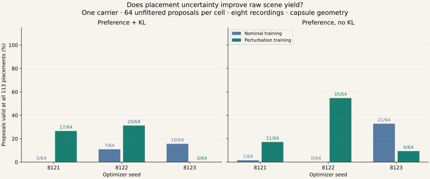

# Placement uncertainty in learned inverse scenes

Perturbation training improves finite-placement validity in two of three optimizer
seeds for each KL setting, meeting the registered development prediction. Both families
regress on the third seed. The result supports retaining uncertainty in the loss, but
also exposes a mismatch between the preference surrogate and the required upright
interference margin. The next change should address that constraint directly.

## Results

Every count below has denominator **64 unfiltered proposals**. Passing the combined
set requires all 113 placements and all eight recordings to satisfy the geometric rule.

| Training | Seed | Nominal | Grid 81 | Interior 32 | All 113 | All 113, gradient sources only |
|---|---:|---:|---:|---:|---:|---:|
| nominal_full | 8121 | 27 | 0 | 0 | 0 | 1 |
| nominal_full | 8122 | 51 | 7 | 11 | 7 | 9 |
| nominal_full | 8123 | 38 | 10 | 14 | 10 | 13 |
| nominal_no_kl | 8121 | 62 | 1 | 3 | 1 | 1 |
| nominal_no_kl | 8122 | 59 | 0 | 1 | 0 | 0 |
| nominal_no_kl | 8123 | 59 | 21 | 27 | 21 | 25 |
| robust_full | 8121 | 63 | 17 | 29 | 17 | 23 |
| robust_full | 8122 | 61 | 20 | 28 | 20 | 24 |
| robust_full | 8123 | 27 | 0 | 0 | 0 | 0 |
| robust_no_kl | 8121 | 64 | 11 | 42 | 11 | 11 |
| robust_no_kl | 8122 | 64 | 35 | 53 | 35 | 41 |
| robust_no_kl | 8123 | 59 | 6 | 8 | 6 | 8 |

For KL training, robust-valid counts change from **0 / 7 / 10** to **17 / 20 / 0**.
Without KL, they change from **1 / 0 / 21** to **11 / 35 / 6**. These are paired
optimizer-seed comparisons on one carrier, not independent carrier replications or a
statistical significance claim. In this evaluation, grid and combined pass counts coincide; checking the interior
set alone accepts additional proposals that fail grid placements.



## Failure diagnosis and decision

A descriptive audit of the six new cells finds **295 rejected proposals out of 384**:
271 fail only the upright-interference margin, 24 fail only target clearance, and none
fail both. In the failed KL seed 8123, all 64 proposals preserve target clearance but
none constrain every upright recording by the required amount across placements.
This is observed failure classification; it does not by itself identify every cause of
optimizer instability or rule out a role for the finite corner sampling schedule.

There is also a direct mathematical mismatch in the frozen objective. Give the upright
candidate clearance −0.005 m and the target clearance +0.030 m, with fixed costs 0 and 1.
`choice_energies` returns approximately 3.04859 and 1.01815. `inverse_terms` then returns
selection loss **0.0002969644** and target-feasibility penalty **0**, even though the
upright fails the required −0.010 m clearance threshold. This is a constructed objective
counterexample, not an additional motion experiment. Preference and a quantitative
interference reserve are different conditions.

The next registered objective should therefore retain placement uncertainty and add an
explicit alternative-interference barrier alongside target clearance. With worst target
clearance `d_target`, worst upright clearance `d_upright`, and margin `m = 0.01 m`:

```text
B_target  = [max(0, m - d_target) / m]^2
B_upright = [max(0, m + d_upright) / m]^2
L         = preference + λ_target B_target + λ_upright B_upright + β KL
```

This is a proposed change, not a retrospectively modified run or a collision guarantee.
Freeze its weights, query budget and comparisons before training; retain the current
nominal and uncertainty checkpoints. Test constraint-only versus preference-plus-
constraint training to separate exact-margin satisfaction from preference modeling.
After that test, investigate conditional coverage and independent-carrier transfer.
The [saved research plan](NEXT_RESEARCH_PLAN.md) defines the remaining data, geometry,
scene-family and downstream-policy milestones.

## Evidence and limits

All six registered training cells complete without a recorded failure. Training takes
344.55 seconds and evaluation 207.69 seconds of wall time on CPU; no GPU training or
new physics runs are used. The same update budget entails five times as many placement
queries in the new arms. Checkpoints are final-step outputs, with no best-step selection.

The independent NumPy checker evaluates 768 proposals × 113 placements × 8 recordings
= **694,272 proposal/placement/recording queries**. PyTorch cross-checks the first eight
proposals in each cell at every placement (86,784 corresponding recording queries),
with maximum absolute disagreement **5.56 × 10⁻¹⁷ m**. Agreement validates the two
primitive query implementations on these samples; it is not proof of imported-robot
geometry equivalence or continuous collision freedom.

The [carrier audit](evidence/uncertainty-carrier-audit.json) covers the existing timing
and repeated-pair studies. Only original-clock 41002 passed the timing study's crouch
tracker, route and behavior gates and then received successful three-seed repeatability.
There is one repeated development carrier and zero Q4-admitted ladders in this audited
bank. A different execution seed is not a different carrier. The generator has not
established motion-input dependence, population generalization, distribution coverage
under uncertainty, or obstacle-present tracking success. All eligibility flags remain false.

The [portable results](evidence/uncertainty-learning.json) include all proposal coordinates,
per-proposal worst clearances, rejection categories and original raw-array hashes.
The [manifest](evidence/uncertainty-learning-manifest.json) fixes source files, checkpoints,
protocol and placements; [export hashes](assets/uncertainty-manifest.json) identify the
public copies. Complete 64 × 113 × 8 clearance arrays and six trained checkpoints remain
in `/home/linjiw/research-data/groot-wbc/m2s-uncertainty-learning-v1/`.

Frozen main manifest:
`sha256:fadcb06f44e49bc0a91222eab95951b25f234065e1f53388a268d6355bb217aa`.

## Mechanism and scope

The [registered protocol](UNCERTAINTY_LEARNING_V1.md) adds world translation and yaw
perturbations to the fixed motion-only inverse objective. Each step checks nominal
placement and four randomly selected corners of the uncertainty box, then trains on
worst target clearance and weakest upright interference. The beam dimensions and
station/height domain, motion encoder, mixture architecture, optimizer schedule and
candidate-motion costs are inherited from V1. No obstacle coordinates, analytic
feasible intervals, or paired scene labels supervise the model.

The independent evaluation checks every one of 64 unfiltered proposals per cell at
81 grid placements and 32 fixed interior placements, against all eight reference and
execution recordings. The pose domain is ±2 cm x/y, ±1 cm z, ±0.02 rad yaw. All target
recordings must clear by 10 mm; every upright recording must overlap the capsule
proxy by at least 10 mm. That overlap value is not physical penetration depth.

There are six saved nominal comparator cells and six newly trained cells. Optimizer
seeds are paired, but new arms use five placement queries per proposal/update. The
comparison matches updates and latent draws, not geometric compute. Execution seed
7903 is excluded from gradients, but was already observed in development. All models
still use the same selected source carrier 41002.

## Reproduction and validation

Training and analysis commands are in the [protocol](UNCERTAINTY_LEARNING_V1.md).
Export the public evidence and figure with:

```bash
.venv_research/bin/python scripts/research/render_motion2scene_uncertainty_report.py \
  --result /home/linjiw/research-data/groot-wbc/m2s-uncertainty-learning-v1/result.json \
  --out docs/motion2scene
```

Sample a saved model on its original development carrier, then independently audit all
draws and report rejections:

```bash
.venv_research/bin/python scripts/research/motion2scene_sample_robust_beams.py \
  --manifest /home/linjiw/research-data/groot-wbc/m2s-uncertainty-learning-v1/manifest.json \
  --arm robust_full --model-seed 8121 --sample-seed 9421 --count 8 \
  --out /path/to/new-sample-audit.json
```

The sampler's default fresh draw passes 3/8 and rejects 5/8 under the 113-placement
check. This separate smoke of the sampling interface is not pooled into the registered
64-proposal evaluation. No obstacle-present simulator scene is emitted.

Validation commands:

```bash
.venv_research/bin/python -m pytest \
  tests/dataset_generation/test_capsule_box_exact.py \
  tests/dataset_generation/test_capsule_box_torch.py \
  tests/dataset_generation/test_motion2scene_inverse.py \
  tests/dataset_generation/test_motion2scene_uncertainty.py \
  tests/dataset_generation/test_motion2scene_beam_teacher.py \
  tests/dataset_generation/test_motion2scene_repeatability.py \
  tests/dataset_generation/test_motion2scene_timing_diagnostic.py -q
.venv_research/bin/ruff check --select E,F,I \
  gear_sonic/dataset_generation/hallucination/motion2scene_uncertainty.py \
  scripts/research/motion2scene_uncertainty_learning.py \
  scripts/research/motion2scene_sample_robust_beams.py \
  scripts/research/render_motion2scene_uncertainty_report.py \
  tests/dataset_generation/test_motion2scene_uncertainty.py
.venv_research/bin/black --check \
  gear_sonic/dataset_generation/hallucination/motion2scene_uncertainty.py \
  scripts/research/motion2scene_uncertainty_learning.py \
  scripts/research/motion2scene_sample_robust_beams.py \
  scripts/research/render_motion2scene_uncertainty_report.py \
  tests/dataset_generation/test_motion2scene_uncertainty.py
git diff --check
```

All 46 impacted tests pass. Six new tests cover uncertainty-domain culling at both
vertical boundaries, zero-offset equivalence to the frozen objective, worst-offset
gradient direction, independent NumPy agreement over all 113 placements, and rejection
of an empty offset set. The two-update engineering smoke completed six cells in a
separate artifact directory; its outcomes are excluded from research metrics.

The local report was checked in headless Chrome at 1440 × 1000 and 390 × 844. The new
figure decodes at both sizes, with no page JavaScript exceptions or horizontal overflow.
All 68 local page links/anchors and links in the four updated/new Markdown documents
resolve. New export hashes and the three earlier follow-up export manifests verify.
The page changes are local; this work did not publish or push them.
