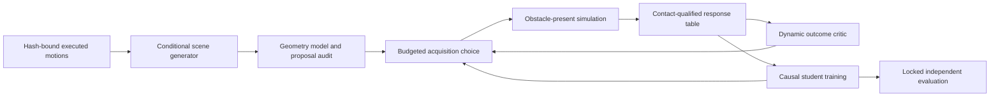

# Learning obstacle distributions from humanoid motion

A promising next contribution is a motion-conditioned generator that improves the usefulness of physically labeled training encounters per unit of simulation. Merely fitting an obstacle distribution, obtaining a low reconstruction loss, or replacing a CNN with a Transformer would not establish that contribution. The consequential question is whether a learned constructor outperforms strong screened sampling and analytic construction when the robot, teacher, learner, information, and physical labeling budget are matched.

The immediate engineering work supports a narrower conclusion. A fresh CPU experiment trained eight small generators on an existing, hash-bound seven-motion bank. It exposed a tendency to make the requested motion geometrically clear without making it distinguishable from other motions. Separate collision tests reproduced two optimistic-clearance failure modes in the existing research decoder. These findings motivate a better objective and collision representation before broad architecture scaling.

This report separates verified local observations, published precedents, mathematical arguments under stated assumptions, and proposed experiments. The new design and measurements are exploratory, dated September 11, 2026, after earlier development and partial pilot outcomes were accessible. They do not amend the original acquisition pilot or establish held-out humanoid performance.

## 1. Research position and nearest alternatives

LfLH learns obstacle distributions conditioned on open-space motion using a fixed differentiable planner as a decoder. Planner reconstruction, a distribution prior, and collision penalties provide its learning signal; rendered observations then train a separate navigation policy. Its ground-robot encoder uses temporal convolutions. A humanoid adaptation must explain why its surrogate decoder remains informative about the actual closed-loop tracker rather than merely resemble that architecture.[^1]

Dyna-LfLH extends the hallucination construction to moving obstacles and sensing histories. This is relevant to a future dynamic-scene extension, but its ground-robot experiments do not qualify this humanoid’s dynamics, sensing, or safety. Static beam placement should be resolved before introducing obstacle velocities and temporal uncertainty.[^2]

LfH-CP supplies a particularly relevant alternative: factor the inverse problem into critical locations/times and subsequent generation of obstacle trajectories. Its authors identify collapse and unrepresentative obstacle configurations as problems in learned dynamic hallucination. The transferable idea is to learn the consequential constraint separately from incidental variation. Its formulation and results are not a proof that critical points suffice for a humanoid’s balance, body clearance, and recovery.[^3]

Motion-to-scene generation is already established beyond navigation. MIME generates human-compatible indoor layouts with an autoregressive Transformer, and spatially constrained diffusion has been used for human-aware scene generation. These studies make “generate scenes from human motion” an insufficient novelty claim. They also provide meaningful architecture and representation precedents, but visual plausibility and human-mesh collision metrics are different outcomes from a robot’s contact-qualified passage.[^4][^5]

Unsupervised environment design provides the other half of the research question. PAIRED uses relative return to avoid an adversary that simply produces unsolvable tasks. Prioritized Level Replay prioritizes estimated learning potential, and ACCEL edits environments near the learner’s capability frontier. These motivate explicit controls for acquisition strategy, not just comparisons among neural backbones. Recent environment-curriculum generation and steerable scene generation also limit novelty claims based solely on an adaptive generator.[^6][^7][^8][^9][^10]

**Candidate contribution, not an established claim:** an execution-calibrated, motion-conditioned obstacle distribution that learns a useful *collection of decisions*, improving physical passage at a matched labeling budget beyond screened placement and an equally informed analytic constructor. A second, separable contribution could be lower proposal cost at comparable physical yield. The two must be measured separately.

| Competing explanation | Discriminating comparison | What it could establish |
|---|---|---|
| Positive feasibility support supplies the useful data | Learned constructor versus Screened Uniform | Incremental utility beyond screening |
| Fast amortization of geometry is the benefit | Learned generator versus equal-budget analytic search | Proposal efficiency, conditional on yield |
| Adaptive data selection supplies the benefit | Same proposal pool with uniform versus regret-informed selection | Acquisition-objective effect |
| Motion conditioning supplies the benefit | Conditional generator versus input-ablated/retrained unconditional controls | Dependence on motion information |
| A richer architecture supplies the benefit | Same objective, data, search, and distribution head; different encoder | Architecture effect within the tested contract |
| The inverse problem needs multimodal output | Same encoder; Gaussian, mixture, flow, and diffusion heads | Distribution-family effect |
| The student cannot observe the distinctions | Same physical response table with controlled causal observation information | Information limitation, not necessarily capacity |

## 2. What the current evidence permits

The existing audited Gen-2 development panel records executed contrast and Screened Uniform at 5/6 passages in each of three acquisition seeds. Thirteen of fifteen learned policies are constant on that panel. Those finite results do not establish equivalence, population effects, or source-ancestry transfer. The positive-support and complementarity explanations remain hypotheses consistent with the observations.[^11]

The support-broadening pilot has 288 scored acquisition assignments and 171 of 200 scored validation assignments. An interrupted episode lacks its terminal/contact/trajectory evidence; 28 assignments remain unrun. Screened Uniform is absent from that validation panel. The unchanged runner refuses automatic retry of the interrupted launch. This project cannot infer an adoption gate from partial outcomes, insert a historical baseline, or expand the original budget to make a new method succeed.[^11]

There is already an LfLH research implementation in the checkout. Its current components include a pair-conditioned temporal CNN, a multi-obstacle Gaussian head, a geometric bank-choice decoder, capsule-cloud geometry, and an SDF training script. That decoder is not the original paper’s optimization-based motion planner. Historical reference CSV paths in the 24-clip candidate file are absent in this runtime, so retraining that exact reference-based experiment is presently blocked. The new benchmark instead uses the verified native execution bank and records this substitution explicitly.[^12]

The new research code lives in `scripts/research/lflh_next/`. The frozen `gear_sonic` sources, pilot registration, physical scorer, controller, outcomes, and manuscript were not edited in this work. No protected validation context or reserved layout was used for new training or scoring.

## 3. Define the inverse learning problem precisely

Let a recorded motion be

\[
\tau=(x_{0:T},u_{0:T-1},s_{0:T}),
\]

where states include the robot’s pose, velocities and articulated geometry, controls identify the schedule or tracker inputs, and contact/support states are retained when measured. Let \(c\) contain the start state, goal, source ancestry, controller identity and task specification. Let \(e\) parameterize the scene: obstacle count, type, pose, dimensions, and eventually time dependence.

A generator models \(q_\phi(e\mid \tau,c)\). A new scene is not uniquely determined by an open-space motion. Many scenes allow that motion, including an empty room and obstacles too distant to matter. Consequently, trajectory reconstruction alone does not identify a unique scene distribution. A prior, task domain and utility objective express which of those inverse solutions should be preferred; this is a modeling choice, not information recovered from the trajectory.

A conceptual constrained inverse model is

\[
q(e\mid\tau,c) \propto \mu(e\mid c)
\exp[-\beta\,\mathcal E(\tau,e,c)],
\]

where \(\mu\) specifies the valid scene domain and \(\mathcal E\) measures explanation cost. This formula describes a chosen target distribution. It does not make a kinematic demonstration optimal, dynamically executable, or statistically identified. A frozen finite schedule bank only permits claims relative to that bank.

Three kinds of learning should remain distinct:

1. **Self-supervised geometric pretraining:** use the input motion as its own reconstruction target. No human scene label is needed, but geometry and the decoder encode assumptions.
2. **Simulation-supervised calibration:** use obstacle-present executions and measured failures to learn where the geometric surrogate is wrong.
3. **Adaptive data acquisition:** use the current student’s measured capability to choose the next labeled encounter. This is a feedback process with changing sampling probabilities, not independent identically distributed data collection.

The scene generator may condition on the whole archived trajectory. A deployed decision policy may only use its causal observation history. The generator’s privileged information must not silently become a student input or an unavailable teacher cue.

## 4. Collision learning: make the inequalities honest

### 4.1 Signed distance and model scope

For a point \(p\), a box with centre \(b\), rotation \(R\), and positive half-extents \(h\), define \(v=|R^\top(p-b)|-h\). The exact point-to-box signed distance is

\[
 d_{\rm box}(p)=\|\max(v,0)\|_2+\min(\max_i v_i,0).
\]

It is positive outside and negative inside. For a capsule represented by a segment and radius \(r\), minimize \(d_{\rm box}(p)-r\) along the segment. Its sign provides a separation/intersection criterion for that capsule model. It is not a measured contact force, a native-mesh guarantee without containment evidence, or a proof about a future tracked trajectory.

Collision roles must be explicit. Foot-ground support is permitted in the existing task; obstacle-body contact is evaluated by the registered contact criterion. Generic “penalize all contact” optimization would attack the support needed for locomotion. Recovery and return trajectories must be included because a beam can be cleared during crouching and struck while standing back up.

### 4.2 Why the current weighted soft minimum is optimistic

The existing SDF decoder computes

\[
\bar d=\sum_i w_i d_i,\qquad w_i=\operatorname{softmax}(-d_i/\tau).
\]

Every weighted average is at least the smallest input. In a reproduced test with distances \(-1\) mm and \(+9\) mm and temperature 10 mm, the result is **+1.689 mm**, although one point penetrates. Reporting \(\bar d>0\) as collision-free is therefore unsound. This counterexample does not by itself reclassify any recorded physical episode.[^13]

For training, an unnormalized log-sum-exp supplies a lower bound:

\[
\underline d_\tau=-\tau\log\sum_i\exp(-d_i/\tau),\quad
\min_i d_i-\tau\log N\leq\underline d_\tau\leq\min_i d_i.
\]

Its proof follows by bounding the exponential sum between its largest term and \(N\) times that term. The implementation uses numerically stable `logsumexp`. Averaging inside the logarithm adds \(\tau\log N\) and destroys the required upper inequality. The number of sampled points affects conservatism, so comparisons need the same discretization and a recorded temperature.

### 4.3 Sampling does not automatically make a bound conservative

Suppose a capsule axis has length \(L\) and \(K\ge2\) equally spaced samples. Any axis point lies within

\[
\rho_s=\frac{L}{2(K-1)}
\]

of a sample. Because box signed distance is 1-Lipschitz in position, a conservative sampled-axis bound is

\[
\underline d=\min_j\{d_{\rm box}(p_j)-r-\rho_s\}.
\]

The new module implements this correction. A test with capsule endpoints on opposite sides of a small obstacle shows both sampled endpoints clear while the segment crosses the obstacle. Subtracting the covering correction detects that clearance cannot be certified. This reverses the existing comment’s misleading description of optimistic subsampling as conservative.[^13]

A **positive lower bound** can certify separation for the represented geometry. A **negative lower bound cannot prove penetration**. For a penetration witness, require an actual sampled point with \(d_{\rm box}(p_j)-r<0\), an exact intersection test, or another appropriate upper bound on minimum separation. For native robot collision, even an intersecting outer capsule is insufficient: it may enclose empty space. Use native geometry or a verified inner subset for that direction of inference.

### 4.4 Temporal gaps and tracking error

Spatial sampling corrections do not cover missing time steps. If geometry motion has a verified relative-speed bound \(V\), a nearest-frame bound can subtract \(V\Delta t/2\), with endpoint coverage and all relevant motion included. A tracking-error bound \(\epsilon\) could be subtracted separately. This yields a conditional form

\[
\underline d_{\rm continuous}
\ge \min d_{\rm sampled}-\rho_s-V\Delta t/2-\epsilon.
\]

Here the right-hand side is a proposed conservative certificate only if those bounds are valid. A maximum velocity observed on a few trajectories is not a universal bound. The implemented benchmark makes no continuous-time or closed-loop certificate; it evaluates supplied capsule geometry at recorded frames. Physical passage still needs the original 200 Hz contact evidence and complete scorer.

### 4.5 Practical training design

Use a geometrically meaningful positive-clearance hinge, \([m-\underline d]_+^2\), with meters documented. Use exact or tighter geometry for scoring and keep uncertain cases explicit. Represent dimensions with positive bounded transforms and positions in a declared scene domain. Avoid discrete station rounding in the differentiable path: indexing by `round().long()` destroys the station gradient. Continuous route interpolation or direct world-coordinate parameters keep that path differentiable.

Do not solve optimization failure by changing the simulator’s contact threshold. Do not use a huge collision weight as proof of constraint satisfaction. The benchmark shows how an optimizer can reduce a clearance penalty by moving obstacles into uninformative placements. If geometric projection is added, count each projection/search operation, retain rejected proposals, and compare to an analytic method with the same access and budget.

## 5. A framework that can learn useful distributions

A practical system should have four distinct components with separate artifacts and evaluation:

Evaluation has no outgoing feedback edge. A generator can propose from full trajectories, but only physical training outcomes may update its dynamic critic. A rejected proposal, unsolved context, or censored technical attempt remains part of the acquisition receipt.

### 5.1 Pretraining an explanation without confusing it with utility

Use a fixed decoder \(D(e,\mathcal B)\) over a qualified motion bank \(\mathcal B\). A possible pretraining objective is

\[
\mathcal L_{\rm pre}=\mathbb E_{\tau,e\sim q_\phi}
[\mathcal L_{\rm rec}(D(e,\mathcal B),\tau)
+\lambda_g\mathcal L_{\rm clearance}
+\lambda_o\mathcal L_{\rm overlap}
+\lambda_d\mathcal L_{\rm domain}]
+\lambda_p D_{\rm KL}(q_\phi\Vert\mu).
\]

Every term needs its intended role: preserve the target motion, make the scene informative relative to valid alternatives, maintain valid obstacle arrangements, and constrain the authored domain. If several schedules are legitimately equivalent, use a target set or verified tie rule instead of forcing a unique arbitrary label. The existing pilot teacher remains unchanged; this is a future method design.

KL regularization alone does not guarantee multimodal coverage or prevent all collapse. Reverse KL can prefer a subset of modes, while a broad Gaussian can average between disconnected valid placements. An uninformative no-obstacle solution and an all-colliding solution should both appear in objective unit tests. A no-adaptation target must remain possible; always forcing the neutral schedule to collide would exclude useful walking contexts by design.

### 5.2 Calibrate the geometric model against actual execution

Learn \(\hat p_\psi(a,e,c)\), the probability of contact-qualified passage for schedule \(a\), from acquisition executions. Keep contact magnitude, crossing, stability, reset/guard failures and technical unknowns as separate fields. Train on valid measured outcomes; missing telemetry is not a negative physical label. An ensemble or a suitable uncertainty model can flag extrapolation, but uncertainty is a query priority, not a calibrated failure-probability guarantee.

Use grouped fitting/calibration splits by source ancestry. Include off-screen examples from a declared broad channel so the critic is not trained only on examples the current geometry already prefers. Record proposal probability or channel and inclusion probability when it is computable. Deterministic ranking can make some selection probabilities zero; ordinary inverse-propensity correction cannot recover data from that missing support.

The critic must never turn its own predictions into “measured” teacher labels. Its task is to spend simulation effort more effectively and identify disagreement between geometry and dynamics. Newly executed schedules still supply the final labels.

### 5.3 Choose examples the current policy can benefit from

A useful bank-relative acquisition signal is

\[
\widehat R(e)=\max_a\hat p_\psi(a,e,c)
-\sum_a\pi_\theta(a\mid o(e,c))\hat p_\psi(a,e,c).
\]

It estimates the student’s avoidable loss relative to the current bank. If every schedule truly has zero success probability, this quantity is zero: making the scene impossible is not rewarded. With a learned critic this protection is only as good as the predictions, so measured bank checks and an uncertainty allocation are needed. This is a bank-relative regret surrogate, not a claim to reproduce PAIRED’s theoretical game.[^6]

For a fixed utility estimate \(U(e)\) and prior \(\mu\), maximizing

\[
\mathbb E_q U(e)-\tau D_{\rm KL}(q\Vert\mu)
\]

over unrestricted normalized densities gives \(q^*(e)\propto\mu(e)\exp(U(e)/\tau)\), provided the normalizer is finite. The derivation substitutes this density to rewrite the objective as \(\tau\log Z-\tau D_{\rm KL}(q\Vert q^*)\). A neural family, changing critic and finite data need not attain that optimum.

A practical bounded-support proposal is a declared mixture

\[
q_{\rm acquire}=\epsilon\mu+(1-\epsilon)q_\phi.
\]

For \(\epsilon>0\), it has at least \(\epsilon\mu\)'s probability on each measurable region. This is a support statement, not geometric certification or a promise of finite-sample coverage. A new epsilon must be selected before its experiment and compared at fixed budgets; the current pilot’s committed 50/50 sequence is not tunable.

### 5.4 Optimize collections, not just isolated contrasts

For an evaluation distribution \(P(e)\) and true schedule success probabilities \(p(a,e)\), define

\[
V_{\rm const}=\max_a\mathbb E_e p(a,e),\qquad
V_{\rm full}=\mathbb E_e\max_a p(a,e).
\]

Their difference \(\Omega=V_{\rm full}-V_{\rm const}\ge0\) is the opportunity available to a fully informed contextual selector relative to the best constant. If it is zero, action diversity cannot improve expected passage over that constant on this distribution. Conversely, positive opportunity does not mean a particular student can identify the right action.

With only causal observations \(o\), the relevant upper bound is

\[
V_{\rm obs}=\mathbb E_o\max_a\mathbb E[p(a,e)\mid o],
\qquad V_{\rm const}\le V_{\rm obs}\le V_{\rm full}.
\]

Two geometrically different scenes with indistinguishable observations can require different actions and remain impossible to distinguish for this student. This connects acquisition design to sensor timing. It also explains why entropy of schedules or passing-set diversity alone is not a utility criterion. A constant policy can still improve over a worse baseline; \(\Omega\) bounds contextual value, not every possible passage gain.

A proposed acquisition implementation should therefore track three signals separately: estimated avoidable student failure, response-table coverage, and causal observability. A diversity term may regularize the batch, but must not replace the physical outcome objective. All-fail and all-pass contexts still need reported frequencies rather than retrospective deletion.

## 6. Which architectures to compare, and in what order

Start with the low-dimensional problem actually specified by the task. A beam’s station, underside, span, thickness and yaw do not initially require a large scene Transformer. Separate the trajectory encoder from the distribution head so an apparent gain can be attributed to representation or multimodality instead of changing both.

| Component | First comparison | Why include it | Principal failure mode |
|---|---|---|---|
| Trajectory encoder | MLP, temporal CNN, small Transformer | Different temporal inductive biases with shared inputs/head | Memorization of one bank; apparent capacity ranking from too few fits |
| Distribution head | Single Gaussian versus mixture | Smallest test of disconnected placement modes | Mode averaging or inactive mixture components |
| Density model | Conditional spline flow | Flexible density with tractable density evaluation | Learned support gaps; unnecessary complexity at small data |
| Set generation | Autoregressive object model | Variable obstacle count and interactions | Order sensitivity and cumulative errors |
| Rich continuous generation | Conditional diffusion or flow matching | Candidate for genuinely complex multi-obstacle distributions | Sampling cost; surrogate-guidance exploitation; unsupported scaling |
| Critical-constraint model | Learn event/location, procedurally sample remainder | Factor relevance from nuisance geometry | Missing long-horizon balance/recovery interactions |

Spline flows support tractable density modeling; flow matching supplies a continuous generative training formulation. Neither establishes superiority for these scene parameters.[^14][^15] Diffusion Policy is a useful example of conditional multimodal generation in robotics, but its output is robot action, not a proof about obstacle generators.[^16]

There should be two resource views: matched training examples and optimizer updates, and matched measured compute. Parameter counts alone do not equalize compute. Declare hyperparameter searches and failed fits, and retain the best analytic method instead of only weak random proposals. Distribution models must also share the same geometry scorer, accepted-domain rules, and proposal/rejection accounting.

An input-rotation check at inference, as used below, is a diagnostic. It is not interchangeable with retraining an unconditional model; the rotated input may be out of distribution. Both belong in a full experiment. Avoid reporting only the stronger of multiple ablations.

## 7. Completed bounded training experiment

The dated design was written before these fits. It allowed four architectures at seeds 101 and 102, 120 updates each, two CPU threads, and a 600-second stop budget. All eight fits completed in **12.7373 seconds** for the training/evaluation loop; individual fit wall times are in the CSV. Data preparation, later analysis, and general research time are not included in that loop measurement. No GPU training or new physics was used.[^17]

The inputs are seven previously executed qualified schedules from one source bank, each with 298 recorded body-pose frames. The bank uses 299 reference frames; those are different counts. Training uses 16 selected frames; scoring uses all 298 recorded frames. Both use five axis samples per capsule and the spatial covering correction. The model outputs a diagonal Gaussian in two latent coordinates mapped to one beam’s position and underside. All architectures use the same distribution family, learning rate, margin, and reconstruction/clearance/KL objective.

The decoder ranks conservative geometric clearance across seven schedules with equal base costs. It is deliberately a limited bank-choice optimization diagnostic. It is not an optimization-based dynamics planner, the pilot’s teacher, an exact reproduction of LfLH, or a source-held-out benchmark. Every target remains included even if a single beam cannot distinguish it. Fit and score use the same bank; only Gaussian draws are fresh.

Each seed/model has 56 conditioned samples: eight draws for each of seven targets. An additional 56 matched draws per model rotate only the encoder inputs. The following sums the two training seeds for readability; 112 correlated draws are not 112 independent experiments.

| Model | Parameters | Target reconstructed | Capsule-clear target at recorded frames | Capsule-model contrast witness | Sparse clearance disagreement |
|---|---:|---:|---:|---:|---:|
| Unconditional Gaussian | 4 | 16/112 | 41/112 | 5/112 | 4/112 |
| MLP | 10,628 | 11/112 | 108/112 | 1/112 | 1/112 |
| Temporal CNN | 5,764 | 20/112 | 112/112 | 0/112 | 0/112 |
| Small Transformer | 9,412 | 11/112 | 87/112 | 0/112 | 3/112 |

Dots are the two initialization seeds; bars are their descriptive means, not confidence intervals. [Underlying CSV](benchmark/architecture-results.csv).

“Reconstructed” means the target wins this geometric ranking, including the fixed first-index tie behavior. “Capsule-clear” means a lower bound exceeds 10 mm at the recorded frames. “Contrast witness” requires that target bound plus a sampled penetration witness for another represented capsule trajectory. It is not a native collision or physical response label. “Sparse disagreement” means sparse-frame clearance was positive at the margin while the dense-frame lower bound was not; it does not necessarily prove a collision.

The original `contrast` diagnostic used a negative lower bound for the alternative, which only indicates lack of a certificate. That interpretation was corrected after inspecting results. Original receipts are retained; `posthoc-analysis.json` and `draws.csv` record the separate penetration-witness check. The corrected counts happen to match the original conditioned counts in this batch; that coincidence does not validate the original definition.[^17]

The CNN obtained geometrically clear targets but no witnessed contrasts. Reconstruction was low for every learned encoder and did not show a stable conditioning benefit across the input-rotation check. These observations support investigating objective/representation informativeness. They do **not** establish that a CNN is best, that a Transformer cannot work, that the generator is useless, or that LfLH fails for humanoids. There are only two initialization seeds, one shared bank with unestablished source-ancestry independence, a narrow scene parameterization, a short optimization schedule, and a simplified decoder. No further fits were added to improve the numbers.

The capsule-gap toy counterexample, not an architecture victory, is the strongest new engineering result. Seven focused tests cover sign masking, the smooth lower bound and its gradients, missed capsule-axis intersections, rigid-frame invariance, and invalid inputs. The new kernel is isolated from the frozen pilot and still needs native-geometry parity and temporal qualification before adoption.[^13]

## 8. A staged scaling study that can answer the research question

### Stage A: qualify the geometry instrument

Complete native primitive/mesh parity, tangency, thin-beam, rotated-box, long-capsule, rapid-transition and return-motion cases. Quantify the conservative undecided region; a method that certifies nothing can be correct but operationally unhelpful. Add dense-versus-coarse convergence and independent exact-intersection checks. Unit-test the empty-scene, all-blocked and legitimate-tie objectives. Freeze the numerical implementation before collecting a new physical comparison.

### Stage B: qualify conditional learning on actual independent sources

Create a source-ancestry manifest connecting raw motion, retargeting, adaptation, executed schedule and generated scene. Randomly splitting frames or repeated schedules would leak ancestry. Existing reference CSVs must be recovered or replaced through an explicit new data construction with different provenance. No population generalization conclusion is available until distinct source families are actually available.

Use nested training/development/test sources. Determine the number from available source groups and the precision question; do not invent a sample count by dividing a trajectory count. Candidate learning-curve sizes such as 16, 64 and 256 *source families* are proposals conditional on availability, not existing datasets or authorized collection quotas. If only one bank is available, retain the engineering-only scope.

First compare encoder families with a shared Gaussian head and two or three fixed compute tiers. Then compare mixture/flow heads using a selected encoder based only on inner development sources. A rich scene model becomes reasonable when several obstacles, semantic object types and independently varying body responses make the inverse distribution demonstrably complex. Diffusion should not be the default response to a narrow geometric window.

### Stage C: separate proposal efficiency from physical utility

A future proposal comparison should include domain-uniform, Screened Uniform, analytic construction, a faithful declared LfLH-style reconstruction baseline, and the proposed execution-calibrated acquisition method. Give analytic search the same critic and motion information when comparing learned amortization. Compare the same generator under static reconstruction and adaptive regret objectives when testing the latter mechanism.

Record proposal calls, raw samples, rejected samples, geometry evaluations, critic evaluations, fitting time, storage, and accepted yield. A generator can win proposal latency while losing downstream utility; report both. High geometric acceptance is not evidence that fresh obstacle-present executions will pass.

### Stage D: only a separately registered physical comparison can support adoption

The original pilot must be reconciled and its gates resolved before Phase 3. Any new physical program needs its own explicit budget, implementation lock, terminal-censoring policy, assignment order, seeds, comparators and stopping rule. A planning formula, not an allocation, is

\[
N_{\rm acquire}=A\,S\,N\,(K+1),
\]

for \(A\) acquisition methods, \(S\) corpus replications, \(N\) encounters per corpus, \(K\) complete-continuation branches and one student rollout. Reused prefixes are tracked once in marginal cost and disclosed per corpus. Evaluation adds the actual number of learned/fixed/scripted policies times shared contexts and execution seeds. No value for these variables authorizes new episodes.

Screened Uniform must appear contemporaneously on the same evaluation contexts. All fixed schedules and the strong script remain. The primary outcome is contact-qualified passage under the original crossing, stabilization and horizon contract; diversity, reconstruction and critic accuracy are diagnostics. The eighteen reserved layouts retain their adoption gates and must not become another tuning split.

For each contrast, state whether the estimand is conditional on one bank/panel or averaged over sampled source families. Keep matches over context, corpus and physics seed. Establish an exchangeability scheme before using exact permutations. Otherwise report descriptive paired effects with p = NA. A superiority tie cannot establish equivalence or non-inferiority. A practical margin and uncertainty rule require a prospective scientific justification, not selection from these preliminary scores.

### Stage E: broaden the system only after evidence supports it

Restore source-ancestry-held-out transfer before generalization claims. Separately specify realistic sensors, noise/dropout and timing; the proposed 70-degree field of view needs a sensor definition. Evaluate causal delay under matched conditions. Qualify every sequential skill and transition, including return, recovery, steering and any proposed under-beam controller. An existing crouch schedule is not a crawling controller. Whole-chain passage and failure counts replace selected successful segments.

## 9. Decisions and next implementation priority

| Question | Current decision | Consequence |
|---|---|---|
| Can the weighted distance average safely certify sampled clearance? | CONTRADICTED FOR THE STATED MATHEMATICAL PROPERTY | Use a proven bound or exact scorer; preserve historical receipts |
| Does the new spatial correction bound the represented capsule axis under its assumptions? | SUPPORTED FOR THE STATED MATHEMATICAL PROPERTY | Retain tests; do not extrapolate to time, native meshes or dynamics |
| Does one trained architecture establish useful motion-specific scene construction? | INCONCLUSIVE | No architecture promotion from this engineering batch |
| Does LfLH improve humanoid passage over screened placement? | BLOCKED/UNTESTED | Needs a complete matched physical comparison |
| Is more data or model scale the main missing ingredient? | INCONCLUSIVE | Audit objective and independent source supply before scaling |
| May Phase 3, hardware or protective-stopping claims advance now? | BLOCKED/UNTESTED | Existing gates remain |

The next implementation priority is a *set-aware target and acquisition objective*, evaluated against strong analytic controls, with corrected geometry and explicit uncertainty. It should preserve contexts where walking is appropriate, avoid rewarding unsolvable scenes, and distinguish geometric feasibility from information the student can actually observe. That is a testable scientific direction. A learned architecture becomes a major contribution only if it adds measured value under that comparison.

## Sources

[^1]: Zizhao Wang et al. **From Agile Ground to Aerial Navigation: Learning from Learned Hallucination.** IROS 2021. [Primary paper](https://www.cs.utexas.edu/~xiao/papers/lflh.pdf), Sections III–IV. Method and encoder details inspected; its claims are not inherited as humanoid evidence.
[^2]: Saad Abdul Ghani et al. **Dyna-LfLH: Learning Agile Navigation in Dynamic Environments from Learned Hallucination.** 2024 preprint, version 2. [Primary text](https://arxiv.org/html/2403.17231v2).
[^3]: Saad Abdul Ghani, Kameron Lee, Xuesu Xiao. **Learning from Hallucinating Critical Points for Navigation in Dynamic Environments.** 2025. [Primary text](https://arxiv.org/html/2509.26513v1), Sections I–III. The paper’s factorization motivates a proposed extension; it does not establish humanoid sufficiency.
[^4]: Hongwei Yi et al. **MIME: Human-Aware 3D Scene Generation.** CVPR 2023. [Primary paper](https://openaccess.thecvf.com/content/CVPR2023/papers/Yi_MIME_Human-Aware_3D_Scene_Generation_CVPR_2023_paper.pdf), [author abstract](https://arxiv.org/abs/2212.04360).
[^5]: Xiaolin Hong et al. **Human-Aware 3D Scene Generation with Spatially-constrained Diffusion Models.** 2024. [Primary text](https://arxiv.org/html/2406.18159v1).
[^6]: Michael Dennis et al. **Emergent Complexity and Zero-shot Transfer via Unsupervised Environment Design.** 2020/2021. [Primary record](https://arxiv.org/abs/2012.02096).
[^7]: Minqi Jiang, Edward Grefenstette, Tim Rocktäschel. **Prioritized Level Replay.** ICML 2021. [PMLR](https://proceedings.mlr.press/v139/jiang21b.html).
[^8]: Jack Parker-Holder et al. **Evolving Curricula with Regret-Based Environment Design.** 2022, revised 2023. [Primary record](https://arxiv.org/abs/2203.01302).
[^9]: William Liang et al. **Environment Curriculum Generation via Large Language Models.** CoRL proceedings, 2025. [PMLR](https://proceedings.mlr.press/v270/liang25a.html). Related environment-design precedent; no reproduced result claimed.
[^10]: **Steerable Scene Generation with Post Training and Inference-Time Search.** 2025. [Primary record](https://arxiv.org/abs/2505.04831). Adjacent scene-generation precedent; detailed baseline implementation was not audited here.
[^11]: Motion2Scene local audit, September 11, 2026. [State recheck](../../audit/20260911-state-recheck/README.md), [claim-to-artifact ledger](../../audit/20260911-pilot-boundary/CLAIMS.md), [complete assignment table](../../audit/20260911-pilot-boundary/assignment-outcomes.csv). Local development evidence, not independent population confirmation.
[^12]: Local implementation: `gear_sonic/dataset_generation/hallucination/lflh.py`, `sdf_decoder.py`, `scripts/research/hallucination/train_lflh_sdf.py`, and `docs/hallucination/lflh_candidates.json`. Inspected in this checkout; the candidate CSV paths were unavailable. Historical training JSON was not treated as a newly reproduced run.
[^13]: New `scripts/research/lflh_next/geometry.py` and `decoupled_wbc/tests/test_motion2scene_lflh_geometry.py`. Local mathematical counterexamples and tests; see [execution receipt](RECEIPT.md).
[^14]: Conor Durkan et al. **Neural Spline Flows.** 2019. [Primary record](https://arxiv.org/abs/1906.04032).
[^15]: Yaron Lipman et al. **Flow Matching for Generative Modeling.** 2022. [Primary record](https://arxiv.org/abs/2210.02747).
[^16]: Cheng Chi et al. **Diffusion Policy: Visuomotor Policy Learning via Action Diffusion.** 2023. [Primary record](https://arxiv.org/abs/2303.04137).
[^17]: New exploratory engineering benchmark. [Dated design and input hashes](benchmark/design.json), [all fit summaries](benchmark/results.json), [corrected draw-level table](benchmark/draws.csv), [architecture CSV](benchmark/architecture-results.csv), [metric correction](benchmark/posthoc-analysis.json). Eight fits, one bank, no physical outcomes.
