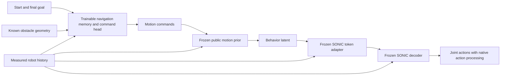

# Preserve the motion foundation; learn scene-aware navigation downstream

**September 12 implementation revision:** The user enabled student residual learning. [TRAINING_PIPELINE.md](TRAINING_PIPELINE.md) now specifies a zero-initialized bounded action residual as the main adaptation, with command-only as the comparison and latent residual optional. Native foundation collection, fitting and a small DAgger round have executed; their [pilot receipt](../../../docs/motion2scene/BFM_DISTILLATION_IMPLEMENTATION_20260912.md) does not establish a qualified foundation or scene-navigation controller. The September 11 proposal below is historical.

Revision dated September 11, 2026, America/New_York. This incorporates the user's instruction to retain a BFM-like teacher and behavior prior. It supersedes the **jointly learned scene-conditioned prior as the preferred architecture**, while retaining that earlier prototype as a comparison. The previous design packet is archived unchanged. This is a new engineering proposal, not an amendment to the original acquisition arms or a new claim of physical utility.

## Three different roles

1. **Tracking teacher:** the existing SONIC PPO run, using privileged state and a target motion. Its configuration, data allocation, rewards, checkpoint cadence and 8,000-iteration ceiling stay unchanged. It is a teacher of motion tracking, not yet of scene-dependent route choice.
2. **Motion foundation:** a BFM-style masked prior/posterior distilled from a qualified tracking teacher. It learns reusable motion behavior independently of downstream obstacle placement. Freeze its public prior, proprioception encoder, token adapter and selected SONIC decoder before the navigation stage. This trained Gaussian foundation does **not** yet exist in the inspected artifacts.
3. **Navigation student:** a recurrent scene-and-goal module that chooses commands for the frozen foundation. It learns what to do given the task and obstacles. The foundation supplies the motor response. No reference trajectory is required by the navigation inference API.

[BFM](https://arxiv.org/html/2509.13780v1), Sections IV-C–E, motivates masked behavior distillation and a public prior with a privileged training posterior. Section V-D freezes BFM and adds an **action residual** for a new motion-tracking task. Our primary downstream proposal instead learns scene-dependent **commands** for a frozen foundation. The optional latent residual below is a separate adaptation; neither our navigation result nor its collision performance is established by that paper.

## Inference contract

External inputs are the current 930D native proprioceptive history, six body-frame start/goal coordinates, and up to five exact primitive obstacle tokens. Recurrent memory is initialized at episode reset and evolves only from public observations. No ground-truth route, future reference, motion ID or reference phase enters the navigation actor. A route may be computed internally from the available map; it must not be supplied secretly from the demonstration.

For the initial interface prototype the navigation head emits forward velocity, lateral velocity, yaw rate and base height. They occupy four named entries in an eight-command motion interface. Values are bounded by an explicitly supplied command profile, with separate availability bits. The constructor requires bounds; there are no fabricated deployed G1 limits. Test bounds are synthetic fixtures. This profile is an interface slice, not the complete root/keypoint/joint command interface of BFM, and does not establish every motion is expressible through four commands. A faithful full-interface foundation adapter and trained checkpoint remain work to do.

The existing SONIC shapes stay native: 930D measured history, 640D privileged target encoder input, 1645D critic input, 64D FSQ tokens and 29 action means. Our proposed Gaussian behavior latent is separate from SONIC's tokens. The main prototype evaluates command selection at each native control tick; slower hierarchical timing is not silently introduced. If later reduced, its command-frame transformation and hold policy need a separate explicit specification.

Initially the scene is a known map with known robot localization. This is the information the user intends to supply without cameras. Camera-only sensing, unseen space, localization drift and field of view are future specifications, not properties of this interface. Padding means an absent object in the known map, not an invisible obstacle.

## Preserving the prior precisely

Let `p0(z | o,c)` be the frozen motion prior, `c = f_theta(o,start,goal,scene,h)` the navigation commands, and `D0` the frozen adapter and decoder. The primary actor is:

`a = D0(o, z), z ~ p0(z | o,c)`.

Only the navigation encoder, recurrent memory and command head are optimized downstream. For the **same proprioception, commands and noise**, the primary actor uses exactly the original foundation distribution and action output. Different scene-dependent commands may correctly produce different actions. Preserving foundation weights is not a claim that every chosen command is feasible or that downstream success cannot degrade.

Autograd must flow through `p0` and `D0` into `c`, even though their weights are frozen. Wrapping the complete foundation call in `no_grad()` would block action imitation from teaching command selection. The implementation tests nonzero navigation gradients, frozen parameter gradients, evaluation mode and bitwise preservation through a synthetic optimizer step.

If command steering demonstrably lacks capacity, a separately locked ablation may use:

`mu_nav = mu_0 + sigma_0 * alpha * tanh(r_theta(h))`,

with the prior covariance unchanged. Then

`KL(p_nav || p0) = 0.5 * sum((alpha * tanh(r_theta(h)))^2)`.

This yields a finite, interpretable deviation in prior-standard-deviation units. It does not give a physical safety bound. `alpha=0` is the primary proposal; the residual module does not exist in that configuration. If enabled, its output starts at zero. Our latent modification differs from BFM's downstream action residual and must be identified as our design.

The prototype accepts explicit latent noise. The mean is the deterministic default. Sampling cadence, persistence and route-mode consistency must be fixed before rollout; choosing a new latent independently each frame is not an established coherent navigation policy. Do not use a Gaussian mean as evidence that incompatible left/right solutions have been resolved.

## Distillation stages and labels

**Foundation distillation:** finish and qualify the tracking teacher. Use its executed states and same-state action queries to train the scene-independent public prior, privileged posterior and adapter with action reconstruction plus posterior-to-prior KL. Include the intended command-mask profiles and check their controllability. Future reference is allowed in the training posterior; explicitly supplied full-motion commands belong only to a declared motion-control interface, never to navigation's external observations. Our compact prototype does not implement the complete BFM masking curriculum or launch this stage.

**Navigation distillation:** keep that foundation frozen. A privileged scene expert must choose a feasible continuation for the current goal and geometry, then query the same tracking teacher at the student's current measured state. This preserves the motion teacher while supplying scene-dependent decisions. A fixed reference can label qualified nominal scene rollouts; it cannot automatically label arbitrary changed-goal tasks, blocked routes or student recovery states.

The primary downstream objective is same-state action imitation through the frozen foundation:

`L_nav = mean(||a_nav - a_expert||^2)`.

For the optional residual ablation, add a separately specified `eta * KL(p_nav || p0)`. Do not add a KL against the unconditional locomotion prior that would penalize every task-relevant command change; the comparison uses the base prior under the same selected command. Missing or unqualified queries remain missing. The loss refuses an all-missing batch, and the existing query contract checks matching history, state, scene, goal, timestamp and selected checkpoint. Hash strings alone do not authenticate the referenced execution receipts.

Warm-start from qualified teacher rollouts, then query on student-visited states through DAgger under a locked collection budget. Reset failures, expert interventions, unqualified recovery queries and technical failures must remain in the ledger. A teacher evaluated on nominal states is not automatically competent everywhere the student drifts. Auxiliary motion/command targets may help only when their semantics are verified; heuristic turn labels are not executed expert actions.

## What makes the student learn navigation

The current frozen dataset has 100 training motions and 20 development motions. All 120 three-obstacle scenes are prefixes of their five-obstacle counterparts, both attached to the same reference. All 240 scene teacher-action fields are empty. This is useful geometry preparation but insufficient evidence of learned scene-dependent decisions.

Prepare discriminating training tasks with:

- Fixed initial state/start/goal and changed obstacles that require a different qualified continuation.
- Fixed geometry and changed goals, so scene identity alone cannot determine the answer.
- Obstacles that block a plausible shortcut while preserving a demonstrated turn, plus scenes where that turn is no longer the right response.
- Complete approach, turn/traversal, recovery and arrival transitions, with failures retained. “Near goal” is not equivalent to stabilized completion.

These are proposed new assignments. They do not authorize opening the eighteen reserved layouts or adding executions to the unchanged pilot. A scene expert, motion continuation and terminal behavior must be qualified before their labels teach the student. A 2D geometric planner, ray clearance, reconstruction loss or a pleasing render cannot provide that qualification.

The command interface itself is a gate: test whether the frozen foundation can execute required turning, lateral movement, slowing and goal arrival, then any intended under-beam or recovery transitions. If a required response cannot be expressed, expand and qualify the foundation's command/skill interface before increasing the navigation network size. The four-command prototype does not turn the crouch bank into a validated crawling controller, and zero velocity is not a qualified protective stop.

## Evaluation and current state

Compare command-only navigation first against the earlier direct scene-conditioned student using a common qualified task pool, frozen motor decoder and equal registered execution/labeling budgets. Account for different foundation pretraining costs and DAgger state distributions. Only then test whether a latent residual adds physical value. Separately compare hindsight construction with contemporaneous placement baselines using a fixed navigation recipe.

Inference evaluation must remove the training posterior and full future reference. Measure whole-chain goal completion, the applicable contact-qualified passage criterion with retained 200 Hz contacts, falls, terminal stabilization, censoring and command-profile violations. Final-goal tolerances, deadline and terminal-hold rules still need a locked navigation-task specification. No extra loss term replaces these physical outcomes. Map shuffling and action non-constancy are diagnostics only.

Implemented now: scene-independent foundation architecture, a downstream command director with frozen motor modules, optional zero-initialized latent residual, loss and contract tests. No foundation checkpoint was trained in this revision, and no scene-navigation policy is ready to execute. CPU tests verify the architecture and preservation properties, not avoidance or generalization. The running teacher is unchanged.

Next permitted work: finish the current teacher run and audit complete-motion tracking; prepare a bounded foundation-distillation/command-qualification protocol; implement and qualify the measured-state scene expert and collector. Downstream fitting follows only when those labels and budgets exist. Original manuscript, physical-utility, adoption, ancestry-transfer and protected-layout gates remain in force.
