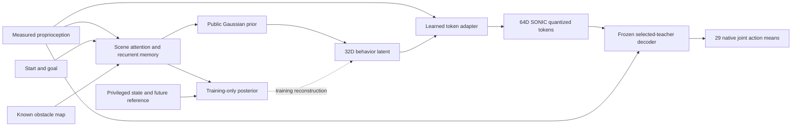

# Scene-conditioned SONIC distillation: BFM-inspired engineering proposal

**September 12:** See [the implemented training pipeline](TRAINING_PIPELINE.md) for masked foundation fitting, same-state DAgger, scene-navigation training and bounded action-residual PPO. The [execution receipt](../../../docs/motion2scene/BFM_DISTILLATION_IMPLEMENTATION_20260912.md) distinguishes native physical checks from synthetic integration tests. The descriptions of unimplemented stages below refer to the earlier September 11 snapshot.

**Design revision:** the user's request to preserve the BFM-style motion foundation is implemented in [FOUNDATION_NAVIGATION.md](FOUNDATION_NAVIGATION.md). The preferred downstream candidate now learns commands for a frozen scene-independent prior and motor decoder. The direct scene-conditioned variational architecture below remains an earlier prototype and comparison; it is not a trained foundation. The original packet is preserved unchanged.

Prepared September 11, 2026, America/New_York (receipts use UTC). Status: design and CPU-tested prototype; **no student optimization or new physics execution**. This is a dated engineering amendment, not the original Motion2Scene preregistration. Existing teacher training, acquisition assignments, protected layouts, and physical-utility gates remain authoritative for their respective experiments.

## What the paper contributes

[Behavior Foundation Model for Humanoid Robots, arXiv:2509.13780v1](https://arxiv.org/html/2509.13780v1), Sections IV-C–E, combines masked control inputs, a conditional variational model, and online teacher queries. Its prior uses available proprioception and controls; its posterior has richer simulator and target information. The posterior mean adds a learned residual to the prior mean. The action decoder receives proprioception and the latent, without a direct goal input. Online distillation queries the proxy tracking teacher at student-visited states and uses action imitation plus posterior-to-prior KL regularization. Masks hide control components, not scene obstacles. The reported tasks concern tracking, teleoperation and velocity control; they do not establish our start–goal obstacle-navigation result.

The PDF and equations were inspected. The [official project page](https://bfm4humanoid.github.io/) currently labels code as incoming. This prototype is our adaptation, not a reproduction of unpublished implementation details. In particular, our explicit prior-rollout/posterior-reconstruction schedule below is a design choice; the paper alone does not completely specify every optimizer and sampling detail.

## Research question and current evidence

Can motion-conditioned obstacle construction supply supervision that improves contact-qualified navigation, beyond equally budgeted feasibility-screened placement, when both train the same student?

The current frozen dataset contains 120 motions (100 train, 20 development), 240 proposed scenes and 25,335 reference frames. All 120 three-obstacle scenes are exact prefixes of the corresponding five-obstacle scenes, with the same underlying motion. There are 960 placements but only 600 distinct motion/candidate pairs. Thirteen scenes have a kinematic contrast proxy. None has executed scene-teacher labels or scene-teacher qualification. These are geometry assets, not 240 successful navigation demonstrations.

Nested scenes can support robustness learning if dynamically qualified. Their pairing does not by itself test whether the policy changes its route because obstacles change. Nor does conditioning scene construction on a demonstration invalidate learning: [LfLH](https://arxiv.org/html/2108.09793v1) motivates learning an inverse environment distribution coupled to a planner-consistency objective. For this robot, however, differentiable reconstruction and reference clearance remain proposal diagnostics; obstacle-present closed-loop execution must supply physical labels.

A decisive pair holds start, goal and initial robot state fixed, changes an obstacle, and requires different qualified continuations. For a Z-shaped demonstration, blocking a corner-cutting shortcut while leaving the demonstrated turn feasible is one candidate construction. A turn is not evidence of avoidance, and placing an obstacle directly on the turn can destroy feasibility. Include straight paths and scenes where the original motion is the wrong response, rather than selecting only visually impressive turns.

## Information available to each component

| Information | Student at inference | Privileged teacher / training posterior |
|---|---|---|
| Measured SONIC proprioception | 930D: native ten-step history | Same measured history |
| Start and final goal | Six body-frame coordinates, commanded once and transformed at each step | Same task |
| Static obstacle geometry | Known map: up to five 15D primitive tokens and validity bits | Same map plus simulator geometry/state |
| Future reference pose and intended motion progression | Absent | Native target-encoder input, 640D |
| Full native critic observation | Absent | 1645D, subject to collector parity |
| Route, motion ID, reference phase, future contacts | Absent | Route/phase may inform expert queries; IDs only index provenance |
| Images or depth | Absent | Absent in this experiment |

“Privileged” is relative to the deployed actor. An exact obstacle map is privileged relative to camera-only robotics, but here it is explicitly an **inference-time input**. A policy cannot reliably avoid an unobserved obstacle merely because its teacher knew that obstacle. This prototype therefore claims a known-map simulation interface, not perception or realistic sensing. Root localization and map coordinates must be available together. Unknown space cannot be encoded as known empty space.

Each obstacle token contains center xyz, full dimensions xyz, the first two local rotation columns, and three shape bits (box, cylinder, sphere). A beam is a box. `observations.py` rejects unsupported meshes, more than five obstacles, and inconsistent sphere/cylinder dimensions. Render assets can decorate qualified collision primitives; arbitrary furniture needs a richer, explicitly tested collision representation. Wxyz quaternions, meters, joint ordering, native observation normalization and native action scaling must remain consistent with SONIC.

## Proposed architecture

The public encoder embeds proprioception, start/goal and an unordered set of obstacles, then updates a 128D GRU. A learned null token makes empty maps well defined. The deterministic baseline directly predicts SONIC tokens from this memory. The variational candidate predicts a 32D Gaussian behavior distribution. This Gaussian is **not** SONIC's 64D finite-scalar-quantized representation; a learned adapter connects them.

Our variational prior has 497,728 acting parameters; including the training posterior gives 1,160,960. The deterministic baseline has 467,332. Both use a separately frozen 10,184,221-parameter SONIC decoder. These are inspected prototype counts, not evidence that model size improves navigation. The acting capacities are reasonably close, while any architecture comparison must also disclose training-only capacity and measured cost.

With public history embedding h and optional masked commands c, define

`p(z | h,c) = Normal(mu_p, diag(exp(logvar_p)))`.

The training posterior uses full native state s and reference r:

`q(z | h,c,s,r) = Normal(mu_p + delta_mu, diag(exp(logvar_q)))`.

The adapter receives z and a proprioception-only embedding. It has no direct goal/map bypass. It outputs 64 tokens on SONIC's 1/16 lattice in [-1,15/16], using a straight-through estimator during training. The frozen decoder maps those tokens and the same 930D history to native action means. The simulator must still apply the original action-processing, PD, timing and joint-order conventions; CPU tensor parity does not validate that simulator integration.

`prior_step` cannot accept privileged state or future reference. `posterior_step` is a separate training API. Gaussian noise is explicit so a future collector can record and persist its seed. Do not resample incompatible route choices independently at 50 Hz. A fixed-noise episode or registered temporal chunk is a candidate; the deterministic mean is an ablation, not a guarantee of a valid middle route. Gaussian latents alone do not solve left/right route ambiguity.

The primary start–goal experiment supplies no optional low-level controls. The prototype additionally represents yaw, body velocity, height, yaw rate and arrival speed with availability bits. Absent commands differ from commanded zero; yaw sine/cosine are masked together. Any later multi-interface curriculum must include start–goal-only episodes and be registered separately. Randomly hiding obstacles would change the sensing problem and is not this command-mask mechanism.

## Teacher construction and supervision

The running SONIC teacher is learning motion tracking without obstacles. Finishing 8,000 iterations does not establish whole-motion tracking quality, scene passage, or response selection. First audit all assigned motions, including early terminations and difficult interaction/traversal motions. Preserve their denominator. Do not adopt a new failure-filtering curriculum mid-run.

For scene tasks the expert needs two functions: choose a scene-compatible continuation, and track it from the current state. A frozen tracking network supplies the second function. Initially a reference can supply the first only for tasks on which its complete obstacle-present continuation has been qualified. General start–goal tasks need a qualified route/skill chooser, replanning or another demonstrably competent expert. A 2D planner alone cannot qualify under-beam posture, foot contact, support, or recovery.

Freeze the **selected teacher checkpoint and its decoder together after qualification**. Current PPO can change decoder weights, so a student must not combine actions from a later teacher with the old release decoder. The inspected iteration-500 checkpoint was used only for CPU interface parity; it has not been selected for deployment or qualified as a scene expert.

Use [DAgger](https://proceedings.mlr.press/v15/ross11a.html) to address student-induced state drift. At each collected state, preserve actual history, simulator snapshot, scene, goal, commands, recurrent reset, checkpoint hashes and time. Query the teacher on that exact state before stepping. An old action from the nominal reference trajectory is not the correct teacher label after the student deviates. Query receipt checks reject mismatched history/state/scene/goal, future observations, changed checkpoints and development IDs. They are consistency guards; a collector must also verify the referenced files and qualification receipts. Hash strings do not authenticate a physical execution.

If richer teacher information changes the desired action while all student-visible information is identical, blindly minimizing action MSE can average incompatible responses. This is the information-asymmetry problem highlighted by [Student-Informed Teacher Training](https://arxiv.org/html/2412.09149v2). Use a stable qualified expert choice per episode, measure conditional action ambiguity, and retain multiple qualified continuations where possible. The optional admissible-mode loss chooses one qualified target instead of averaging opposing targets; it does not itself produce coherent long-horizon mode selection. Do not apply that loss to unqualified geometric alternatives.

## Objective and collection schedule

The primary proposed loss on one bound expert query is

`L = E_q[mean_j (D(u(z), o)_j - a_teacher,j)^2] + beta KL(q || p)`.

The implementation sums KL over 32 latent coordinates and averages over samples. `beta` is required explicitly. A small initial coefficient such as 0.001 is an engineering candidate to lock on training diagnostics before protected evaluation; it is not a copied or empirically validated paper setting. The CPU gradient fixture uses 0.01 only to exercise the implementation. Token MSE defaults to zero in the variational objective; adding it is an ablation because closeness of quantized codes need not mean closeness of useful behavior.

Collect with the public **prior**, reconstruct teacher actions through the privileged **posterior**, and train the prior through KL. Record prior-only action error alongside posterior reconstruction and KL to expose a prior/posterior gap or posterior collapse. Additional direct prior imitation is a separate proposed ablation. No posterior or full reference can enter evaluation. Optional displacement prediction uses only fully observed horizons as labels; terminal/censored futures remain missing. An arrival head is diagnostic, not a qualified stopping controller.

The later bounded collection loop should:

1. Freeze training and development IDs, task allocation, expert checkpoint, collision assets, scorer and maximum execution/labeling budget before rollout.
2. Warm-start from executed, scene-qualified teacher demonstrations; reference poses are not action labels. Include rest/arrival transitions only after qualification.
3. Collect prior-driven student episodes under a prespecified teacher-intervention schedule; query the expert at each student state, preserve intervention flags and every attempt.
4. Aggregate by episode/motion, with declared weighting so long clips and repeatedly failing clips do not silently dominate. Train recurrent sequences with a public-history burn-in; never borrow teacher hidden states. Keep train and development shards separate.
5. Evaluate the prior alone on a locked panel, without feedback into fitting. Report whole-chain completion and all failure/censoring modes.

No collector, scene-aware teacher, batched scene-cloning integration or student training launch is completed by the current prototype. Their execution budget and task-level terminal/censoring rules remain to be registered. The existing single-environment scene-USD hook is not a ready 512-environment training implementation. Rendering a robot replay also does not supply an articulated scene-training environment.

## Discriminating evaluation and adoption gates

Keep architecture and dataset questions separate. First compare a deterministic recurrent student with this variational student using the same qualified corpus, state-query budget, expert, task distribution and action decoder. Account for DAgger's policy-dependent visited states rather than pretending labels are identical. Then compare acquisition methods using the same selected student recipe and equally budgeted contemporaneous baselines. Any such experiment is separate from the unchanged original A/B/C pilot.

Evaluate matched changes of scene at fixed start/goal/state, matched changes of goal in the same scene, empty scenes, narrow clearance, turns, and qualified traversal/recovery transitions. A shuffled-map diagnostic on a development set can detect scene-insensitive behavior; it cannot substitute for success with the correct map. Nonconstant actions or latent plots alone do not pass the physical-utility gate.

Report goal reach and sustained terminal behavior, complete reference/chain coverage where applicable, contact-qualified passage, falls, technical failures, censoring, query cost and simulation steps. Retain 200 Hz obstacle-contact evidence and the applicable registered contact aggregation, upright, crossing and horizon rules. Goal-navigation endpoint and stopping semantics still need a separately locked task specification; this prototype does not silently repurpose the beam-passage scorer. No protective-stopping, hardware safety, or camera field-of-view claim follows.

The 20 development motions are for development. Their prompt-derived groups do not overlap training, but that does not independently establish source-ancestry transfer or policy generalization. Keep the eighteen reserved layouts unopened, restore the required ancestry-held-out step before generalization claims, and satisfy manuscript reconciliation and registered utility/adoption gates before Phase 3.

Use paired, task-level effects and preserve dependence among motions, source groups, scenes and training replicas. Do not count action frames or 240 proposed scenes as independent policy experiments. Until assignments and exchangeability are defensible, p is NA; a tie is not equivalence. Dataset utility additionally requires an actual reuse result, licensing and reproduction evidence.

## Validation and status

The accompanying packet contains the original paper PDF and hash, a 1,331-file dataset integrity audit, all 240 assignment rows with missing physical outcomes preserved, CPU interface/gradient receipts, tests, source snapshots and a SHA-256 manifest. Eight synthetic rows matched the inspected checkpoint's decoder with maximum absolute error 0.0. Synthetic gradient checks do not measure student training performance.

Implemented: known-map observation conversion; deterministic recurrent baseline; public-prior/privileged-posterior candidate; frozen-decoder imitation and KL loss; causal, query-provenance and censoring guards. Not established: teacher scene qualification, physical dataset usefulness, navigation success, or architecture superiority. The next permitted engineering work is the measured-state collector and qualified scene-expert interface. Student physics must wait for a concrete bounded protocol and the relevant teacher/task gates.
